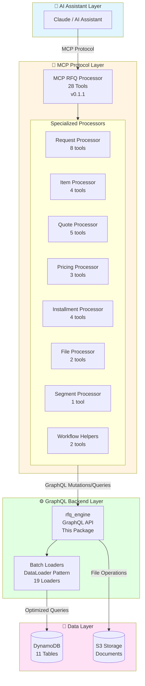

# RFQ Engine

A comprehensive GraphQL-based Request for Quote (RFQ) management system built with Python, DynamoDB, and AWS Lambda. This engine provides intelligent quote generation, pricing management, and supplier relationship tools for B2B procurement workflows.

## 🔀 Dual-Backend Persistence

The engine supports two deployment-selectable persistence backends behind a single GraphQL contract:

- **DynamoDB** (default): PynamoDB models via `silvaengine_dynamodb_base`
- **PostgreSQL**: SQLAlchemy models with Alembic migrations

Backend selection is controlled by the `DB_BACKEND` setting at deployment time. A repository dispatch boundary (`models/repositories/`) routes all persistence operations to the active backend.

- [DUAL_BACKEND_DEVELOPMENT_PLAN.md](docs/DUAL_BACKEND_DEVELOPMENT_PLAN.md) — Architecture and phased plan
- [DUAL_BACKEND_CONFIG.md](docs/DUAL_BACKEND_CONFIG.md) — Configuration guide
- [POSTGRESQL_SETUP.md](docs/POSTGRESQL_SETUP.md) — PostgreSQL setup guide
- [MIGRATION_DYNAMODB_TO_POSTGRESQL.md](docs/MIGRATION_DYNAMODB_TO_POSTGRESQL.md) — Data migration guide

## 🚀 Features

### Core Functionality
- **Item Management**: Catalog management with support for multiple item types, specifications, and units of measure
- **Provider Management**: Supplier onboarding with item catalogs, pricing tiers, and batch tracking
- **RFQ Processing**: Automated quote request distribution and response collection
- **Quote Generation**: AI-powered quote generation with pricing optimization
- **Installment Planning**: Flexible payment scheduling and financial planning
- **File Management**: Document attachment and management for RFQ processes

### Advanced Features
- **Tiered Pricing**: Volume-based pricing with configurable tiers
- **AI-Driven Discount Prompts**: Hierarchical discount system with GLOBAL, SEGMENT, ITEM, and PROVIDER_ITEM scopes (see [Discount Prompts Documentation](docs/DISCOUNT_PROMPTS.md))
- **Batch Tracking**: Lot/batch management for inventory control
- **Segment Management**: Customer segmentation for targeted pricing with email-based lookup
- **Multi-Provider Support**: Competitive bidding across multiple suppliers

### ⚡ Performance & Scalability
- **Lazy Loading**: Efficient on-demand data fetching via nested resolvers
- **Batch Optimization**: DataLoader pattern eliminates N+1 query problems (see [Batch Loaders Documentation](docs/BATCH_LOADERS.md))
- **Hybrid Caching**: Multi-layer caching strategy (Application, Request, Method) for sub-millisecond response times
- **Serverless Architecture**: Auto-scaling AWS Lambda backend
- **Smart Cache Normalization**: Automatic handling of cached vs fresh data

## 🤖 MCP Integration

The RFQ Engine integrates seamlessly with AI assistants through the **[MCP RFQ Processor](../mcp_rfq_processor)** - a Model Context Protocol (MCP) server that exposes the GraphQL backend as 28 intelligent tools for AI-driven RFQ workflow automation.

### MCP RFQ Processor Overview

**Version**: 0.1.1 | **Tools**: 28 | **Supports**: Claude, Custom MCP Clients

The MCP RFQ Processor provides AI assistants with high-level operations that abstract away complex GraphQL queries and mutations. It handles:

- **Automated Workflows**: Multi-step processes like "confirm request and create quotes" in single tool calls
- **Intelligent Pricing**: Batch-optimized price tier and discount prompt queries using email-based segment lookup
- **Status Management**: Validated state transitions with automatic business rule enforcement
- **Provider Assignment**: Smart assignment of provider items to request items with batch tracking

### Architecture Integration



### Key Benefits

1. **AI-Native Interface**: Tools designed for natural language interaction
2. **Batch Optimization**: Single GraphQL queries for multi-item operations
3. **Email-Based Segment Lookup**: Automatic customer segmentation via `email → segment_contact → segment`
4. **Business Rule Enforcement**: Automatic status transitions and validations
5. **Workflow Abstraction**: Complex multi-step processes in single tool calls

### Quick Example

```python
# AI Assistant using MCP RFQ Processor
from mcp_rfq_processor import MCPRfqProcessor

processor = MCPRfqProcessor(endpoint_id="demo")

# Step 1: Calculate pricing (batch-optimized)
pricing = processor.calculate_quote_pricing(
    request_uuid="req_001",
    email="buyer@company.com"  # Auto-resolves segment
)
# Returns grouped pricing by provider with discount prompts

# Step 2: Create quotes for all providers (single call)
result = processor.confirm_request_and_create_quotes(
    request_uuid="req_001",
    provider_corp_external_ids=["PROV_001", "PROV_002"]
)
# Creates quotes with auto-generated quote items from request
```

**Learn More**: See [mcp_rfq_processor/README.md](../mcp_rfq_processor/README.md) for complete tool catalog and workflow examples.

---

## 🏗️ Architecture

### Technology Stack
- **Backend**: Python 3.8+
- **Database**: Amazon DynamoDB
- **API**: GraphQL with Graphene
- **Cloud**: AWS Lambda (Serverless)
- **Framework**: SilvaEngine (Custom framework)
- **MCP Integration**: Model Context Protocol server for AI assistants

### Project Structure
```
rfq_engine/
├── rfq_engine/           # Main package
│   ├── handlers/            # Configuration and handlers
│   ├── models/              # Data models and business logic
│   │   └── batch_loaders/   # DataLoader implementations
│   ├── mutations/           # GraphQL mutations
│   ├── queries/             # GraphQL queries
│   ├── types/               # GraphQL type definitions
│   ├── tests/               # Test suite
│   ├── main.py              # Entry point and deployment config
│   └── schema.py            # GraphQL schema definition
├── pyproject.toml           # Project configuration
├── LICENSE                  # MIT License
└── README.md                # This file
```

### 🏛️ Architectural Patterns

#### 1. Nested Resolver Architecture
The engine implements a **Lazy Loading** pattern where related data is fetched only when requested by the client. This replaces the traditional "eager loading" approach, significantly reducing payload size and database read operations.

**Example**:
```graphql
query {
  quote(requestUuid: "...", quoteUuid: "...") {
    quoteUuid
    # Request data is ONLY fetched if this field is included
    request {
      requestTitle
      email
    }
  }
}
```

#### 2. Batch Loading Optimization
To prevent the "N+1 Query Problem" common in GraphQL, the engine uses the **DataLoader** pattern.
- **Problem**: Fetching a list of 50 quotes and their parent requests would traditionally trigger 1 query for quotes + 50 queries for requests (51 total).
- **Solution**: DataLoaders collect all request UUIDs and fetch them in a **single batch query** (2 queries total).
- **Implementation**: `RequestLoaders` container manages request-scoped loaders for all core entities.

#### 3. Caching Strategy
A robust **3-Layer Caching System** ensures high performance:
1.  **Application Cache**: Caches schema and static configuration.
2.  **Request Cache (DataLoader)**: Deduplicates fetches within a single GraphQL request. If the same item is requested multiple times, it's fetched only once.
3.  **Method Cache (`@method_cache`)**: Caches expensive method results (like complex pricing calculations) across requests using `HybridCacheEngine`.

## 📊 Data Model

### Core Entities

#### Items
- **Purpose**: Product/service catalog management
- **Key Fields**: `item_uuid`, `item_type`, `item_name`, `uom`, `item_description`
- **Features**: Hierarchical categorization, specification management

#### Providers & Provider Items
- **Purpose**: Supplier management and their product offerings
- **Key Fields**: `provider_item_uuid`, `item_uuid`, `base_price_per_uom`, `item_spec`
- **Features**: Multi-supplier support, competitive pricing

#### Segments & Contacts
- **Purpose**: Customer segmentation and contact management
- **Key Fields**: `segment_uuid`, `segment_name`, `email`
- **Features**: Targeted pricing, relationship management

#### Requests & Quotes
- **Purpose**: RFQ workflow management
- **Key Fields**: `request_uuid`, `quote_uuid`, `items[]`, `total_quote_amount`
- **Features**: Multi-item requests, automated quote generation

#### Pricing & Discounts
- **Purpose**: Dynamic pricing management
- **Key Fields**: `item_price_tier_uuid`, `discount_prompt_uuid`, `scope`, `tags[]`, `quantity_ranges`
- **Features**: Volume discounts, hierarchical AI-driven discount prompts, tag-based entity linking

### Database Schema
The system uses DynamoDB with the following table structure:

- `are-items`: Item catalog
- `are-segments`: Customer segments
- `are-segment-contacts`: Segment-contact relationships (email → segment mapping)
- `are-provider-items`: Provider item catalog
- `are-provider-item-batches`: Batch/lot tracking
- `are-item-price-tiers`: Tiered pricing rules
- `are-discount-prompts`: AI-driven discount prompts with hierarchical scopes
- `are-requests`: RFQ requests
- `are-quotes`: Generated quotes
- `are-quote-items`: Quote line items
- `are-installments`: Payment schedules
- `are-files`: Document attachments

## 🔗 Model Relationships

The RFQ Engine implements a sophisticated relational data model using DynamoDB. Understanding these relationships is crucial for effective system usage and integration.

### Relationship Overview

```
┌─────────────────────────────────────────────────────────────────┐
│                    RFQ WORKFLOW RELATIONSHIPS                    │
└─────────────────────────────────────────────────────────────────┘

REQUEST (Hub Model)
    │
    ├─── (1:N) ──→ QUOTES
    │                  │
    │                  ├─── (1:N) ──→ QUOTE_ITEMS
    │                  │                  │
    │                  │                  ├─── (N:1) ──→ ITEMS
    │                  │                  │
    │                  │                  └─── (N:1) ──→ PROVIDER_ITEMS
    │                  │
    │                  └─── (1:N) ──→ INSTALLMENTS
    │
    └─── (1:N) ──→ FILES

┌─────────────────────────────────────────────────────────────────┐
│                   CATALOG & PRICING RELATIONSHIPS                │
└─────────────────────────────────────────────────────────────────┘

ITEMS (Core Catalog)
    │
    ├─── (1:N) ──→ PROVIDER_ITEMS
    │                  │
    │                  └─── (1:N) ──→ PROVIDER_ITEM_BATCHES
    │
    ├─── (1:N) ──→ ITEM_PRICE_TIERS
    │                  │
    │                  ├─── (N:1) ──→ SEGMENTS
    │                  │
    │                  └─── (N:1) ──→ PROVIDER_ITEMS
    │
    └─── (1:N) ──→ DISCOUNT_PROMPTS (via tags[])
                       │
                       ├─── Scope: GLOBAL (all endpoints)
                       ├─── Scope: SEGMENT (tags → segment_uuid)
                       ├─── Scope: ITEM (tags → item_uuid)
                       └─── Scope: PROVIDER_ITEM (tags → provider_item_uuid)

┌─────────────────────────────────────────────────────────────────┐
│                 CUSTOMER SEGMENTATION RELATIONSHIPS              │
└─────────────────────────────────────────────────────────────────┘

SEGMENTS
    │
    ├─── (1:N) ──→ SEGMENT_CONTACTS (email-based lookup)
    │
    ├─── (1:N) ──→ ITEM_PRICE_TIERS
    │
    └─── (1:N) ──→ DISCOUNT_PROMPTS (via tags[], scope=SEGMENT)
```

### Core Relationship Patterns

#### 1. One-to-Many Relationships

These relationships are implemented via foreign key references (UUID fields) with cascading delete protections.

| Parent Model | Child Model | Foreign Key | Description |
|--------------|-------------|-------------|-------------|
| **Request** | Quote | `request_uuid` | One RFQ request can have multiple quotes from different suppliers |
| **Request** | File | `request_uuid` | One request can have multiple attached documents |
| **Quote** | QuoteItem | `quote_uuid` | One quote contains multiple line items |
| **Quote** | Installment | `quote_uuid` | One quote can have multiple payment installments |
| **Item** | ProviderItem | `item_uuid` | One item can be offered by multiple providers |
| **ProviderItem** | ProviderItemBatch | `provider_item_uuid` | One provider item can have multiple batches/lots |
| **Item** | ItemPriceTier | `item_uuid` | One item can have multiple price tiers |
| **Item** | DiscountRule | `item_uuid` | One item can have multiple discount rules |
| **Segment** | SegmentContact | `segment_uuid` | One segment can contain multiple contacts |
| **Segment** | ItemPriceTier | `segment_uuid` | One segment can have multiple pricing rules |
| **Segment** | DiscountRule | `segment_uuid` | One segment can have multiple discount rules |

**Cascading Delete Protection**: Parent models cannot be deleted if child records exist. For example:
- Cannot delete a `Request` if related `Quotes` exist
- Cannot delete a `ProviderItem` if related `QuoteItems`, `ItemPriceTiers`, or `ProviderItemBatches` exist
- Cannot delete a `Segment` if related `SegmentContacts` exist

#### 2. Many-to-One Relationships

Child models reference their parent via foreign key fields.

| Child Model | Parent Model | Foreign Key Field | Purpose |
|-------------|--------------|-------------------|---------|
| **Quote** | Request | `request_uuid` | Links quote back to originating request |
| **QuoteItem** | Quote | `quote_uuid` | Associates line item with specific quote |
| **QuoteItem** | Item | `item_uuid` | References the catalog item being quoted |
| **QuoteItem** | ProviderItem | `provider_item_uuid` | References supplier's specific item offering |
| **ProviderItem** | Item | `item_uuid` | Links provider offering to catalog item |
| **ProviderItemBatch** | ProviderItem | `provider_item_uuid` | Links batch to provider item |
| **ProviderItemBatch** | Item | `item_uuid` | Direct reference to catalog item |
| **ItemPriceTier** | Item | `item_uuid` | Associates pricing tier with catalog item |
| **ItemPriceTier** | ProviderItem | `provider_item_uuid` | Associates tier with specific provider |
| **ItemPriceTier** | Segment | `segment_uuid` | Applies pricing to specific customer segment |
| **DiscountRule** | Item | `item_uuid` | Associates discount rule with catalog item |
| **DiscountRule** | ProviderItem | `provider_item_uuid` | Associates rule with specific provider |
| **DiscountRule** | Segment | `segment_uuid` | Applies discount to specific customer segment |
| **SegmentContact** | Segment | `segment_uuid` | Links contact to customer segment |
| **File** | Request | `request_uuid` | Associates document with RFQ request |
| **Installment** | Quote | `quote_uuid` | Links payment to specific quote |

### Special Relationship Patterns

#### 3. Hierarchical Tier Relationships

Both **ItemPriceTier** and **DiscountRule** implement a sophisticated linked-list hierarchy where tiers/rules are ordered by their threshold values.

**ItemPriceTier Hierarchy Example**:
```
Tier 1: qty ≥ 0    AND qty < 100   → margin: 25%
Tier 2: qty ≥ 100  AND qty < 500   → margin: 20%  (points to Tier 1)
Tier 3: qty ≥ 500  AND qty < NULL  → margin: 15%  (points to Tier 2)
```

**DiscountRule Hierarchy Example**:
```
Rule 1: subtotal > 1000   AND subtotal < 5000  → max_discount: 5%
Rule 2: subtotal > 5000   AND subtotal < 10000 → max_discount: 10%  (points to Rule 1)
Rule 3: subtotal > 10000  AND subtotal < NULL  → max_discount: 15%  (points to Rule 2)
```

**Key Features**:
- **Auto-Linking**: When a new tier/rule is inserted, the system automatically updates the previous tier's upper bound (`quantity_less_then` or `subtotal_less_than`) to point to the new tier
- **Validation**: The system validates that new tiers maintain proper ordering
- **Gap-Free Coverage**: Ensures continuous coverage across all quantity/subtotal ranges
- **No Upper Limit**: The highest tier can have `NULL` as the upper bound, covering all values above the threshold

**Implementation Methods**:
- `_get_previous_tier()`: Finds the tier immediately below the new tier's threshold
- `_update_previous_tier()`: Updates the previous tier's upper bound to maintain continuity

#### 4. Calculated/Derived Relationships

Some models auto-calculate field values based on related data:

| Model | Calculated Field | Calculation Logic | Triggers |
|-------|------------------|-------------------|----------|
| **ProviderItemBatch** | `total_cost_per_uom` | `cost_per_uom + freight_cost_per_uom + additional_cost_per_uom` | Insert/Update |
| **ProviderItemBatch** | `guardrail_price_per_uom` | `total_cost_per_uom × (1 + guardrail_margin_per_uom/100)` | Insert/Update |
| **QuoteItem** | `price_per_uom` | Queries `ItemPriceTier` based on qty, segment, provider | Insert (auto-calculated) |
| **QuoteItem** | `subtotal` | `price_per_uom × qty` | Insert/Update |
| **QuoteItem** | `final_subtotal` | `subtotal - subtotal_discount` | Insert/Update |
| **Quote** | `total_quote_amount` | Sum of all related QuoteItem `subtotal` values | After QuoteItem change |
| **Quote** | `total_quote_discount` | Sum of all related QuoteItem `subtotal_discount` values | After QuoteItem change |
| **Quote** | `final_total_quote_amount` | `total_quote_amount - total_quote_discount + shipping_amount` | After QuoteItem change |
| **Installment** | `installment_ratio` | `(installment_amount / quote.final_total_quote_amount) × 100` | Insert/Update |

**Key Methods**:
- `QuoteItem.get_price_per_uom()`: Automatically finds the matching price tier and calculates price
- `Quote.update_quote_totals()`: Recalculates all quote totals from related quote items
- `Installment._calculate_installment_ratio()`: Auto-calculates payment ratio

### Composite Key Patterns

All models use DynamoDB's composite key pattern for efficient partitioning and querying:

| Model | Hash Key | Range Key | Purpose |
|-------|----------|-----------|---------|
| **Item** | `endpoint_id` | `item_uuid` | Partition by endpoint, unique items within endpoint |
| **Request** | `endpoint_id` | `request_uuid` | Partition by endpoint, chronological requests |
| **Quote** | `request_uuid` | `quote_uuid` | Partition by request, multiple quotes per request |
| **QuoteItem** | `quote_uuid` | `quote_item_uuid` | Partition by quote, line items per quote |
| **ProviderItem** | `endpoint_id` | `provider_item_uuid` | Partition by endpoint, provider catalog |
| **ProviderItemBatch** | `provider_item_uuid` | `batch_no` | Partition by provider item, batches per item |
| **ItemPriceTier** | `item_uuid` | `item_price_tier_uuid` | Partition by item, tiers per item |
| **DiscountRule** | `item_uuid` | `discount_rule_uuid` | Partition by item, rules per item |
| **Segment** | `endpoint_id` | `segment_uuid` | Partition by endpoint, segments per endpoint |
| **SegmentContact** | `endpoint_id` | `email` | Partition by endpoint, unique email per endpoint |
| **File** | `request_uuid` | `file_name` | Partition by request, unique filename per request |
| **Installment** | `quote_uuid` | `installment_uuid` | Partition by quote, installments per quote |

### Index Patterns

#### Local Secondary Indexes (LSI)
Share the same hash key as the primary table but provide alternative range keys:

| Model | Index Name | Hash Key | Range Key | Use Case |
|-------|------------|----------|-----------|----------|
| **Item** | `item_type-index` | `endpoint_id` | `item_type` | Query items by type |
| **Request** | `email-index` | `endpoint_id` | `email` | Query requests by customer email |
| **Quote** | `provider_corp_external_id-index` | `request_uuid` | `provider_corp_external_id` | Query quotes by provider |
| **QuoteItem** | `provider_item_uuid-index` | `quote_uuid` | `provider_item_uuid` | Query quote items by provider item |
| **QuoteItem** | `item_uuid-index` | `quote_uuid` | `item_uuid` | Query quote items by catalog item |
| **ProviderItem** | `item_uuid-index` | `endpoint_id` | `item_uuid` | Query provider items by catalog item |
| **ItemPriceTier** | `provider_item_uuid-index` | `item_uuid` | `provider_item_uuid` | Query price tiers by provider |
| **ItemPriceTier** | `segment_uuid-index` | `item_uuid` | `segment_uuid` | Query price tiers by segment |
| **DiscountRule** | `provider_item_uuid-index` | `item_uuid` | `provider_item_uuid` | Query discount rules by provider |
| **DiscountRule** | `segment_uuid-index` | `item_uuid` | `segment_uuid` | Query discount rules by segment |
| **Segment** | `provider_corp_external_id-index` | `endpoint_id` | `provider_corp_external_id` | Query segments by provider |
| **SegmentContact** | `segment_uuid-index` | `endpoint_id` | `segment_uuid` | Query contacts by segment |

#### Global Secondary Indexes (GSI)
Have different hash/range keys than the primary table:

| Model | Index Name | Hash Key | Range Key | Use Case |
|-------|------------|----------|-----------|----------|
| **Quote** | `provider_corp_external_id-quote_uuid-index` | `provider_corp_external_id` | `quote_uuid` | Query all quotes for a provider across all requests |
| **QuoteItem** | `item_uuid-provider_item_uuid-index` | `item_uuid` | `provider_item_uuid` | Query quote items by item and provider combination |

#### Updated_at Indexes
Nearly all models include an `updated_at-index` (LSI) for time-based queries and audit trails:

```graphql
# Query recent requests
query {
  requestList(
    fromUpdatedAt: "2024-01-01T00:00:00Z"
    toUpdatedAt: "2024-12-31T23:59:59Z"
    limit: 50
  ) {
    requestList {
      requestUuid
      requestTitle
      updatedAt
    }
  }
}
```

### Relationship Usage Examples

#### Example 1: Creating a Complete RFQ with Quote

```graphql
# Step 1: Create a Request
mutation {
  insertUpdateRequest(
    requestUuid: "req_001"
    email: "buyer@company.com"
    requestTitle: "Q1 2024 Steel Requirements"
    items: [{itemUuid: "item_001", quantity: 1000}]
    updatedBy: "buyer@company.com"
  ) {
    request { requestUuid }
  }
}

# Step 2: Create a Quote (linked via request_uuid)
mutation {
  insertUpdateQuote(
    requestUuid: "req_001"
    quoteUuid: "quote_001"
    providerCorpExternalId: "SUPPLIER_ABC"
    salesRepEmail: "sales@supplier.com"
    updatedBy: "sales@supplier.com"
  ) {
    quote { quoteUuid }
  }
}

# Step 3: Add Quote Items (linked via quote_uuid and item_uuid)
# The price_per_uom is automatically calculated from ItemPriceTiers
mutation {
  insertUpdateQuoteItem(
    quoteUuid: "quote_001"
    quoteItemUuid: "qi_001"
    providerItemUuid: "pi_001"
    itemUuid: "item_001"
    segmentUuid: "seg_premium"
    qty: 1000
    requestUuid: "req_001"
    updatedBy: "sales@supplier.com"
  ) {
    quoteItem {
      quoteItemUuid
      pricePerUom      # Auto-calculated
      subtotal         # Auto-calculated
      finalSubtotal    # Auto-calculated
    }
  }
}

# Step 4: Quote totals are automatically recalculated
# Query to see updated quote totals
query {
  quote(requestUuid: "req_001", quoteUuid: "quote_001") {
    totalQuoteAmount      # Sum of all quote item subtotals
    totalQuoteDiscount    # Sum of all quote item discounts
    finalTotalQuoteAmount # Total with shipping
  }
}

# Step 5: Add Installment Plan (linked via quote_uuid)
mutation {
  insertUpdateInstallment(
    quoteUuid: "quote_001"
    installmentUuid: "inst_001"
    priority: 1
    installmentAmount: 10000.00
    scheduledDate: "2024-06-01T00:00:00Z"
    paymentMethod: "bank_transfer"
    updatedBy: "finance@company.com"
  ) {
    installment {
      installmentUuid
      installmentRatio  # Auto-calculated as percentage of quote total
    }
  }
}
```

#### Example 2: Setting Up Tiered Pricing for an Item

```graphql
# Step 1: Create an Item
mutation {
  insertUpdateItem(
    itemUuid: "item_steel_001"
    itemType: "raw_material"
    itemName: "Stainless Steel Sheet"
    uom: "kg"
    updatedBy: "admin@company.com"
  ) {
    item { itemUuid }
  }
}

# Step 2: Create Provider Item (linked via item_uuid)
mutation {
  insertUpdateProviderItem(
    providerItemUuid: "pi_steel_001"
    itemUuid: "item_steel_001"
    providerCorpExternalId: "STEEL_SUPPLIER_001"
    basePricePerUom: 30.00
    updatedBy: "supplier@company.com"
  ) {
    providerItem { providerItemUuid }
  }
}

# Step 3: Create Provider Item Batches (linked via provider_item_uuid)
mutation {
  insertUpdateProviderItemBatch(
    providerItemUuid: "pi_steel_001"
    batchNo: "BATCH_2024_001"
    itemUuid: "item_steel_001"
    costPerUom: 20.00
    freightCostPerUom: 2.00
    additionalCostPerUom: 1.00
    guardrailMarginPerUom: 25.0
    updatedBy: "supplier@company.com"
  ) {
    providerItemBatch {
      totalCostPerUom        # Auto-calculated: 23.00
      guardrailPricePerUom   # Auto-calculated: 28.75
    }
  }
}

# Step 4: Create Customer Segment
mutation {
  insertUpdateSegment(
    segmentUuid: "seg_premium"
    segmentName: "Premium Customers"
    updatedBy: "admin@company.com"
  ) {
    segment { segmentUuid }
  }
}

# Step 5: Create Tiered Pricing (linked via item_uuid, provider_item_uuid, segment_uuid)
# Tier 1: 0-100 kg
mutation {
  insertUpdateItemPriceTier(
    itemUuid: "item_steel_001"
    itemPriceTierUuid: "tier_001"
    providerItemUuid: "pi_steel_001"
    segmentUuid: "seg_premium"
    quantityGreaterThen: 0
    quantityLessThen: 100
    marginPerUom: 0.30
    status: "active"
    updatedBy: "admin@company.com"
  ) {
    itemPriceTier {
      quantityGreaterThen
      quantityLessThen
      marginPerUom
    }
  }
}

# Tier 2: 100-500 kg
# This automatically updates Tier 1's quantityLessThen to 100
mutation {
  insertUpdateItemPriceTier(
    itemUuid: "item_steel_001"
    itemPriceTierUuid: "tier_002"
    providerItemUuid: "pi_steel_001"
    segmentUuid: "seg_premium"
    quantityGreaterThen: 100
    quantityLessThen: 500
    marginPerUom: 0.25
    status: "active"
    updatedBy: "admin@company.com"
  ) {
    itemPriceTier {
      quantityGreaterThen
      quantityLessThen
      marginPerUom
    }
  }
}

# Tier 3: 500+ kg (no upper limit)
# This automatically updates Tier 2's quantityLessThen to 500
mutation {
  insertUpdateItemPriceTier(
    itemUuid: "item_steel_001"
    itemPriceTierUuid: "tier_003"
    providerItemUuid: "pi_steel_001"
    segmentUuid: "seg_premium"
    quantityGreaterThen: 500
    marginPerUom: 0.20
    status: "active"
    updatedBy: "admin@company.com"
  ) {
    itemPriceTier {
      quantityGreaterThen
      quantityLessThen      # Will be null (no upper limit)
      marginPerUom
    }
  }
}

# Step 6: Query Price Tiers for Specific Quantity
# Database-level filtering with quantityValue parameter
query {
  itemPriceTierList(
    itemUuid: "item_steel_001"
    providerItemUuid: "pi_steel_001"
    segmentUuid: "seg_premium"
    quantityValue: 250.0    # Filters at database level
    status: "active"
  ) {
    itemPriceTierList {
      itemPriceTierUuid
      quantityGreaterThen   # Will return tier_002 (100-500)
      quantityLessThen
      marginPerUom          # 0.25
    }
  }
}

# Step 7: Create Discount Rules (parallel hierarchy to price tiers)
# Rule 1: Subtotal $1,000 - $5,000
mutation {
  insertUpdateDiscountRule(
    itemUuid: "item_steel_001"
    discountRuleUuid: "discount_001"
    providerItemUuid: "pi_steel_001"
    segmentUuid: "seg_premium"
    subtotalGreaterThan: 1000.0    # Must be > 0
    subtotalLessThan: 5000.0
    maxDiscountPercentage: 5.0
    status: "active"
    updatedBy: "admin@company.com"
  ) {
    discountRule { discountRuleUuid }
  }
}

# Rule 2: Subtotal $5,000+
# This automatically updates Rule 1's subtotalLessThan to 5000
mutation {
  insertUpdateDiscountRule(
    itemUuid: "item_steel_001"
    discountRuleUuid: "discount_002"
    providerItemUuid: "pi_steel_001"
    segmentUuid: "seg_premium"
    subtotalGreaterThan: 5000.0
    maxDiscountPercentage: 10.0
    status: "active"
    updatedBy: "admin@company.com"
  ) {
    discountRule {
      subtotalGreaterThan
      subtotalLessThan      # Will be null (no upper limit)
      maxDiscountPercentage
    }
  }
}

# Query Discount Rules for Specific Subtotal
# Database-level filtering with subtotalValue parameter
query {
  discountRuleList(
    itemUuid: "item_steel_001"
    providerItemUuid: "pi_steel_001"
    segmentUuid: "seg_premium"
    subtotalValue: 12500.0  # Filters at database level
    status: "active"
  ) {
    discountRuleList {
      discountRuleUuid
      subtotalGreaterThan   # Will return discount_002 (>$5,000)
      subtotalLessThan
      maxDiscountPercentage # 10.0
    }
  }
}
```

#### Example 3: Querying Related Data Across Models

```graphql
# Find all quotes for a specific request with their items
query {
  quoteList(requestUuid: "req_001") {
    quoteList {
      quoteUuid
      providerCorpExternalId
      totalQuoteAmount
      finalTotalQuoteAmount
      quoteItems {            # Related QuoteItems
        quoteItemUuid
        itemUuid
        qty
        pricePerUom
        subtotal
        item {                # Related Item via item_uuid
          itemName
          itemType
          uom
        }
        providerItem {        # Related ProviderItem via provider_item_uuid
          basePricePerUom
          itemSpec
        }
      }
      installments {          # Related Installments
        installmentUuid
        installmentAmount
        installmentRatio
        scheduledDate
      }
    }
  }
}

# Find all provider items for a specific catalog item
query {
  providerItemList(itemUuid: "item_steel_001") {
    providerItemList {
      providerItemUuid
      providerCorpExternalId
      basePricePerUom
      batches {               # Related ProviderItemBatches
        batchNo
        totalCostPerUom
        guardrailPricePerUom
        inStock
        slowMoveItem
      }
      priceTiers {            # Related ItemPriceTiers
        quantityGreaterThen
        quantityLessThen
        marginPerUom
        pricePerUom
        segment {             # Related Segment
          segmentName
        }
      }
    }
  }
}

# Find all requests for a customer email
query {
  requestList(emails: ["buyer@company.com"]) {
    requestList {
      requestUuid
      requestTitle
      status
      quotes {                # Related Quotes
        quoteUuid
        providerCorpExternalId
        finalTotalQuoteAmount
      }
      files {                 # Related Files
        fileName
        fileSize
        fileType
      }
    }
  }
}

# Find all contacts in a segment
query {
  segmentContactList(segmentUuid: "seg_premium") {
    segmentContactList {
      email
      contactUuid
      consumerCorpExternalId
      segment {               # Related Segment
        segmentName
        segmentDescription
      }
    }
  }
}
```

### Relationship Validation Rules

#### Insert/Update Validation
1. **Foreign Key Existence**: When creating a child record, the system validates that the parent record exists
   - Example: Cannot create a `Quote` without a valid `Request`
   - Example: Cannot create a `QuoteItem` without valid `Quote`, `Item`, and `ProviderItem`

2. **Tier Ordering**: When creating price tiers or discount rules, the system validates proper ordering
   - New tier's `quantity_greater_then` must be greater than existing tiers
   - No overlapping ranges allowed

3. **Segment Assignment**: Price tiers and discount rules must reference valid segments

#### Delete Validation
1. **Cascading Delete Prevention**: Cannot delete parent records if children exist
   - Example: Cannot delete `Request` if `Quotes` exist
   - Example: Cannot delete `ProviderItem` if `QuoteItems` reference it

2. **Orphan Prevention**: System prevents creation of orphaned records

### Best Practices for Working with Relationships

1. **Creating Related Records**: Always create parent records before children
   ```
   Request → Quote → QuoteItem → Installment
   Item → ProviderItem → ProviderItemBatch
   Item → ItemPriceTier (with Segment)
   ```

2. **Querying Related Data**: Use indexes for efficient queries
   - Use LSI for queries within the same partition
   - Use GSI for cross-partition queries
   - Leverage `updated_at` indexes for time-based queries

3. **Updating Calculated Fields**: Let the system handle calculations
   - Don't manually set `total_quote_amount` - it's auto-calculated
   - Don't manually set `installment_ratio` - it's auto-calculated
   - Don't manually set `total_cost_per_uom` - it's auto-calculated

4. **Deleting Records**: Check for dependencies first
   - Query child records before attempting delete
   - Use appropriate delete mutations that check for dependencies

5. **Pricing Queries**: Use database-level filtering for performance
   - Use `quantityValue` parameter in `itemPriceTierList` queries
   - Use `subtotalValue` parameter in `discountRuleList` queries
   - This reduces memory usage and improves response times

## 🚀 Quick Start

### Prerequisites
- Python 3.8 or higher
- AWS Account with DynamoDB access
- AWS CLI configured

### Installation

1. **Clone the repository**
```bash
git clone <repository-url>
cd rfq_engine
```

2. **Install dependencies**
```bash
pip install -e .
```

3. **Install development dependencies**
```bash
pip install -e ".[dev,test]"
```

### Configuration

1. **Environment Setup**
Create a `.env` file with your AWS credentials:
```env
AWS_ACCESS_KEY_ID=your_access_key
AWS_SECRET_ACCESS_KEY=your_secret_key
AWS_DEFAULT_REGION=us-east-1
ENDPOINT_ID=your_endpoint_id
EXECUTE_MODE=local_for_all
```

2. **Database Initialization**
The system automatically creates DynamoDB tables when running in local mode.

### Running the Application

#### Local Development
```bash
# Set environment for local development
export EXECUTE_MODE=local_for_all

# Run tests to verify setup
pytest rfq_engine/tests/ -v
```

### API Testing

To facilitate testing and exploration of the API, a comprehensive Postman collection is included in the project.

#### Using the Postman Collection

1. **Locate the Collection**: The collection file is located at `rfq_engine/rfq_postman_collection.json`.
2. **Import into Postman**:
   - Open Postman.
   - Click "Import" in the top left.
   - Drag and drop the `rfq_postman_collection.json` file or select it from the file dialog.
3. **Explore the API**:
   - The collection includes pre-configured GraphQL queries and mutations for all supported operations.
   - It covers CRUD operations for Items, Segments, Providers, Quotes, Requests, and more.
   - Use it to verify nested relationships and batch loading behavior.

## 📚 Documentation

Comprehensive documentation is available in the `docs/` directory:

### Core Documentation

- **[Batch Loaders Architecture](docs/BATCH_LOADERS.md)** - Deep dive into the DataLoader pattern implementation
  - Complete loader catalog (19 loaders)
  - Implementation patterns and best practices
  - Cache handling and normalization
  - Performance metrics and optimization strategies
  - Testing patterns and troubleshooting

- **[Discount Prompts System](docs/DISCOUNT_PROMPTS.md)** - AI-driven discount management
  - Hierarchical scope system (GLOBAL → SEGMENT → ITEM → PROVIDER_ITEM)
  - Tag-based entity linking architecture
  - Batch loading with dependency injection
  - Quote resolution flow with email-based segment lookup
  - Migration guide from legacy discount_rules

- **[Development Plan](docs/DEVELOPMENT_PLAN.md)** - Project roadmap and implementation status
  - Current implementation status (75% complete)
  - Data model architecture with Mermaid diagrams
  - Testing strategy and coverage metrics
  - Roadmap for future enhancements

- **[Pricing Calculation](docs/PRICING_CALCULATION.md)** - Dynamic pricing algorithms
  - Volume-based tiered pricing
  - Margin calculations with batch costs
  - Installment ratio calculations
  - Integration with discount prompts

### Key Features Documented

#### Batch Loading Performance
- **Query Reduction**: 97% fewer database queries (153 → 5 queries for typical quote)
- **Response Time**: Up to 95% faster for complex queries
- **Cache Hit Rates**: Near-zero DB queries for cached data

#### Discount Prompts Innovation
- **Hierarchical Scoping**: Discounts automatically combine from GLOBAL to PROVIDER_ITEM level
- **Email-Based Segment Lookup**: Seamless customer segmentation via `request.email → segment_contact → segment`
- **Tag-Based Linking**: Flexible entity associations without rigid foreign keys
- **AI-Ready**: Prompt-based system ready for LLM integration

#### Test Data Generation
- Comprehensive test data in `tests/test_data.json`
- Includes: Segments, Items, Providers, Price Tiers, Discount Prompts, Requests, Quotes, and Quote Items
- Parametrized tests for all CRUD operations
- Integration tests with full nested resolution

## 🔧 Recent Updates (December 2024)

### Discount Prompts Migration
- ✅ Migrated from `discount_rules` to hierarchical `discount_prompts` model
- ✅ Implemented 4 specialized batch loaders with scope hierarchy
- ✅ Added `SegmentContactLoader` for email-based segment lookup
- ✅ Fixed PynamoDB query operator precedence issues
- ✅ Fixed cache normalization for dict/model handling
- ✅ Generated comprehensive test data for all entities

### Performance Improvements
- ✅ Implemented dependency injection for hierarchical loaders (eliminates duplicate GLOBAL queries)
- ✅ Added proper cache handling for both fresh and cached data
- ✅ Optimized quote discount prompt resolution (constant O(1) queries regardless of item count)

### Documentation Enhancements
- ✅ Created comprehensive Batch Loaders documentation
- ✅ Created detailed Discount Prompts system documentation
- ✅ Updated README with new features and architecture changes
- ✅ Added performance metrics and optimization strategies