# RFQ Engine — Architecture & ER Diagrams

> **Focus**: Travel & Hospitality Business Domain
> **Companion docs**: [PRD.md](PRD.md) · [ER_DIAGRAM.md](ER_DIAGRAM.md) · [HOSPITALITY_BUSINESS_GUIDE.md](HOSPITALITY_BUSINESS_GUIDE.md) · [PRICING_CALCULATION.md](PRICING_CALCULATION.md)
> **Interactive diagrams**: See `diagrams/architecture-hospitality.excalidraw` and `diagrams/er-hospitality.excalidraw` for editable versions

---

## 1. System Architecture Overview

### 1.1 High-Level Architecture

```
┌─────────────────────────────────────────────────────────────────────┐
│                        CLIENTS & INTEGRATIONS                       │
│  ┌──────────┐  ┌──────────┐  ┌──────────┐  ┌──────────────────┐   │
│  │ Procure- │  │ Hospital.│  │  Travel  │  │   AI Assistant   │   │
│  │  ment    │  │ Operator │  │  Agent   │  │   (via MCP)      │   │
│  │  Mgr     │  │  Portal  │  │  App     │  │                  │   │
│  └────┬─────┘  └────┬─────┘  └────┬─────┘  └───────┬──────────┘   │
│       │              │              │                │              │
└───────┼──────────────┼──────────────┼────────────────┼──────────────┘
        │              │              │                │
        ▼              ▼              ▼                ▼
┌─────────────────────────────────────────────────────────────────────┐
│                     GRAPHQL API (Graphene)                          │
│  ┌─────────────────────────────────────────────────────────────┐    │
│  │  26 Queries · 32 Mutations · 4 Availability Operations     │    │
│  │  ┌─────────┐ ┌──────────┐ ┌────────────┐ ┌──────────────┐ │    │
│  │  │ Catalog │ │ Pricing  │ │  RFQ Flow  │ │ Availability  │ │    │
│  │  │ Queries │ │ Queries  │ │  Mutations │ │  Operations   │ │    │
│  │  └─────────┘ └──────────┘ └────────────┘ └──────────────┘ │    │
│  └─────────────────────────────────────────────────────────────┘    │
│                               │                                     │
│  ┌────────────────────────────────────────────────────────────┐     │
│  │              RESOLVER & BATCH LOADER LAYER                  │     │
│  │  DataLoader (19+ loaders) · HybridCacheEngine · Telemetry  │     │
│  └────────────────────────────────────────────────────────────┘     │
│                               │                                     │
│  ┌────────────────────────────────────────────────────────────┐     │
│  │                BUSINESS LOGIC LAYER                          │     │
│  │  ┌───────────────────┐  ┌─────────────────────────────────┐ │     │
│  │  │ Quote Item Engine  │  │  Availability Handler            │ │     │
│  │  │ · Pricing modes    │  │  · check / acquire_hold /        │ │     │
│  │  │ · FX conversion    │  │    release / confirm / expire    │ │     │
│  │  │ · Cancellation     │  │  · Expiry Scanner (scheduled)   │ │     │
│  │  │   snapshot         │  │                                  │ │     │
│  │  │ · Discount rules   │  │  Catalog Handler                │ │     │
│  │  │ · Bundle grouping  │  │  · KGE search inquiry            │ │     │
│  │  └───────────────────┘  └─────────────────────────────────┘ │     │
│  └────────────────────────────────────────────────────────────┘     │
│                               │                                     │
│  ┌────────────────────────────────────────────────────────────┐     │
│  │                 PYNAMODB MODEL LAYER (18 Tables)             │     │
│  │  Multi-tenant via partition_key on every table               │     │
│  └────────────────────────────────────────────────────────────┘     │
│                               │                                     │
└───────────────────────────────┼─────────────────────────────────────┘
                                │
                                ▼
                ┌───────────────────────────────┐
                │      AWS DynamoDB             │
                │  (18 are-* tables, on-demand) │
                └───────────────────────────────┘

                ┌───────────────────────────────┐
                │  Knowledge Graph Engine (KGE) │
                │  External catalog search      │
                │  (invoked via Lambda)          │
                └───────────────────────────────┘
```

### 1.2 Hospitality-Specific Architecture

The following diagram highlights the components and data flows that are specific to or particularly relevant for travel & hospitality workflows:

```
┌──────────────────────────────────────────────────────────────────┐
│                HOSPITALITY OPERATOR PORTAL                       │
│  Create rooms · Set dates & capacity · Configure cancellation   │
│  Build itineraries · Quote with holds · Accept & confirm        │
└──────────────────────────┬───────────────────────────────────────┘
                           │ GraphQL API
                           ▼
┌──────────────────────────────────────────────────────────────────┐
│              HOSPITALITY-CAPABLE ENGINE SURFACE                   │
│                                                                  │
│  ┌─────────────────┐   ┌──────────────────┐   ┌──────────────┐  │
│  │  Catalog Mgmt    │   │  Pricing Engine   │   │  RFQ Flow    │  │
│  │                  │   │                   │   │              │  │
│  │  Item            │   │  ItemPriceTier    │   │  Request     │  │
│  │  · pricing_mode  │   │  · unit           │   │  · bundle_uuid│  │
│  │    (occupancy,   │   │  · per_pax_type   │   │              │  │
│  │   per_pax_type,  │   │  · occupancy      │   │  Quote       │  │
│  │   unit)          │   │  · base_occupancy │   │  · currency  │  │
│  │                  │   │  · extra_pax_     │   │  · display_  │  │
│  │  ProviderItem    │   │    surcharges    │   │    currency  │  │
│  │  · availability  │   │                   │   │  · fx_rate   │  │
│  │    _mode         │   │  DiscountPrompt   │   │  · fx_rate_  │  │
│  │                  │   │  · scope hierarchy│   │    locked_at │  │
│  │  ProviderItem    │   │  · AI negotiation │   │              │  │
│  │    Batch         │   │                   │   │  QuoteItem   │  │
│  │  · service dates │   │  FxRate           │   │  · pax_      │  │
│  │  · availability  │   │  · locked at       │   │    breakdown │  │
│  │    _qty          │   │    quote time     │   │  · bundle_   │  │
│  │  · currency      │   │                   │   │    uuid      │  │
│  │  · cancellation  │   └──────────────────┘   │  · batch_no  │  │
│  │    _policy_uuid  │                           │  · hold_token│  │
│  │                  │   ┌──────────────────┐   │  · subtotal_  │  │
│  │  Cancellation    │   │  Availability      │   │    native   │  │
│  │    Policy        │   │  Handler           │   │  · cancel_  │  │
│  │  · tiers         │   │                    │   │    snapshot │  │
│  │  · snapshot on   │   │  · check_only      │   └──────────────┘  │
│  │    quote line    │   │  · require_hold     │                     │
│  │                  │   │    (TransactWrite)  │                     │
│  │  Bundle /        │   │  · expire scanner  │                     │
│  │  BundleComponent │   │                    │                     │
│  │  · itinerary     │   └──────────────────┘                     │
│  │    templates     │                                            │
│  │                  │   ┌──────────────────┐                     │
│  │  Segment /       │   │  Installment      │                     │
│  │  SegmentContact  │   │  · deposit/balance│                     │
│  │                  │   │    scheduling     │                     │
│  └─────────────────┘   └──────────────────┘                     │
│                                                                  │
│  ┌──────────────────────────────────────────────────────────┐    │
│  │  CATALOG BRIDGE (KGE)                                     │    │
│  │  inquire_catalog → KGE search → ItemCatalogRef mapping    │    │
│  └──────────────────────────────────────────────────────────┘    │
└──────────────────────────────────────────────────────────────────┘
```

---

## 2. Hospitality Quote Lifecycle

### 2.1 End-to-End Quote Flow

```
    ┌─────────┐     ┌──────────┐     ┌──────────────┐     ┌──────────┐
    │ DISCOVER │────▶│  REQUEST  │────▶│    QUOTE      │────▶│  ACCEPT   │
    │ (optional)│    │           │    │  + QUOTE ITEM  │    │  & CONFIRM │
    └─────────┘     └──────────┘     └──────────────┘     └──────────┘
         │              │                   │                     │
         │              │                   │                     │
         ▼              ▼                   ▼                     ▼
    KGE search     bundle_uuid        Price line(s)        Confirm hold
    → ItemCatalog  → items list       · unit mode           → confirmed
    Ref mapping    → email            · per_pax_type         Installments
                                     · occupancy mode       → scheduled
                                     + availability check
                                     + hold (if require_hold)
                                     + cancellation snapshot
                                     + FX conversion
```

### 2.2 Quote Item Creation Pipeline

When a `QuoteItem` is created via `insert_update_quote_item`, the following pipeline executes sequentially:

```
┌────────────────────────────────────────────────────────────────┐
│                    QUOTE ITEM INSERT PIPELINE                    │
│                                                                │
│  1. VALIDATE INPUTS                                             │
│     └─ item_uuid, qty, provider_item_uuid, segment_uuid        │
│                                                                │
│  2. RESOLVE ITEM & PRICING MODE                                │
│     └─ Item.pricing_mode → unit | per_pax_type | occupancy     │
│                                                                │
│  3. PRICE THE LINE                                             │
│     ├─ Resolve Segment from email                              │
│     ├─ Match active ItemPriceTier (item × provider × segment)  │
│     └─ Compute subtotal by mode:                                │
│        ├─ unit:       price_per_uom × qty                      │
│        ├─ per_pax_type: Σ(pax_breakdown[t] × tier_price(t))   │
│        └─ occupancy:  (base_rate + surcharges) × qty            │
│                                                                │
│  4. ENFORCE AVAILABILITY                                       │
│     ├─ none:       skip                                        │
│     ├─ check_only: verify batch in_stock & qty ≤ availability  │
│     └─ require_hold: TransactWrite                              │
│        ├─ decrement batch.availability_qty                     │
│        ├─ insert AvailabilityHoldModel (held, 15min TTL)       │
│        └─ store hold_token + hold_expires_at on QuoteItem      │
│                                                                │
│  5. BUILD CANCELLATION SNAPSHOT (engine-owned)                  │
│     ├─ If batch.cancellation_policy_uuid → load policy          │
│     ├─ Write immutable snapshot to request_data                 │
│     └─ Reject any caller-supplied cancellation_policy_snapshot │
│                                                                │
│  6. APPLY FX CONVERSION                                        │
│     ├─ If quote has locked fx_rate AND display ≠ native        │
│     │   subtotal_native = subtotal (in native currency)        │
│     │   subtotal = subtotal_native × fx_rate (in display)     │
│     └─ If same currency → skip conversion (no silent 1.0)      │
│                                                                │
│  7. PERSIST QUOTE ITEM                                          │
│     └─ On failure: release any acquired hold                   │
│                                                                │
└────────────────────────────────────────────────────────────────┘
```

### 2.3 Availability Hold Lifecycle

```
                    acquireAvailabilityHold
                            │
                            ▼
                  ┌──────────────────┐
                  │      held        │
                  │  (15-min TTL)    │
                  └──┬────┬────┬────┘
                     │    │    │
          confirm    │    │    │   expireAvailabilityHold
                     │    │    │   (scheduled scanner)
                     ▼    │    ▼
            ┌──────────┐  │  ┌──────────┐
            │ confirmed │  │  │ expired  │
            └──────────┘  │  └──────────┘
                          │
                   releaseAvailabilityHold
                   (on quote-item delete)
                          │
                          ▼
                   ┌──────────┐
                   │ released │
                   └──────────┘

  KEY PROPERTIES:
  • Acquire: TransactWrite (batch.decrement + hold.insert) — atomic
  • Confirm: held → confirmed (no 2nd decrement)
  • Release: held → released (restore capacity once, idempotent)
  • Expire:  held → expired (restore capacity once, idempotent)
  • Unknown tokens fail closed (reject confirm & release)
  • Unquantified batches (availability_qty=null) rejected by require_hold
```

---

## 3. Entity-Relationship Diagram (Hospitality Focus)

### 3.1 Core Domain ER Diagram

```mermaid
erDiagram
    %% ===== CATALOG LAYER =====
    ITEM ||--o{ PROVIDER_ITEM : "offered by suppliers"
    ITEM ||--o{ ITEM_PRICE_TIER : "priced via tiers"
    ITEM ||--o{ ITEM_CATALOG_REF : "discovered from KGE"
    ITEM ||--o{ BUNDLE_COMPONENT : "template component"

    %% ===== SUPPLIER / INVENTORY LAYER =====
    PROVIDER_ITEM ||--o{ PROVIDER_ITEM_BATCH : "stocked as batches"
    PROVIDER_ITEM ||--o{ ITEM_PRICE_TIER : "supplier-specific pricing"
    PROVIDER_ITEM ||--o{ AVAILABILITY_HOLD : "reserves capacity"
    PROVIDER_ITEM ||--o{ QUOTE_ITEM : "quoted line item"
    PROVIDER_ITEM ||--o{ BUNDLE_COMPONENT : "default supplier"
    PROVIDER_ITEM ||--o{ CANCELLATION_POLICY : "default policy"

    PROVIDER_ITEM_BATCH ||--o{ AVAILABILITY_HOLD : "reserved from"
    PROVIDER_ITEM_BATCH ||--o{ QUOTE_ITEM : "pinned by service dates"
    PROVIDER_ITEM_BATCH }o--|| CANCELLATION_POLICY : "links policy"

    %% ===== PRICING LAYER =====
    SEGMENT ||--o{ SEGMENT_CONTACT : "has contacts"
    SEGMENT ||--o{ ITEM_PRICE_TIER : "segmented pricing"
    DISCOUNT_PROMPT }o..o{ QUOTE_ITEM : "scoped discount rules"

    %% ===== RFQ WORKFLOW LAYER =====
    REQUEST ||--o{ QUOTE : "answered by"
    REQUEST ||--o{ FILE : "attached files"
    REQUEST }o--|| BUNDLE : "selected package"

    QUOTE ||--o{ QUOTE_ITEM : "contains line items"
    QUOTE ||--o{ INSTALLMENT : "payment schedule"
    QUOTE ||--o{ AVAILABILITY_HOLD : "holds for"

    QUOTE_ITEM }o--|| ITEM : "of item"
    QUOTE_ITEM }o--|| PROVIDER_ITEM : "from supplier"
    QUOTE_ITEM }o--|| AVAILABILITY_HOLD : "hold_token"
    QUOTE_ITEM }o--|| BUNDLE : "bundle_uuid group"
    QUOTE_ITEM }o--|| BUNDLE_COMPONENT : "from template"

    %% ===== BUNDLE LAYER =====
    BUNDLE ||--o{ BUNDLE_COMPONENT : "has components"
    BUNDLE ||--o{ REQUEST : "selected in"
    BUNDLE ||--o{ QUOTE_ITEM : "grouped in"

    %% ===== FX LAYER =====
    FX_RATE }o..o{ QUOTE : "reference rate"

    %% ===== ENTITY DETAILS (hospitality-relevant fields) =====

    ITEM {
        string partition_key PK "tenant isolation"
        string item_uuid PK
        string item_type "room, seat, transfer, product"
        string item_name "display name"
        string pricing_mode "unit / per_pax_type / occupancy"
        string uom "night, seat, each"
        string item_external_id "external reference"
    }

    PROVIDER_ITEM {
        string partition_key PK
        string provider_item_uuid PK
        string item_uuid FK
        string provider_corp_external_id "supplier corp"
        number base_price_per_uom "reference rate"
        map item_spec "amenities, capacity"
        string availability_mode "none / check_only / require_hold"
    }

    PROVIDER_ITEM_BATCH {
        string provider_item_uuid PK "FK to ProviderItem"
        string batch_no PK "lot identifier"
        string item_uuid FK
        string partition_key "tenant"
        datetime service_start_at "hospitality: check-in date"
        datetime service_end_at "hospitality: check-out date"
        number availability_qty "remaining bookable units"
        boolean in_stock "availability flag"
        string currency "native currency"
        string cancellation_policy_uuid FK "linked policy"
        number total_cost_per_uom "auto-calculated"
        number guardrail_price_per_uom "minimum sell price"
        boolean slow_move_item "slow-moving flag"
    }

    ITEM_PRICE_TIER {
        string item_uuid PK "FK to Item"
        string item_price_tier_uuid PK
        string provider_item_uuid FK
        string segment_uuid FK
        number quantity_greater_then "lower bound (inclusive)"
        number quantity_less_then "upper bound (exclusive)"
        string pax_type "adult / child / infant"
        number price_per_uom "sell price"
        number margin_per_uom "margin from batch cost"
        map base_occupancy "occupancy: {pax_type: count}"
        map extra_pax_surcharges "occupancy: {pax_type: surcharge}"
        string status "active / in_review / inactive"
    }

    CANCELLATION_POLICY {
        string partition_key PK
        string policy_uuid PK
        string provider_item_uuid FK "supplier scope"
        string label "e.g. Non-Refundable, Free Cancellation"
        string description "policy details"
        map tiers "refund tiers by days before service"
        string status "active / inactive"
    }

    AVAILABILITY_HOLD {
        string partition_key PK
        string hold_token PK "SHA-256 derived token"
        string provider_item_uuid FK
        string batch_no FK
        string quote_uuid FK
        string quote_item_uuid FK
        number qty "reserved units"
        datetime service_start_at "service window start"
        datetime service_end_at "service window end"
        string status "held / confirmed / released / expired"
        datetime expires_at "15-min TTL"
    }

    REQUEST {
        string partition_key PK
        string request_uuid PK
        string email "customer email"
        string request_title "RFQ title"
        string status "draft / in_progress / confirmed / completed"
        string bundle_uuid FK "selected package template"
        datetime expired_at "deadline"
    }

    QUOTE {
        string request_uuid PK "FK"
        string quote_uuid PK
        string provider_corp_external_id "supplier"
        string currency "native currency (EUR)"
        string display_currency "customer currency (USD)"
        number fx_rate "locked exchange rate"
        datetime fx_rate_locked_at "when rate was locked"
        number total_quote_amount "sum of subtotals"
        number total_quote_discount "sum of discounts"
        number final_total_quote_amount "total - discount + shipping"
        number rounds "negotiation round counter"
        string status "draft / submitted / accepted / rejected"
    }

    QUOTE_ITEM {
        string quote_uuid PK "FK"
        string quote_item_uuid PK
        string request_uuid FK
        string item_uuid FK
        string provider_item_uuid FK
        string batch_no FK "pinned service-dated batch"
        string bundle_uuid "itinerary grouping"
        string bundle_label "human-readable name"
        string bundle_component_uuid FK "template link"
        number qty "room-nights or total pax"
        map pax_breakdown "{adult: 2, child: 1}"
        number price_per_uom "resolved tier price"
        number subtotal "display-currency amount"
        number subtotal_native "native-currency amount"
        number subtotal_discount "applied discount"
        number final_subtotal "subtotal - discount"
        string currency "native currency"
        string hold_token FK "availability hold"
        datetime hold_expires_at "hold TTL"
        map request_data "includes cancellation_policy_snapshot"
    }

    INSTALLMENT {
        string quote_uuid PK "FK"
        string installment_uuid PK
        string request_uuid FK
        number priority "payment order"
        number installment_amount "amount in display currency"
        number installment_ratio "% of final total"
        datetime scheduled_date "when due"
        string payment_method "deposit / balance"
        string status "pending / paid"
    }

    BUNDLE {
        string partition_key PK
        string bundle_uuid PK
        string bundle_code "e.g. PKG-HONEYMOON-3D"
        string bundle_name "Honeymoon Package"
        string bundle_type "package / itinerary / event"
        string description "package description"
        string status "active / inactive"
    }

    BUNDLE_COMPONENT {
        string partition_key PK
        string bundle_component_uuid PK
        string bundle_uuid FK
        string item_uuid FK "default item"
        string provider_item_uuid FK "default supplier"
        string component_role "room / transfer / activity / meal"
        boolean required "mandatory component"
        number default_qty "suggested quantity"
        number sort_order "display order"
    }

    SEGMENT {
        string partition_key PK
        string segment_uuid PK
        string segment_name "retail / corporate / loyalty"
        string provider_corp_external_id "supplier scope"
    }

    SEGMENT_CONTACT {
        string partition_key PK
        string email PK "customer email"
        string segment_uuid FK
        string consumer_corp_external_id "customer org"
    }

    DISCOUNT_PROMPT {
        string partition_key PK
        string discount_prompt_uuid PK
        string scope "GLOBAL / SEGMENT / ITEM / PROVIDER_ITEM"
        list tags "target identifiers"
        string discount_prompt "AI negotiation text"
        list conditions "predicate list"
        list discount_rules "tiered {greater_than, less_than, max_discount_%}"
        number priority "conflict resolution"
        string status "active / in_review / inactive"
    }

    FX_RATE {
        string partition_key PK
        string fx_rate_uuid PK
        string source_currency "EUR"
        string target_currency "USD"
        number rate "1.08"
        string currency_pair_date "EUR#USD#2026-06-01"
        datetime rate_date "effective date"
        string provider "rate source"
    }

    ITEM_CATALOG_REF {
        string partition_key PK
        string catalog_ref_uuid PK
        string namespace "KGE namespace"
        string node_id "KGE node ID"
        string namespace_node_key "namespace#node_id (LSI)"
        string item_uuid FK "internal item"
        string provider_item_uuid FK "internal supplier item"
    }

    FILE {
        string request_uuid PK "FK"
        string file_name PK
        string email "uploader"
        string partition_key "tenant"
    }
```



### 3.2 Hospitality Domain Model — Simplified View

The following diagram strips away procurement-only concerns and shows only the entities and relationships most relevant to travel & hospitality workflows:

```
┌─────────────────────────────────────────────────────────────────────┐
│                    HOSPITALITY DOMAIN MODEL                         │
│                                                                     │
│  ┌──────────────┐       ┌──────────────────┐                        │
│  │    BUNDLE     │1─────o│ BUNDLE_COMPONENT │                        │
│  │ (Itinerary   │       │  · role: room/  │                        │
│  │  Template)   │       │    transfer/     │                        │
│  │  · type      │       │    activity      │                        │
│  │  · code      │       │  · default_qty   │                        │
│  └──────┬───────┘       └────────┬─────────┘                        │
│         │                        │                                   │
│         │ selected in            │ template for                      │
│         ▼                        ▼                                   │
│  ┌──────────────┐       ┌──────────────────┐                        │
│  │   REQUEST    │       │   QUOTE_ITEM     │                        │
│  │  · email     │──────▶│  · pricing_mode  │                        │
│  │  · bundle_uuid│      │  · pax_breakdown │                        │
│  └──────┬───────┘       │  · bundle_uuid   │                        │
│         │               │  · batch_no      │                        │
│         │ answered by   │  · hold_token    │                        │
│         ▼               │  · subtotal_     │                        │
│  ┌──────────────┐       │    native        │                        │
│  │    QUOTE     │1─────o│  · cancel_       │                        │
│  │  · currency  │       │    snapshot      │                        │
│  │  · display_  │       └────┬──┬──┬───────┘                        │
│  │    currency  │            │  │  │                                  │
│  │  · fx_rate   │            │  │  │ references                      │
│  │  · rounds    │            │  │  │                                  │
│  └──────┬───────┘            │  │  ▼                                  │
│         │                    │  │ ┌────────────────┐                 │
│         │ split into         │  │ │ AVAILABILITY_  │                 │
│         ▼                    │  │ │ HOLD            │                 │
│  ┌──────────────┐            │  │ │ · held/confirmed│                 │
│  │ INSTALLMENT  │            │  │ │ · 15-min TTL   │                 │
│  │ · deposit    │            │  │ │ · qty, dates   │                 │
│  │ · balance    │            │  │ └────────────────┘                 │
│  └──────────────┘            │  │                                     │
│                              │  ▼                                     │
│  ┌──────────────┐       ┌──────────────────┐                        │
│  │   SEGMENT    │1─────o│ SEGMENT_CONTACT  │                        │
│  │  (pricing    │       │  · email          │                        │
│  │   tier)      │       └──────────────────┘                        │
│  └──────┬───────┘                                                   │
│         │ drives pricing                                            │
│         ▼                                                            │
│  ┌──────────────────┐       ┌──────────────────┐                    │
│  │ ITEM_PRICE_TIER  │──────▶│      ITEM        │                    │
│  │ · pax_type       │       │  · pricing_mode   │                    │
│  │ · base_occupancy │       │    (occupancy,     │                    │
│  │ · extra_pax_     │       │     per_pax_type,  │                    │
│  │   surcharges     │       │     unit)          │                    │
│  └──────┬───────────┘       └──────┬───────────┘                    │
│         │                          │                                  │
│         │ references               │ offered by                      │
│         ▼                          ▼                                  │
│  ┌──────────────────┐       ┌──────────────────┐                    │
│  │ PROVIDER_ITEM    │1─────o│ PROVIDER_ITEM_   │                    │
│  │ · availability_  │       │ BATCH             │                    │
│  │   mode           │       │  · service dates  │                    │
│  └──────────────────┘       │  · availability_ │                    │
│                              │    qty            │                    │
│                              │  · currency       │                    │
│                              │  · cancellation_  │                    │
│                              │    policy_uuid   │                    │
│                              └──────┬───────────┘                    │
│                                     │ links                          │
│                                     ▼                                │
│                              ┌──────────────────┐                    │
│                              │ CANCELLATION_    │                    │
│                              │ POLICY            │                    │
│                              │  · tiers          │                    │
│                              │  · label          │                    │
│                              └──────────────────┘                    │
│                                                                     │
│  ┌──────────────────┐       ┌──────────────────┐                    │
│  │ DISCOUNT_PROMPT  │       │ FX_RATE           │                    │
│  │ · scope hierarchy│       │  · source/target  │                    │
│  │ · AI negotiation │       │  · locked rate    │                    │
│  │ · tiered rules   │       └──────────────────┘                    │
│  └──────────────────┘                                                │
│                                                                     │
│  ┌──────────────────┐                                               │
│  │ ITEM_CATALOG_REF │──▶ KGE search → namespace/node_id mapping     │
│  └──────────────────┘                                               │
└─────────────────────────────────────────────────────────────────────┘
```

---

## 4. Data Flow Diagrams

### 4.1 Hotel Room-Night Quote Flow

```
  OPERATOR                          RFQ Engine                        DYNAMODB
  ─────────                         ──────────────                        ────────
      │                                  │                                  │
      │ 1. Create Item                   │                                  │
      │ (pricing_mode=occupancy,         │                                  │
      │  uom=night)                      │                                  │
      │─────────────────────────────────▶│ persist Item                     │
      │                                  │─────────────────────────────────▶│
      │                                  │                                  │
      │ 2. Create ProviderItem           │                                  │
      │ (availability_mode=require_hold) │                                  │
      │─────────────────────────────────▶│ persist ProviderItem             │
      │                                  │─────────────────────────────────▶│
      │                                  │                                  │
      │ 3. Create ProviderItemBatch      │                                  │
      │ (service dates, availability_qty,│                                  │
      │  currency=EUR, cancellation_uuid) │                                  │
      │─────────────────────────────────▶│ persist Batch                    │
      │                                  │─────────────────────────────────▶│
      │                                  │                                  │
      │ 4. Create ItemPriceTier           │                                  │
      │ (occupancy: base_occupancy,      │                                  │
      │  extra_pax_surcharges)           │                                  │
      │─────────────────────────────────▶│ persist Tier                     │
      │                                  │─────────────────────────────────▶│
      │                                  │                                  │
      │ 5. Create Quote                  │                                  │
      │ (currency=EUR, display=USD,      │                                  │
      │  fx_rate=1.08)                   │                                  │
      │─────────────────────────────────▶│ persist Quote                    │
      │                                  │─────────────────────────────────▶│
      │                                  │                                  │
      │ 6. Create QuoteItem              │                                  │
      │ (item, provider_item, batch,     │                                  │
      │  qty=2, pax_breakdown=           │                                  │
      │  {adult:2})                      │                                  │
      │─────────────────────────────────▶│ ┌─────────────────────────┐      │
      │                                  │ │ INSERT PIPELINE:         │      │
      │                                  │ │ 1. Resolve Item          │      │
      │                                  │ │    → pricing_mode=       │      │
      │                                  │ │      occupancy           │      │
      │                                  │ │ 2. Compute subtotal:     │      │
      │                                  │ │    base_rate=200         │      │
      │                                  │ │    occupancy={adult:2}   │      │
      │                                  │ │    200 × 2 nights       │      │
      │                                  │ │    = 400 EUR             │      │
      │                                  │ │ 3. Enforce availability  │      │
      │                                  │ │    → TransactWrite:      │      │
      │                                  │ │      decrement qty,      │      │
      │                                  │ │      insert hold         │      │
      │                                  │ │ 4. Cancel snapshot      │      │
      │                                  │ │    → engine-owned copy   │      │
      │                                  │ │ 5. FX conversion         │      │
      │                                  │ │    400 × 1.08 = 432 USD │      │
      │                                  │ │ 6. Persist QuoteItem     │      │
      │                                  │ └─────────────────────────┘      │
      │                                  │─────────────────────────────────▶│
      │                                  │                                  │
      │ 7. Accept Quote                 │                                  │
      │─────────────────────────────────▶│ confirm holds                   │
      │                                  │─────────────────────────────────▶│
      │                                  │                                  │
```

### 4.2 Multi-Leg Itinerary Quote Flow

```
  A 3-component package (transfer + hotel + activity):

  REQUEST (bundle_uuid="b1")
    │
    ├── QUOTE (currency=EUR, display=USD, fx_rate=1.08)
    │     ├── QUOTE_ITEM #1: transfer
    │     │     · item: Airport Transfer  (pricing_mode=per_pax_type)
    │     │     · provider_item: Driver Co
    │     │     · bundle_uuid: "b1"
    │     │     · bundle_label: "Honeymoon Package"
    │     │     · bundle_component_uuid: "bc-transfer"
    │     │     · qty: 2, pax_breakdown: {adult: 2}
    │     │     · pricing: adult × $50 = $100
    │     │
    │     ├── QUOTE_ITEM #2: hotel
    │     │     · item: Grand Hotel Standard Room (pricing_mode=occupancy)
    │     │     · provider_item: Grand Hotel
    │     │     · bundle_uuid: "b1"
    │     │     · bundle_label: "Honeymoon Package"
    │     │     · bundle_component_uuid: "bc-room"
    │     │     · batch_no: "HOTEL-20260601"  (service dates)
    │     │     · qty: 3 (room-nights), pax_breakdown: {adult: 2}
    │     │     · hold_token: "abc123..." (availability hold)
    │     │     · cancellation_policy_snapshot: {...}
    │     │     · pricing: (200 + 0) × 3 = 600 EUR → 648 USD
    │     │
    │     ├── QUOTE_ITEM #3: activity
    │     │     · item: City Tour (pricing_mode=per_pax_type)
    │     │     · provider_item: Tour Operator
    │     │     · bundle_uuid: "b1"
    │     │     · bundle_label: "Honeymoon Package"
    │     │     · bundle_component_uuid: "bc-activity"
    │     │     · qty: 2, pax_breakdown: {adult: 2}
    │     │     · pricing: adult × $75 = $150
    │     │
    │     ├── INSTALLMENT #1: 30% deposit
    │     └── INSTALLMENT #2: 70% balance
```

---

## 5. Pricing Mode Decision Tree

```
                    ┌──────────────────┐
                    │ Item.pricing_mode │
                    └────────┬─────────┘
                             │
              ┌──────────────┼──────────────┐
              │              │              │
              ▼              ▼              ▼
        ┌──────────┐  ┌───────────┐  ┌──────────┐
        │   unit   │  │per_pax_type│  │occupancy │
        │  (or null)│  │           │  │          │
        └─────┬────┘  └─────┬─────┘  └────┬─────┘
              │              │              │
              ▼              ▼              ▼
        ┌──────────┐  ┌───────────┐  ┌──────────┐
        │ subtotal │  │  subtotal │  │ subtotal │
        │ = price  │  │  = Σ(     │  │ = (base  │
        │ per_uom  │  │  pax_count│  │  rate +  │
        │   × qty  │  │  × tier_  │  │  extra   │
        │          │  │  price_   │  │  pax     │
        │          │  │  for_type)│  │  surch.)  │
        │          │  │           │  │  × qty   │
        │          │  │ qty must  │  │          │
        │          │  │ = Σ pax   │  │ qty =    │
        │          │  │           │  │ room-    │
        │          │  │           │  │ nights,  │
        │          │  │           │  │ NOT pax  │
        └──────────┘  └───────────┘  └──────────┘

  HOSPITALITY EXAMPLES:
  ─────────────────────
  unit:         Parking add-on, breakfast supplement
  per_pax_type: Event ticket (adult $120, child $60), transfer seat, delegate fee
  occupancy:    Hotel room-night (base covers 2 adults, +$25/extra child)
```

---

## 6. Cancellation Policy Snapshot Flow

```
  AT QUOTE TIME:

  ProviderItemBatch
    └── cancellation_policy_uuid ──▶ CancellationPolicy (mutable master)
                                        │
                                        │ _build_cancellation_snapshot()
                                        │ (engine-owned, auto-generated)
                                        ▼
                                   QuoteItem.request_data
                                     .cancellation_policy_snapshot
                                       ├── policy_uuid
                                       ├── label
                                       ├── description
                                       ├── tiers (refund schedule)
                                       ├── content_hash (SHA-256 truncated)
                                       └── snapshotted_at

  GUARANTEES:
  • Caller input containing "cancellation_policy_snapshot" is REJECTED on create
  • Existing generated snapshot CANNOT be edited or removed on update
  • Changing batch or policy requires a new requote → new snapshot
  • Downstream refund processing MUST use the snapshot, not the live policy
```

---

## 7. Technology Stack & Infrastructure

### 7.1 Deployment Architecture

```
  ┌────────────────────────────────────────────────────────────┐
  │                     AWS CLOUD                              │
  │                                                            │
  │  ┌─────────────────┐     ┌─────────────────────────────┐  │
  │  │  API Gateway    │────▶│  AWS Lambda                  │  │
  │  │  (GraphQL)      │     │  (SilvaEngine + RFQ Engine)│  │
  │  └─────────────────┘     │                               │  │
  │                          │  ┌─────────────────────────┐  │  │
  │  ┌─────────────────┐     │  │ Graphene Schema          │  │  │
  │  │  EventBridge /  │────▶│  │ 26 Queries, 32 Mutations│  │  │
  │  │  CloudWatch     │     │  │ 4 Availability Operations │  │  │
  │  │  (scheduled)    │     │  └─────────────────────────┘  │  │
  │  └─────────────────┘     │                               │  │
  │                          │  ┌─────────────────────────┐  │  │
  │                          │  │ DataLoader (19+ loaders)│  │  │
  │                          │  │ HybridCacheEngine       │  │  │
  │                          │  └─────────────────────────┘  │  │
  │                          │                               │  │
  │                          │  ┌─────────────────────────┐  │  │
  │                          │  │ PynamoDB ORM            │  │  │
  │                          │  └──────────┬──────────────┘  │  │
  │                          └─────────────┼─────────────────┘  │
  │                                        │                    │
  │                          ┌─────────────▼─────────────────┐ │
  │                          │      DynamoDB (18 tables)      │ │
  │                          │  Multi-tenant partition_key    │ │
  │                          │  On-demand capacity            │ │
  │                          └────────────────────────────────┘ │
  │                                                            │
  │  ┌─────────────────────────────────────────────────────┐   │
  │  │  Knowledge Graph Engine (separate Lambda)           │   │
  │  │  Catalog search invoked via aws_lambda_invoker      │   │
  │  └─────────────────────────────────────────────────────┘   │
  └────────────────────────────────────────────────────────────┘
```

### 7.2 DynamoDB Tables (18 Tables)

```
  CATALOG LAYER (6 tables):
    are-items                    Item (pricing_mode, uom, item_type)
    are-provider_items           ProviderItem (availability_mode, base_price)
    are-provider_item_batches    ProviderItemBatch (service dates, availability_qty, currency)
    are-item_catalog_refs        ItemCatalogRef (namespace, node_id → internal mapping)
    are-bundles                  Bundle (reusable itinerary templates)
    are-bundle_components        BundleComponent (default items per template)

  PRICING LAYER (4 tables):
    are-item_price_tiers         ItemPriceTier (pax_type, base_occupancy, extra_pax_surcharges)
    are-discount_prompts         DiscountPrompt (scope, AI prompt, tiered rules)
    are-fx_rates                 FxRate (source/target currency, rate, date)
    are-cancellation_policies    CancellationPolicy (refund tiers, linked from batch)

  SEGMENTATION LAYER (2 tables):
    are-segments                 Segment (pricing segment)
    are-segment_contacts         SegmentContact (email → segment mapping)

  RFQ WORKFLOW LAYER (4 tables):
    are-requests                 Request (email, bundle_uuid, status)
    are-quotes                   Quote (currency, display_currency, fx_rate)
    are-quote_items              QuoteItem (pax_breakdown, bundle_uuid, hold_token, cancel snapshot)
    are-installments             Installment (deposit/balance schedule)

  OPERATIONS LAYER (2 tables):
    are-availability_holds       AvailabilityHold (held/confirmed/released/expired, 15-min TTL)
    are-files                    File (request attachments)
```

### 7.3 Cache Invalidation Cascade

```
  Entity Update → 3-Level Cache Purge:

  Level 1: Direct entity cache
    purge entity model + query caches

  Level 2: Dependent entity caches
    e.g., Item update → purge ProviderItem, ItemPriceTier, DiscountPrompt caches

  Level 3: Transitive caches
    e.g., Segment update → purge SegmentContact, ItemPriceTier, DiscountPrompt caches

  Cache Config (from Config.CACHE_ENTITY_CONFIG):
    • 18 entity types registered
    • Cache relationships defined for 6 parent entities
    • Cache TTL: 30 minutes (configurable)
    • HybridCacheEngine: application + request + method layers
```

---

## 8. GraphQL Surface — Hospitality-Relevant Operations

### 8.1 Key Queries (Hospitality Focus)

| Query | Description | Hospitality Use |
|-------|-------------|-----------------|
| `providerItemBatchList` | List batches with service window filters | Find available rooms for date range |
| `itemPriceTiers` | Batch-optimized tier lookup by email | Resolve segment pricing for quote |
| `discountPrompts` | Batch-optimized discount prompt lookup | Find applicable discount rules |
| `checkAvailability` | Verify local batch availability | Check room availability before quoting |
| `acquireAvailabilityHold` | Atomically reserve capacity | Reserve rooms during quote creation |
| `inquireCatalog` | KGE search → ItemCatalogRef mapping | Discover products from knowledge graph |
| `quoteItemList` | Filter by `bundle_uuid`, `provider_item_uuid` | List itinerary line items |
| `requestList` | Filter by `bundle_uuid`, `statuses` | Find package requests |
| `cancellationPolicyList` | Filter by `provider_item_uuid` | View policies for a supplier |

### 8.2 Key Mutations (Hospitality Focus)

| Mutation | Description | Hospitality Use |
|----------|-------------|-----------------|
| `insertUpdateItem` | Create/update item with `pricingMode` | Register room, transfer, activity |
| `insertUpdateProviderItem` | Create/update with `availabilityMode` | Set `require_hold` for rooms |
| `insertUpdateProviderItemBatch` | Create batch with service dates, qty, currency | Open room inventory block |
| `insertUpdateItemPriceTier` | Create tier with `paxType`, `baseOccupancy`, `extraPaxSurcharges` | Set occupancy/per-pax rates |
| `insertUpdateQuote` | Create quote with `currency`, `displayCurrency`, `fxRate` | Start multi-currency quote |
| `insertUpdateQuoteItem` | Full pricing pipeline | Quote room-night with hold |
| `confirmAvailabilityHold` | Transition hold to confirmed | Accept room reservation |
| `releaseAvailabilityHold` | Release hold, restore capacity | Cancel room reservation |
| `expireAvailabilityHold` | Expire abandoned hold, restore capacity | Scheduled cleanup |
| `insertUpdateCancellationPolicy` | Manage reusable cancellation policies | Define refund terms |
| `insertUpdateBundle` / `insertUpdateBundleComponent` | Manage itinerary templates | Define package defaults |
| `insertUpdateFxRate` | Manage exchange rates | Lock EUR→USD rate |

---

## 9. Production Readiness Status (Hospitality)

| Area | Status | Notes |
|------|--------|-------|
| Service-dated inventory | ✅ Implemented | `service_start_at`, `service_end_at` on batch |
| PAX & occupancy pricing | ✅ Implemented | `per_pax_type` and `occupancy` modes |
| Availability holds (local) | ✅ Implemented | TransactWrite, fail-closed, idempotent release |
| Hold expiry scanner | ✅ Implemented | `scan_expired_holds` in expiry_scanner.py |
| Cancellation snapshots | ✅ Implemented | Engine-owned, caller substitution rejected |
| FX conversion | ✅ Implemented | Native + display currency with locked rate |
| Bundle/itinerary templates | ✅ Implemented | Bundle + BundleComponent |
| Catalog bridge (KGE) | ✅ Search-first | Node-by-ID raises OperationUnsupportedError |
| **DynamoDB contention validation** | ⏳ Pending | Unit tests pass; integration against DynamoDB needed |
| **Expiry invocation trigger** | ⏳ Pending | Scanner implemented; scheduled invoker needed |
| **Refund execution contract** | ⏳ Pending | Downstream responsibility; not defined |
| PMS/GDS adapter | ❌ Out of scope | External reservation authority |
| Payment capture | ❌ Out of scope | Downstream payment service |
| Document generation | ❌ Out of scope | Downstream document service |

---

## 10. Companion Files

| File | Description |
|------|-------------|
| `diagrams/architecture-hospitality.excalidraw` | Editable architecture diagram (drag into excalidraw.com) |
| `diagrams/er-hospitality.excalidraw` | Editable ER diagram (drag into excalidraw.com) |
| [PRD.md](PRD.md) | Full product requirements |
| [ER_DIAGRAM.md](ER_DIAGRAM.md) | Complete table/column/index reference |
| [HOSPITALITY_BUSINESS_GUIDE.md](HOSPITALITY_BUSINESS_GUIDE.md) | Hospitality domain model guide |
| [HOSPITALITY_QUICK_START.md](HOSPITALITY_QUICK_START.md) | Step-by-step setup recipe |
| [HOSPITALITY_BUSINESS_GAP_PLAN.md](HOSPITALITY_BUSINESS_GAP_PLAN.md) | Implementation status and gaps |
| [PRICING_CALCULATION.md](PRICING_CALCULATION.md) | Pricing formulas and tier mechanics |