# RFQ Engine — Architecture & ER Diagrams

> **Focus**: B2B Marketplace — Multiple Vendors × Multiple Buyers
> **Companion docs**: [PRD.md](PRD.md) · [ER_DIAGRAM.md](ER_DIAGRAM.md) · [ARCHITECTURE_AND_ER_DIAGRAMS.md](ARCHITECTURE_AND_ER_DIAGRAMS.md) (hospitality variant) · [PRICING_CALCULATION.md](PRICING_CALCULATION.md)
> **Interactive diagrams**: See `diagrams/architecture-marketplace.excalidraw` and `diagrams/er-marketplace.excalidraw` for editable versions

> **Reading note**: This document describes the **same RFQ Engine** (identical 18-table schema and GraphQL surface) as the hospitality variant, reframed for a multi-vendor / multi-buyer marketplace. Where the engine's field names carry hospitality heritage (`pax_type`, `pax_breakdown`, `base_occupancy`, `service_start_at`), the physical column names are unchanged — only their **business meaning** is reinterpreted for B2B. Those reinterpretations are called out inline.

---

## 0. Marketplace Model in One Picture

```
        MANY BUYERS                MARKETPLACE                 MANY VENDORS
   (consumer_corp_external_id)   (partition_key tenant)    (provider_corp_external_id)

   ┌───────────────┐                                          ┌───────────────┐
   │ Buyer Org A   │──┐                                   ┌──▶│ Vendor Corp X │
   │ (Distributor) │  │        ┌──────────────────┐       │   │ (Manufacturer)│
   └───────────────┘  │        │                  │       │   └───────────────┘
   ┌───────────────┐  ├──RFQ──▶│   RFQ  ENGINE    │──bid──┤   ┌───────────────┐
   │ Buyer Org B   │──┤        │                  │       ├──▶│ Vendor Corp Y │
   │ (Reseller)    │  │        │  · catalog       │       │   │ (Wholesaler)  │
   └───────────────┘  │        │  · tier pricing  │       │   └───────────────┘
   ┌───────────────┐  │        │  · inventory hold│       │   ┌───────────────┐
   │ Buyer Org C   │──┘        │  · multi-currency│       └──▶│ Vendor Corp Z │
   │ (Enterprise)  │           └──────────────────┘           │ (Importer)    │
   └───────────────┘                                          └───────────────┘

   Buyers are grouped into SEGMENTS (distributor / reseller / enterprise / contract)
   that drive negotiated pricing. Vendors publish ProviderItems + stock batches.
   One marketplace tenant (partition_key) isolates all data.
```

---

## 1. System Architecture Overview

### 1.1 High-Level Architecture

```
┌─────────────────────────────────────────────────────────────────────┐
│                        CLIENTS & INTEGRATIONS                       │
│  ┌──────────┐  ┌──────────┐  ┌──────────┐  ┌──────────────────┐   │
│  │  Buyer   │  │  Vendor  │  │Marketplace│  │   AI Assistant   │   │
│  │Procurement│ │  Seller  │  │  Admin   │  │   (via MCP)      │   │
│  │  Portal  │  │  Portal  │  │  Console │  │                  │   │
│  └────┬─────┘  └────┬─────┘  └────┬─────┘  └───────┬──────────┘   │
│       │              │              │                │              │
└───────┼──────────────┼──────────────┼────────────────┼──────────────┘
        │              │              │                │
        ▼              ▼              ▼                ▼
┌─────────────────────────────────────────────────────────────────────┐
│                     GRAPHQL API (Graphene)                          │
│  ┌─────────────────────────────────────────────────────────────┐    │
│  │  26 Queries · 32 Mutations · 4 Availability Operations     │    │
│  │  ┌─────────┐ ┌──────────┐ ┌────────────┐ ┌──────────────┐ │    │
│  │  │ Catalog │ │ Pricing  │ │  RFQ Flow  │ │  Inventory    │ │    │
│  │  │ Queries │ │ Queries  │ │  Mutations │ │  Operations   │ │    │
│  │  └─────────┘ └──────────┘ └────────────┘ └──────────────┘ │    │
│  └─────────────────────────────────────────────────────────────┘    │
│                               │                                     │
│  ┌────────────────────────────────────────────────────────────┐     │
│  │              RESOLVER & BATCH LOADER LAYER                  │     │
│  │  DataLoader (19+ loaders) · HybridCacheEngine · Telemetry  │     │
│  └────────────────────────────────────────────────────────────┘     │
│                               │                                     │
│  ┌────────────────────────────────────────────────────────────┐     │
│  │                BUSINESS LOGIC LAYER                          │     │
│  │  ┌───────────────────┐  ┌─────────────────────────────────┐ │     │
│  │  │ Quote Item Engine  │  │  Inventory Handler               │ │     │
│  │  │ · Pricing modes    │  │  · check / acquire_hold /        │ │     │
│  │  │ · Volume tiers     │  │    release / confirm / expire    │ │     │
│  │  │ · FX conversion    │  │  · Expiry Scanner (scheduled)   │ │     │
│  │  │ · Return-policy    │  │                                  │ │     │
│  │  │   snapshot         │  │  Catalog Handler                │ │     │
│  │  │ · Discount rules   │  │  · KGE cross-vendor search      │ │     │
│  │  │ · Kit grouping     │  │                                  │ │     │
│  │  └───────────────────┘  └─────────────────────────────────┘ │     │
│  └────────────────────────────────────────────────────────────┘     │
│                               │                                     │
│  ┌────────────────────────────────────────────────────────────┐     │
│  │                 PYNAMODB MODEL LAYER (18 Tables)             │     │
│  │  Multi-tenant via partition_key on every table               │     │
│  │  Vendor scope: provider_corp_external_id                     │     │
│  │  Buyer scope:  consumer_corp_external_id / segment_uuid      │     │
│  └────────────────────────────────────────────────────────────┘     │
│                               │                                     │
└───────────────────────────────┼─────────────────────────────────────┘
                                │
                                ▼
                ┌───────────────────────────────┐
                │      AWS DynamoDB             │
                │  (18 are-* tables, on-demand) │
                └───────────────────────────────┘

                ┌───────────────────────────────┐
                │  Knowledge Graph Engine (KGE) │
                │  Cross-vendor catalog search  │
                │  (invoked via Lambda)          │
                └───────────────────────────────┘
```

### 1.2 Marketplace-Specific Architecture

The following diagram highlights the components and data flows that are specific to or particularly relevant for multi-vendor / multi-buyer marketplace workflows:

```
┌──────────────────────────────────────────────────────────────────┐
│         VENDOR SELLER PORTAL          │      BUYER PROCUREMENT     │
│  Publish SKUs · Open stock batches    │      PORTAL                │
│  Set volume tiers · Segment pricing   │  Browse catalog · Raise    │
│  Configure return policy · Kit builder│  RFQ · Compare vendor bids │
│  Respond to RFQs (bids) · Confirm     │  Accept · Schedule payment │
└──────────────────────────┬───────────┴────────────────────────────┘
                           │ GraphQL API
                           ▼
┌──────────────────────────────────────────────────────────────────┐
│              MARKETPLACE-CAPABLE ENGINE SURFACE                   │
│                                                                  │
│  ┌─────────────────┐   ┌──────────────────┐   ┌──────────────┐  │
│  │  Catalog Mgmt    │   │  Pricing Engine   │   │  RFQ Flow    │  │
│  │                  │   │                   │   │              │  │
│  │  Item (SKU)      │   │  ItemPriceTier    │   │  Request     │  │
│  │  · pricing_mode  │   │  · volume breaks  │   │  (RFQ / PR)  │  │
│  │    (unit,        │   │    (qty bounds)   │   │  · kit_uuid  │  │
│  │   per_unit_class,│   │  · per buyer      │   │              │  │
│  │   packaged)      │   │    segment        │   │  Quote (Bid) │  │
│  │                  │   │  · per vendor     │   │  · vendor    │  │
│  │  ProviderItem    │   │  · per unit-class │   │  · currency  │  │
│  │  (Vendor Offer)  │   │                   │   │  · display_  │  │
│  │  · vendor corp   │   │  DiscountPrompt   │   │    currency  │  │
│  │  · availability  │   │  · scope hierarchy│   │  · fx_rate   │  │
│  │    _mode         │   │  · AI negotiation │   │  · rounds    │  │
│  │                  │   │                   │   │              │  │
│  │  ProviderItem    │   │  FxRate           │   │  QuoteItem   │  │
│  │    Batch (Lot)   │   │  · locked at       │   │  · qty       │  │
│  │  · lot/expiry    │   │    quote time     │   │  · unit_class│  │
│  │  · availability  │   │                   │   │    breakdown │  │
│  │    _qty          │   └──────────────────┘   │  · batch_no  │  │
│  │  · currency      │                           │  · hold_token│  │
│  │  · return_       │   ┌──────────────────┐   │  · subtotal_  │  │
│  │    policy_uuid   │   │  Inventory         │   │    native   │  │
│  │                  │   │  Handler           │   │  · return_  │  │
│  │  Return/Cancel   │   │                    │   │    snapshot │  │
│  │    Policy        │   │  · check_only      │   └──────────────┘  │
│  │  · refund tiers  │   │  · require_hold     │                     │
│  │  · snapshot on   │   │    (TransactWrite)  │                     │
│  │    quote line    │   │  · expire scanner  │                     │
│  │                  │   │                    │                     │
│  │  Kit /           │   └──────────────────┘                     │
│  │  KitComponent    │                                            │
│  │  · assortment    │   ┌──────────────────┐                     │
│  │    templates     │   │  Installment      │                     │
│  │                  │   │  · deposit /       │                     │
│  │  Segment /       │   │    net-terms /     │                     │
│  │  SegmentContact  │   │    milestone       │                     │
│  │  (Buyer tiers)   │   └──────────────────┘                     │
│  └─────────────────┘                                            │
│                                                                  │
│  ┌──────────────────────────────────────────────────────────┐    │
│  │  CATALOG BRIDGE (KGE)                                     │    │
│  │  inquire_catalog → cross-vendor search → ItemCatalogRef   │    │
│  └──────────────────────────────────────────────────────────┘    │
└──────────────────────────────────────────────────────────────────┘
```

---

## 2. Marketplace RFQ Lifecycle

### 2.1 End-to-End RFQ → Bid Flow

```
    ┌─────────┐     ┌──────────┐     ┌──────────────┐     ┌──────────┐
    │ DISCOVER │────▶│  REQUEST  │────▶│  QUOTE (BID)  │────▶│  ACCEPT   │
    │ (optional)│    │  (RFQ/PR) │    │  + QUOTE ITEM  │    │  & CONFIRM │
    └─────────┘     └──────────┘     └──────────────┘     └──────────┘
         │              │                   │                     │
         │              │                   │                     │
         ▼              ▼                   ▼                     ▼
    KGE cross-     kit_uuid           Vendor prices line(s)  Confirm hold
    vendor search  → items list       · unit mode            → confirmed
    → ItemCatalog  → buyer email      · per_unit_class        Payment terms
    Ref mapping    (→ segment)        · packaged mode         → scheduled
                                     + volume-tier match
                                     + availability check
                                     + hold (if require_hold)
                                     + return-policy snapshot
                                     + FX conversion

  MULTI-VENDOR NOTE: A single buyer REQUEST can be answered by multiple
  competing QUOTEs — one per vendor (provider_corp_external_id). Each Quote
  carries its own currency, fx_rate lock, and negotiation `rounds` counter.
```

### 2.2 Quote Item Creation Pipeline

When a `QuoteItem` is created via `insert_update_quote_item`, the following pipeline executes sequentially (identical mechanics to the hospitality engine; examples reframed for B2B):

```
┌────────────────────────────────────────────────────────────────┐
│                    QUOTE ITEM INSERT PIPELINE                    │
│                                                                │
│  1. VALIDATE INPUTS                                             │
│     └─ item_uuid, qty, provider_item_uuid, segment_uuid        │
│                                                                │
│  2. RESOLVE ITEM & PRICING MODE                                │
│     └─ Item.pricing_mode → unit | per_unit_class | packaged    │
│                                                                │
│  3. PRICE THE LINE                                             │
│     ├─ Resolve buyer Segment from email (contract tier)        │
│     ├─ Match active ItemPriceTier (item × vendor × segment)   │
│     │   including VOLUME BREAK (quantity_greater/less_then)   │
│     └─ Compute subtotal by mode:                                │
│        ├─ unit:           price_per_uom × qty                  │
│        ├─ per_unit_class: Σ(class_qty × tier_price(class))     │
│        └─ packaged:       (base_rate + extra surcharges) × qty  │
│                                                                │
│  4. ENFORCE AVAILABILITY (vendor stock)                        │
│     ├─ none:       skip (make-to-order vendor)                 │
│     ├─ check_only: verify batch in_stock & qty ≤ availability  │
│     └─ require_hold: TransactWrite                             │
│        ├─ decrement batch.availability_qty                     │
│        ├─ insert AvailabilityHoldModel (held, 15min TTL)       │
│        └─ store hold_token + hold_expires_at on QuoteItem      │
│                                                                │
│  5. BUILD RETURN-POLICY SNAPSHOT (engine-owned)                │
│     ├─ If batch.cancellation_policy_uuid → load policy          │
│     ├─ Write immutable snapshot to request_data                 │
│     └─ Reject any caller-supplied cancellation_policy_snapshot │
│                                                                │
│  6. APPLY FX CONVERSION (cross-border vendor)                  │
│     ├─ If quote has locked fx_rate AND display ≠ native        │
│     │   subtotal_native = subtotal (in vendor currency)        │
│     │   subtotal = subtotal_native × fx_rate (in buyer curr.)  │
│     └─ If same currency → skip conversion (no silent 1.0)      │
│                                                                │
│  7. PERSIST QUOTE ITEM                                          │
│     └─ On failure: release any acquired hold                   │
│                                                                │
└────────────────────────────────────────────────────────────────┘
```

### 2.3 Inventory Hold Lifecycle

```
                    acquireAvailabilityHold
                            │
                            ▼
                  ┌──────────────────┐
                  │      held        │
                  │  (15-min TTL)    │
                  └──┬────┬────┬────┘
                     │    │    │
          confirm    │    │    │   expireAvailabilityHold
                     │    │    │   (scheduled scanner)
                     ▼    │    ▼
            ┌──────────┐  │  ┌──────────┐
            │ confirmed │  │  │ expired  │
            └──────────┘  │  └──────────┘
                          │
                   releaseAvailabilityHold
                   (on quote-item delete / lost bid)
                          │
                          ▼
                   ┌──────────┐
                   │ released │
                   └──────────┘

  KEY PROPERTIES:
  • Acquire: TransactWrite (batch.decrement + hold.insert) — atomic
  • Confirm: held → confirmed (no 2nd decrement) — buyer awards the bid
  • Release: held → released (restore vendor capacity once, idempotent)
  • Expire:  held → expired (restore vendor capacity once, idempotent)
  • Unknown tokens fail closed (reject confirm & release)
  • Unquantified batches (availability_qty=null) rejected by require_hold
  • Competing bids each hold independently — losing bids release stock back
```

---

## 3. Entity-Relationship Diagram (Marketplace Focus)

### 3.1 Core Domain ER Diagram

```mermaid
erDiagram
    %% ===== CATALOG LAYER =====
    ITEM ||--o{ PROVIDER_ITEM : "offered by many vendors"
    ITEM ||--o{ ITEM_PRICE_TIER : "priced via volume tiers"
    ITEM ||--o{ ITEM_CATALOG_REF : "discovered from KGE"
    ITEM ||--o{ KIT_COMPONENT : "assortment component"

    %% ===== VENDOR / INVENTORY LAYER =====
    PROVIDER_ITEM ||--o{ PROVIDER_ITEM_BATCH : "stocked as lots"
    PROVIDER_ITEM ||--o{ ITEM_PRICE_TIER : "vendor-specific pricing"
    PROVIDER_ITEM ||--o{ AVAILABILITY_HOLD : "reserves stock"
    PROVIDER_ITEM ||--o{ QUOTE_ITEM : "quoted line item"
    PROVIDER_ITEM ||--o{ KIT_COMPONENT : "default vendor"
    PROVIDER_ITEM ||--o{ CANCELLATION_POLICY : "default return policy"

    PROVIDER_ITEM_BATCH ||--o{ AVAILABILITY_HOLD : "reserved from"
    PROVIDER_ITEM_BATCH ||--o{ QUOTE_ITEM : "pinned by lot"
    PROVIDER_ITEM_BATCH }o--|| CANCELLATION_POLICY : "links policy"

    %% ===== PRICING / BUYER-SEGMENT LAYER =====
    SEGMENT ||--o{ SEGMENT_CONTACT : "buyer contacts"
    SEGMENT ||--o{ ITEM_PRICE_TIER : "contract-tier pricing"
    DISCOUNT_PROMPT }o..o{ QUOTE_ITEM : "scoped discount rules"

    %% ===== RFQ WORKFLOW LAYER =====
    REQUEST ||--o{ QUOTE : "answered by vendor bids"
    REQUEST ||--o{ FILE : "attached specs/drawings"
    REQUEST }o--|| BUNDLE : "selected kit"

    QUOTE ||--o{ QUOTE_ITEM : "contains line items"
    QUOTE ||--o{ INSTALLMENT : "payment terms"
    QUOTE ||--o{ AVAILABILITY_HOLD : "holds for"

    QUOTE_ITEM }o--|| ITEM : "of SKU"
    QUOTE_ITEM }o--|| PROVIDER_ITEM : "from vendor"
    QUOTE_ITEM }o--|| AVAILABILITY_HOLD : "hold_token"
    QUOTE_ITEM }o--|| BUNDLE : "kit_uuid group"
    QUOTE_ITEM }o--|| KIT_COMPONENT : "from template"

    %% ===== KIT LAYER =====
    BUNDLE ||--o{ KIT_COMPONENT : "has components"
    BUNDLE ||--o{ REQUEST : "selected in"
    BUNDLE ||--o{ QUOTE_ITEM : "grouped in"

    %% ===== FX LAYER =====
    FX_RATE }o..o{ QUOTE : "reference rate"

    %% ===== ENTITY DETAILS (marketplace-relevant fields) =====

    ITEM {
        string partition_key PK "marketplace tenant isolation"
        string item_uuid PK
        string item_type "sku, service, license, raw_material"
        string item_name "catalog display name"
        string pricing_mode "unit / per_unit_class / packaged"
        string uom "each, case, pallet, seat, kg"
        string item_external_id "buyer/vendor cross-reference"
    }

    PROVIDER_ITEM {
        string partition_key PK
        string provider_item_uuid PK
        string item_uuid FK
        string provider_corp_external_id "VENDOR organization"
        number base_price_per_uom "list/reference price"
        map item_spec "grade, packaging, MOQ, lead_time"
        string availability_mode "none / check_only / require_hold"
    }

    PROVIDER_ITEM_BATCH {
        string provider_item_uuid PK "FK to ProviderItem"
        string batch_no PK "lot identifier"
        string item_uuid FK
        string partition_key "tenant"
        datetime produced_at "lot production date"
        datetime expired_at "lot expiry / best-before"
        datetime service_start_at "availability/ship-window start"
        datetime service_end_at "availability/ship-window end"
        number availability_qty "remaining sellable units"
        boolean in_stock "availability flag"
        string currency "vendor native currency"
        string cancellation_policy_uuid FK "linked return policy"
        number total_cost_per_uom "landed cost (auto-calculated)"
        number guardrail_price_per_uom "minimum sell price floor"
        boolean slow_move_item "aged/slow-moving stock flag"
    }

    ITEM_PRICE_TIER {
        string item_uuid PK "FK to Item"
        string item_price_tier_uuid PK
        string provider_item_uuid FK "vendor scope"
        string segment_uuid FK "buyer-tier scope"
        number quantity_greater_then "volume break lower bound (incl.)"
        number quantity_less_then "volume break upper bound (excl.)"
        string pax_type "unit class: standard / premium / seat_admin"
        number price_per_uom "contract sell price"
        number margin_per_uom "margin from landed cost"
        map base_occupancy "packaged: {unit_class: count}"
        map extra_pax_surcharges "packaged: {unit_class: surcharge}"
        string status "active / in_review / inactive"
    }

    CANCELLATION_POLICY {
        string partition_key PK
        string policy_uuid PK
        string provider_item_uuid FK "vendor scope"
        string label "e.g. Non-Returnable, 30-Day Return, Restocking Fee"
        string description "return/cancellation terms"
        map tiers "refund tiers by days before ship/fulfilment"
        string status "active / inactive"
    }

    AVAILABILITY_HOLD {
        string partition_key PK
        string hold_token PK "SHA-256 derived token"
        string provider_item_uuid FK "vendor"
        string batch_no FK "lot"
        string quote_uuid FK
        string quote_item_uuid FK
        number qty "reserved units"
        datetime service_start_at "ship-window start"
        datetime service_end_at "ship-window end"
        string status "held / confirmed / released / expired"
        datetime expires_at "15-min TTL"
    }

    REQUEST {
        string partition_key PK
        string request_uuid PK
        string email "buyer contact email"
        string request_title "RFQ / requisition title"
        string status "draft / in_progress / confirmed / completed"
        string bundle_uuid FK "selected kit template"
        datetime expired_at "bid deadline"
    }

    QUOTE {
        string request_uuid PK "FK"
        string quote_uuid PK
        string provider_corp_external_id "VENDOR submitting the bid"
        string currency "vendor native currency (EUR)"
        string display_currency "buyer currency (USD)"
        number fx_rate "locked exchange rate"
        datetime fx_rate_locked_at "when rate was locked"
        number total_quote_amount "sum of subtotals"
        number total_quote_discount "sum of discounts"
        number final_total_quote_amount "total - discount + freight"
        number rounds "negotiation round counter"
        string status "draft / submitted / accepted / rejected"
    }

    QUOTE_ITEM {
        string quote_uuid PK "FK"
        string quote_item_uuid PK
        string request_uuid FK
        string item_uuid FK
        string provider_item_uuid FK "vendor offer"
        string batch_no FK "pinned stock lot"
        string bundle_uuid "kit grouping"
        string bundle_label "human-readable kit name"
        string bundle_component_uuid FK "template link"
        number qty "ordered units"
        map pax_breakdown "unit-class mix: {standard: 10, premium: 2}"
        number price_per_uom "resolved tier price"
        number subtotal "buyer-currency amount"
        number subtotal_native "vendor-currency amount"
        number subtotal_discount "applied discount"
        number final_subtotal "subtotal - discount"
        string currency "vendor native currency"
        string hold_token FK "inventory hold"
        datetime hold_expires_at "hold TTL"
        map request_data "includes cancellation_policy_snapshot"
    }

    INSTALLMENT {
        string quote_uuid PK "FK"
        string installment_uuid PK
        string request_uuid FK
        number priority "payment order"
        number installment_amount "amount in buyer currency"
        number installment_ratio "% of final total"
        datetime scheduled_date "when due (net terms)"
        string payment_method "deposit / net30 / milestone / balance"
        string status "pending / paid"
    }

    BUNDLE {
        string partition_key PK
        string bundle_uuid PK
        string bundle_code "e.g. KIT-STARTER-PACK"
        string bundle_name "Starter Assortment Kit"
        string bundle_type "kit / assortment / configured_bom"
        string description "kit description"
        string status "active / inactive"
    }

    KIT_COMPONENT {
        string partition_key PK
        string bundle_component_uuid PK
        string bundle_uuid FK
        string item_uuid FK "default SKU"
        string provider_item_uuid FK "default vendor"
        string component_role "core / accessory / consumable / service"
        boolean required "mandatory component"
        number default_qty "suggested quantity"
        number sort_order "display order"
    }

    SEGMENT {
        string partition_key PK
        string segment_uuid PK
        string segment_name "distributor / reseller / enterprise / contract"
        string provider_corp_external_id "vendor scope (optional)"
    }

    SEGMENT_CONTACT {
        string partition_key PK
        string email PK "buyer contact email"
        string segment_uuid FK
        string consumer_corp_external_id "BUYER organization"
    }

    DISCOUNT_PROMPT {
        string partition_key PK
        string discount_prompt_uuid PK
        string scope "GLOBAL / SEGMENT / ITEM / PROVIDER_ITEM"
        list tags "target identifiers"
        string discount_prompt "AI negotiation guidance text"
        list conditions "predicate list"
        list discount_rules "tiered {greater_than, less_than, max_discount_%}"
        number priority "conflict resolution"
        string status "active / in_review / inactive"
    }

    FX_RATE {
        string partition_key PK
        string fx_rate_uuid PK
        string source_currency "EUR (vendor)"
        string target_currency "USD (buyer)"
        number rate "1.08"
        string currency_pair_date "EUR#USD#2026-06-01"
        datetime rate_date "effective date"
        string provider "rate source"
    }

    ITEM_CATALOG_REF {
        string partition_key PK
        string catalog_ref_uuid PK
        string namespace "KGE namespace"
        string node_id "KGE node ID"
        string namespace_node_key "namespace#node_id (LSI)"
        string item_uuid FK "internal SKU"
        string provider_item_uuid FK "internal vendor offer"
    }

    FILE {
        string request_uuid PK "FK"
        string file_name PK
        string email "uploader (buyer or vendor)"
        string partition_key "tenant"
    }
```



> **Naming reconciliation** — the physical table remains `BUNDLE`/`BUNDLE_COMPONENT` in the schema; this document labels them `KIT`/`KIT_COMPONENT` to fit B2B assortment/BOM language. Likewise `pax_type`/`pax_breakdown`/`base_occupancy`/`extra_pax_surcharges` are unchanged columns repurposed as **unit-class** dimensions (e.g., license grade, product grade, packaging class).

### 3.2 Marketplace Domain Model — Simplified View

The following diagram strips away hospitality-only concerns and shows only the entities and relationships most relevant for multi-vendor / multi-buyer commerce:

```
┌─────────────────────────────────────────────────────────────────────┐
│                    B2B MARKETPLACE DOMAIN MODEL                     │
│                                                                     │
│  ┌──────────────┐       ┌──────────────────┐                        │
│  │    BUNDLE     │1─────o│  KIT_COMPONENT   │                        │
│  │ (Assortment  │       │  · role: core/  │                        │
│  │  / BOM Kit)  │       │    accessory /   │                        │
│  │  · type      │       │    service       │                        │
│  │  · code      │       │  · default_qty   │                        │
│  └──────┬───────┘       └────────┬─────────┘                        │
│         │                        │                                   │
│         │ selected in            │ template for                      │
│         ▼                        ▼                                   │
│  ┌──────────────┐       ┌──────────────────┐                        │
│  │   REQUEST    │       │   QUOTE_ITEM     │                        │
│  │  (Buyer RFQ) │──────▶│  · pricing_mode  │                        │
│  │  · email     │       │  · unit_class    │                        │
│  │  · bundle_uuid│      │    breakdown     │                        │
│  └──────┬───────┘       │  · bundle_uuid   │                        │
│         │               │  · batch_no      │                        │
│         │ answered by   │  · hold_token    │                        │
│         │ (many vendor  │  · subtotal_     │                        │
│         │  bids)        │    native        │                        │
│         ▼               │  · return_       │                        │
│  ┌──────────────┐       │    snapshot      │                        │
│  │ QUOTE (BID)  │1─────o│                  │                        │
│  │  · vendor    │       └────┬──┬──┬───────┘                        │
│  │  · currency  │            │  │  │                                  │
│  │  · display_  │            │  │  │ references                      │
│  │    currency  │            │  │  │                                  │
│  │  · fx_rate   │            │  │  ▼                                  │
│  │  · rounds    │            │  │ ┌────────────────┐                 │
│  └──────┬───────┘            │  │ │ AVAILABILITY_  │                 │
│         │                    │  │ │ HOLD            │                 │
│         │ split into         │  │ │ · held/confirmed│                 │
│         ▼                    │  │ │ · 15-min TTL   │                 │
│  ┌──────────────┐            │  │ │ · qty, lot     │                 │
│  │ INSTALLMENT  │            │  │ └────────────────┘                 │
│  │ · deposit    │            │  │                                     │
│  │ · net-terms  │            │  │                                     │
│  │ · milestone  │            │  ▼                                     │
│  └──────────────┘       ┌──────────────────┐                        │
│                         │   SEGMENT        │                        │
│  ┌──────────────┐       │  (Buyer Tier)    │                        │
│  │SEGMENT_CONTACT│─────o│  · distributor /  │                        │
│  │ · buyer email │      │    enterprise     │                        │
│  │ · consumer_   │      └──────┬───────────┘                        │
│  │   corp        │             │ drives pricing                      │
│  └──────────────┘             ▼                                      │
│  ┌──────────────────┐       ┌──────────────────┐                    │
│  │ ITEM_PRICE_TIER  │──────▶│      ITEM (SKU)  │                    │
│  │ · volume breaks  │       │  · pricing_mode   │                    │
│  │ · unit_class     │       │    (unit,          │                    │
│  │ · base_occupancy │       │     per_unit_class,│                    │
│  │ · extra_surch.   │       │     packaged)      │                    │
│  └──────┬───────────┘       └──────┬───────────┘                    │
│         │                          │                                  │
│         │ references               │ offered by (many vendors)       │
│         ▼                          ▼                                  │
│  ┌──────────────────┐       ┌──────────────────┐                    │
│  │ PROVIDER_ITEM    │1─────o│ PROVIDER_ITEM_   │                    │
│  │ (Vendor Offer)   │       │ BATCH (Lot)       │                    │
│  │ · vendor corp    │       │  · produced/expiry│                    │
│  │ · availability_  │       │  · ship window    │                    │
│  │   mode           │       │  · availability_ │                    │
│  └──────────────────┘       │    qty            │                    │
│                              │  · currency       │                    │
│                              │  · return_        │                    │
│                              │    policy_uuid   │                    │
│                              └──────┬───────────┘                    │
│                                     │ links                          │
│                                     ▼                                │
│                              ┌──────────────────┐                    │
│                              │ CANCELLATION_    │                    │
│                              │ POLICY (Returns) │                    │
│                              │  · refund tiers   │                    │
│                              │  · label          │                    │
│                              └──────────────────┘                    │
│                                                                     │
│  ┌──────────────────┐       ┌──────────────────┐                    │
│  │ DISCOUNT_PROMPT  │       │ FX_RATE           │                    │
│  │ · scope hierarchy│       │  · vendor/buyer   │                    │
│  │ · AI negotiation │       │    currency pair  │                    │
│  │ · tiered rules   │       │  · locked rate    │                    │
│  └──────────────────┘       └──────────────────┘                    │
│                                                                     │
│  ┌──────────────────┐                                               │
│  │ ITEM_CATALOG_REF │──▶ KGE cross-vendor search → node_id mapping  │
│  └──────────────────┘                                               │
└─────────────────────────────────────────────────────────────────────┘
```

---

## 4. Data Flow Diagrams

### 4.1 Single-Vendor Bulk SKU Quote Flow

```
  VENDOR                            RFQ Engine                        DYNAMODB
  ─────────                         ──────────────                        ────────
      │                                  │                                  │
      │ 1. Create Item (SKU)             │                                  │
      │ (pricing_mode=unit,              │                                  │
      │  uom=case)                       │                                  │
      │─────────────────────────────────▶│ persist Item                     │
      │                                  │─────────────────────────────────▶│
      │                                  │                                  │
      │ 2. Create ProviderItem           │                                  │
      │ (vendor corp, availability_mode  │                                  │
      │  =require_hold)                  │                                  │
      │─────────────────────────────────▶│ persist ProviderItem             │
      │                                  │─────────────────────────────────▶│
      │                                  │                                  │
      │ 3. Create ProviderItemBatch      │                                  │
      │ (lot, availability_qty=500,      │                                  │
      │  currency=EUR, return_uuid)      │                                  │
      │─────────────────────────────────▶│ persist Batch                    │
      │                                  │─────────────────────────────────▶│
      │                                  │                                  │
      │ 4. Create ItemPriceTier(s)        │                                  │
      │ (volume breaks: 1–99 @ €12,      │                                  │
      │  100–499 @ €10, 500+ @ €9;       │                                  │
      │  segment=distributor)            │                                  │
      │─────────────────────────────────▶│ persist Tier(s)                  │
      │                                  │─────────────────────────────────▶│
      │                                  │                                  │
      │ 5. Create Quote (Bid)            │                                  │
      │ (currency=EUR, display=USD,      │                                  │
      │  fx_rate=1.08)                   │                                  │
      │─────────────────────────────────▶│ persist Quote                    │
      │                                  │─────────────────────────────────▶│
      │                                  │                                  │
      │ 6. Create QuoteItem              │                                  │
      │ (item, provider_item, batch,     │                                  │
      │  qty=120)                        │                                  │
      │─────────────────────────────────▶│ ┌─────────────────────────┐      │
      │                                  │ │ INSERT PIPELINE:         │      │
      │                                  │ │ 1. Resolve Item          │      │
      │                                  │ │    → pricing_mode=unit   │      │
      │                                  │ │ 2. Match volume tier:    │      │
      │                                  │ │    qty 120 → 100–499     │      │
      │                                  │ │    price=€10/case        │      │
      │                                  │ │    120 × €10 = €1,200    │      │
      │                                  │ │ 3. Enforce availability  │      │
      │                                  │ │    → TransactWrite:      │      │
      │                                  │ │      decrement 120,      │      │
      │                                  │ │      insert hold         │      │
      │                                  │ │ 4. Return snapshot      │      │
      │                                  │ │    → engine-owned copy   │      │
      │                                  │ │ 5. FX conversion         │      │
      │                                  │ │    1200 × 1.08 = $1,296 │      │
      │                                  │ │ 6. Persist QuoteItem     │      │
      │                                  │ └─────────────────────────┘      │
      │                                  │─────────────────────────────────▶│
      │                                  │                                  │
      │ 7. Buyer Accepts Bid             │                                  │
      │─────────────────────────────────▶│ confirm holds                   │
      │                                  │─────────────────────────────────▶│
      │                                  │                                  │
```

### 4.2 Multi-Vendor Competitive RFQ Flow

```
  One buyer RFQ, three competing vendor bids for the same SKU:

  REQUEST (email=buyer@acme.com → segment=enterprise)
    │
    ├── QUOTE (BID) A — Vendor X  (currency=EUR, display=USD, fx_rate=1.08)
    │     └── QUOTE_ITEM: Widget-A, qty 200
    │           · tier match: 100–499 @ €9.50
    │           · 200 × €9.50 = €1,900 → $2,052
    │           · hold_token: "x-hold-1" (200 reserved from Vendor X lot)
    │
    ├── QUOTE (BID) B — Vendor Y  (currency=USD, display=USD, no FX)
    │     └── QUOTE_ITEM: Widget-A, qty 200
    │           · tier match: 100–499 @ $10.20
    │           · 200 × $10.20 = $2,040  (same currency → no conversion)
    │           · hold_token: "y-hold-1" (200 reserved from Vendor Y lot)
    │
    └── QUOTE (BID) C — Vendor Z  (currency=CNY, display=USD, fx_rate=0.14)
          └── QUOTE_ITEM: Widget-A, qty 200
                · tier match: 100–499 @ ¥68
                · 200 × ¥68 = ¥13,600 → $1,904
                · availability_mode=check_only (make-to-order, no hold)

  AWARD: Buyer accepts BID C (lowest landed) →
    · confirmAvailabilityHold is a no-op for C (check_only, no hold)
    · releaseAvailabilityHold on A ("x-hold-1") and B ("y-hold-1")
      → restores reserved stock to Vendors X and Y
```

### 4.3 Kit / BOM Assortment Quote Flow

```
  A 3-component starter kit sourced from one vendor:

  REQUEST (bundle_uuid="kit1")
    │
    ├── QUOTE (currency=EUR, display=USD, fx_rate=1.08)
    │     ├── QUOTE_ITEM #1: core unit
    │     │     · item: Control Module  (pricing_mode=unit)
    │     │     · provider_item: Vendor X
    │     │     · bundle_uuid: "kit1"
    │     │     · bundle_label: "Starter Assortment Kit"
    │     │     · bundle_component_uuid: "kc-core"
    │     │     · qty: 10 → 10 × €80 = €800
    │     │
    │     ├── QUOTE_ITEM #2: seats/licenses (per_unit_class)
    │     │     · item: Software Seats (pricing_mode=per_unit_class)
    │     │     · unit_class breakdown: {admin: 2, standard: 8}
    │     │     · bundle_component_uuid: "kc-license"
    │     │     · pricing: 2×€120 + 8×€40 = €560
    │     │
    │     ├── QUOTE_ITEM #3: consumables (unit + stock hold)
    │     │     · item: Cartridges (pricing_mode=unit)
    │     │     · provider_item: Vendor X
    │     │     · batch_no: "LOT-20260601"  (expiry-dated lot)
    │     │     · qty: 50, hold_token: "abc123..." (inventory hold)
    │     │     · return_policy_snapshot: {...}
    │     │     · pricing: 50 × €6 = €300 → $324
    │     │
    │     ├── INSTALLMENT #1: 30% deposit
    │     └── INSTALLMENT #2: 70% net-30 balance
```

---

## 5. Pricing Mode Decision Tree

```
                    ┌──────────────────┐
                    │ Item.pricing_mode │
                    └────────┬─────────┘
                             │
              ┌──────────────┼──────────────┐
              │              │              │
              ▼              ▼              ▼
        ┌──────────┐  ┌────────────┐  ┌──────────┐
        │   unit   │  │per_unit_    │  │ packaged │
        │  (or null)│  │  class     │  │          │
        └─────┬────┘  └─────┬──────┘  └────┬─────┘
              │              │              │
              ▼              ▼              ▼
        ┌──────────┐  ┌────────────┐  ┌──────────┐
        │ subtotal │  │  subtotal  │  │ subtotal │
        │ = price  │  │  = Σ(      │  │ = (base  │
        │ per_uom  │  │  class_    │  │  rate +  │
        │   × qty  │  │  count     │  │  extra   │
        │          │  │  × tier_   │  │  class   │
        │ (volume  │  │  price_    │  │  surch.)  │
        │  break   │  │  for_class)│  │  × qty   │
        │  from    │  │            │  │          │
        │  tier)   │  │ qty must   │  │ qty =    │
        │          │  │ = Σ class  │  │ number   │
        │          │  │            │  │ of packs │
        └──────────┘  └────────────┘  └──────────┘

  B2B EXAMPLES:
  ─────────────
  unit:           Bulk goods by case/pallet; MRO consumables; raw material by kg
                  → volume-break pricing via ItemPriceTier quantity bounds
  per_unit_class: Software seats (admin vs standard); mixed-grade lot
                  (Grade-A vs Grade-B units on one line); delegate tiers
  packaged:       Configured product (base config + priced options); base
                  license pack covers N seats, surcharge per extra seat

  NOTE: `per_unit_class` and `packaged` reuse the engine's `per_pax_type` /
  `occupancy` code paths and the `pax_breakdown` / `base_occupancy` /
  `extra_pax_surcharges` columns unchanged — only the business meaning differs.
```

---

## 6. Return / Cancellation Policy Snapshot Flow

```
  AT QUOTE TIME:

  ProviderItemBatch
    └── cancellation_policy_uuid ──▶ CancellationPolicy (mutable master)
                                        │
                                        │ _build_cancellation_snapshot()
                                        │ (engine-owned, auto-generated)
                                        ▼
                                   QuoteItem.request_data
                                     .cancellation_policy_snapshot
                                       ├── policy_uuid
                                       ├── label       (e.g. "30-Day Return")
                                       ├── description
                                       ├── tiers (refund schedule by days
                                       │          before ship/fulfilment)
                                       ├── content_hash (SHA-256 truncated)
                                       └── snapshotted_at

  GUARANTEES:
  • Caller input containing "cancellation_policy_snapshot" is REJECTED on create
  • Existing generated snapshot CANNOT be edited or removed on update
  • Changing vendor lot or policy requires a new requote → new snapshot
  • Downstream returns/refund processing MUST use the snapshot, not the live
    policy — protects the buyer's awarded terms even if the vendor later edits
    the master policy
```

---

## 7. Technology Stack & Infrastructure

### 7.1 Deployment Architecture

```
  ┌────────────────────────────────────────────────────────────┐
  │                     AWS CLOUD                              │
  │                                                            │
  │  ┌─────────────────┐     ┌─────────────────────────────┐  │
  │  │  API Gateway    │────▶│  AWS Lambda                  │  │
  │  │  (GraphQL)      │     │  (SilvaEngine + RFQ Engine)│  │
  │  └─────────────────┘     │                               │  │
  │                          │  ┌─────────────────────────┐  │  │
  │  ┌─────────────────┐     │  │ Graphene Schema          │  │  │
  │  │  EventBridge /  │────▶│  │ 26 Queries, 32 Mutations│  │  │
  │  │  CloudWatch     │     │  │ 4 Inventory Operations   │  │  │
  │  │  (scheduled)    │     │  └─────────────────────────┘  │  │
  │  └─────────────────┘     │                               │  │
  │                          │  ┌─────────────────────────┐  │  │
  │                          │  │ DataLoader (19+ loaders)│  │  │
  │                          │  │ HybridCacheEngine       │  │  │
  │                          │  └─────────────────────────┘  │  │
  │                          │                               │  │
  │                          │  ┌─────────────────────────┐  │  │
  │                          │  │ PynamoDB ORM            │  │  │
  │                          │  └──────────┬──────────────┘  │  │
  │                          └─────────────┼─────────────────┘  │
  │                                        │                    │
  │                          ┌─────────────▼─────────────────┐ │
  │                          │      DynamoDB (18 tables)      │ │
  │                          │  Multi-tenant partition_key    │ │
  │                          │  Vendor & buyer scoping keys   │ │
  │                          │  On-demand capacity            │ │
  │                          └────────────────────────────────┘ │
  │                                                            │
  │  ┌─────────────────────────────────────────────────────┐   │
  │  │  Knowledge Graph Engine (separate Lambda)           │   │
  │  │  Cross-vendor catalog search via aws_lambda_invoker │   │
  │  └─────────────────────────────────────────────────────┘   │
  └────────────────────────────────────────────────────────────┘
```

### 7.2 DynamoDB Tables (18 Tables)

```
  CATALOG LAYER (6 tables):
    are-items                    Item / SKU (pricing_mode, uom, item_type)
    are-provider_items           ProviderItem — VENDOR offer (provider_corp, base_price)
    are-provider_item_batches    ProviderItemBatch — stock LOT (produced/expiry, ship window, qty, currency)
    are-item_catalog_refs        ItemCatalogRef (namespace, node_id → internal mapping)
    are-bundles                  Bundle — KIT / assortment / BOM templates
    are-bundle_components        KitComponent — default SKUs/vendors per kit

  PRICING LAYER (4 tables):
    are-item_price_tiers         ItemPriceTier — VOLUME BREAKS × buyer segment × vendor
    are-discount_prompts         DiscountPrompt (scope, AI prompt, tiered rules)
    are-fx_rates                 FxRate (vendor/buyer currency pair, rate, date)
    are-cancellation_policies    CancellationPolicy — RETURN terms (refund tiers, linked from lot)

  SEGMENTATION LAYER (2 tables):
    are-segments                 Segment — BUYER tier (distributor/reseller/enterprise/contract)
    are-segment_contacts         SegmentContact — buyer email → segment + consumer_corp mapping

  RFQ WORKFLOW LAYER (4 tables):
    are-requests                 Request — buyer RFQ / requisition (email, bundle_uuid, status)
    are-quotes                   Quote — VENDOR BID (provider_corp, currency, display_currency, fx_rate)
    are-quote_items              QuoteItem (unit_class breakdown, bundle_uuid, hold_token, return snapshot)
    are-installments             Installment — payment terms (deposit / net / milestone)

  OPERATIONS LAYER (2 tables):
    are-availability_holds       AvailabilityHold — inventory reservation (held/confirmed/released/expired, 15-min TTL)
    are-files                    File — RFQ attachments (specs, drawings, compliance docs)
```

### 7.3 Cache Invalidation Cascade

```
  Entity Update → 3-Level Cache Purge:

  Level 1: Direct entity cache
    purge entity model + query caches

  Level 2: Dependent entity caches
    e.g., Item update → purge ProviderItem, ItemPriceTier, DiscountPrompt caches

  Level 3: Transitive caches
    e.g., Segment (buyer-tier) update → purge SegmentContact, ItemPriceTier,
          DiscountPrompt caches (contract pricing must re-resolve)

  Cache Config (from Config.CACHE_ENTITY_CONFIG):
    • 18 entity types registered
    • Cache relationships defined for 6 parent entities
    • Cache TTL: 30 minutes (configurable)
    • HybridCacheEngine: application + request + method layers
```

---

## 8. GraphQL Surface — Marketplace-Relevant Operations

### 8.1 Key Queries (Marketplace Focus)

| Query | Description | Marketplace Use |
|-------|-------------|-----------------|
| `providerItemBatchList` | List vendor lots with window/expiry filters | Find in-stock lots across vendors |
| `itemPriceTiers` | Batch-optimized tier lookup by email | Resolve buyer-segment volume pricing |
| `discountPrompts` | Batch-optimized discount prompt lookup | Find applicable contract discount rules |
| `checkAvailability` | Verify local vendor lot availability | Check stock before submitting a bid |
| `acquireAvailabilityHold` | Atomically reserve vendor stock | Reserve inventory during bid creation |
| `inquireCatalog` | KGE cross-vendor search → ItemCatalogRef | Discover equivalent SKUs across vendors |
| `quoteItemList` | Filter by `bundle_uuid`, `provider_item_uuid` | List kit / per-vendor line items |
| `requestList` | Filter by `bundle_uuid`, `statuses` | Find open RFQs / requisitions |
| `cancellationPolicyList` | Filter by `provider_item_uuid` | View a vendor's return policies |

### 8.2 Key Mutations (Marketplace Focus)

| Mutation | Description | Marketplace Use |
|----------|-------------|-----------------|
| `insertUpdateItem` | Create/update SKU with `pricingMode` | Register catalog SKU / service / license |
| `insertUpdateProviderItem` | Create/update vendor offer with `availabilityMode` | Vendor publishes an offer; set `require_hold` |
| `insertUpdateProviderItemBatch` | Create lot with ship window, qty, currency | Vendor opens a stock lot |
| `insertUpdateItemPriceTier` | Create tier with volume bounds, `paxType`, `baseOccupancy` | Set volume-break & segment pricing |
| `insertUpdateQuote` | Create bid with `currency`, `displayCurrency`, `fxRate` | Vendor submits a multi-currency bid |
| `insertUpdateQuoteItem` | Full pricing pipeline | Quote a line with stock hold |
| `confirmAvailabilityHold` | Transition hold to confirmed | Buyer awards the bid |
| `releaseAvailabilityHold` | Release hold, restore stock | Losing bid / cancelled line |
| `expireAvailabilityHold` | Expire abandoned hold, restore stock | Scheduled cleanup |
| `insertUpdateCancellationPolicy` | Manage reusable return policies | Define return/refund terms |
| `insertUpdateBundle` / `insertUpdateBundleComponent` | Manage kit / assortment templates | Define kit defaults (BOM) |
| `insertUpdateFxRate` | Manage exchange rates | Lock vendor→buyer currency rate |

---

## 9. Production Readiness Status (Marketplace)

| Area | Status | Notes |
|------|--------|-------|
| Multi-vendor offers per SKU | ✅ Implemented | `provider_corp_external_id` on ProviderItem; N vendors per Item |
| Multi-buyer segmentation | ✅ Implemented | Segment + SegmentContact (`consumer_corp_external_id`) |
| Volume-break pricing | ✅ Implemented | `quantity_greater_then` / `quantity_less_then` on ItemPriceTier |
| Unit-class & packaged pricing | ✅ Implemented | `per_pax_type` and `occupancy` code paths (repurposed) |
| Inventory holds (local) | ✅ Implemented | TransactWrite, fail-closed, idempotent release |
| Hold expiry scanner | ✅ Implemented | `scan_expired_holds` in expiry_scanner.py |
| Return-policy snapshots | ✅ Implemented | Engine-owned, caller substitution rejected |
| Multi-currency FX conversion | ✅ Implemented | Vendor-native + buyer-display currency with locked rate |
| Kit / BOM templates | ✅ Implemented | Bundle + BundleComponent |
| Cross-vendor catalog bridge (KGE) | ✅ Search-first | Node-by-ID raises OperationUnsupportedError |
| Competitive-bid comparison | ⚠️ Client-side | Engine stores N quotes/request; ranking/award UX is client responsibility |
| **DynamoDB contention validation** | ⏳ Pending | Unit tests pass; integration against DynamoDB needed |
| **Expiry invocation trigger** | ⏳ Pending | Scanner implemented; scheduled invoker needed |
| **Refund/returns execution contract** | ⏳ Pending | Downstream responsibility; not defined |
| Vendor onboarding / KYC | ❌ Out of scope | External vendor-management system |
| Payment capture & settlement | ❌ Out of scope | Downstream payment / escrow service |
| Fulfilment / logistics tracking | ❌ Out of scope | External WMS / carrier integration |
| Document generation (PO/invoice) | ❌ Out of scope | Downstream document service |

---

## 10. Companion Files

| File | Description |
|------|-------------|
| `diagrams/architecture-marketplace.excalidraw` | Editable architecture diagram (drag into excalidraw.com) |
| `diagrams/er-marketplace.excalidraw` | Editable ER diagram (drag into excalidraw.com) |
| [ARCHITECTURE_AND_ER_DIAGRAMS.md](ARCHITECTURE_AND_ER_DIAGRAMS.md) | Hospitality variant of this document |
| [PRD.md](PRD.md) | Full product requirements |
| [ER_DIAGRAM.md](ER_DIAGRAM.md) | Complete table/column/index reference |
| [PRICING_CALCULATION.md](PRICING_CALCULATION.md) | Pricing formulas and tier mechanics |

---

## Appendix A — Terminology Map (Hospitality → B2B Marketplace)

The engine ships with hospitality-flavored identifiers. This table maps them to the B2B marketplace concepts used throughout this document. **Physical schema names are unchanged** — only the interpretation differs.

| Engine / Hospitality term | B2B Marketplace meaning |
|---------------------------|--------------------------|
| `provider_corp_external_id` | **Vendor** organization |
| `consumer_corp_external_id` | **Buyer** organization |
| Segment / SegmentContact | Buyer contract **tier** (distributor / reseller / enterprise) |
| ProviderItem | **Vendor offer** for a SKU |
| ProviderItemBatch | Vendor **stock lot** (`produced_at`/`expired_at` = production/best-before; `service_*` = ship/availability window) |
| `availability_mode` | Stock policy: `none` (make-to-order) / `check_only` / `require_hold` |
| AvailabilityHold | **Inventory reservation** during bidding |
| CancellationPolicy | **Return / cancellation** policy |
| Bundle / BundleComponent | **Kit / assortment / BOM** template |
| `pricing_mode = occupancy` | `packaged` — base configuration + priced options |
| `pricing_mode = per_pax_type` | `per_unit_class` — mixed-class line (grade / seat type) |
| `pax_breakdown` / `base_occupancy` | Unit-class quantities (e.g., `{standard: 8, premium: 2}`) |
| Request | Buyer **RFQ / purchase requisition** |
| Quote | Vendor **bid** |
| Installment | **Payment terms** (deposit / net-30 / milestone) |
| Itinerary / service dates | Order ship window / lot validity |
```
