# Entity-Relationship Reference

> **Scope**: Every persisted DynamoDB table in this engine — its keys, columns, indexes, and the soft foreign-key links that tie the model together.
> **Companion docs**:
> - [PRICING_CALCULATION.md](PRICING_CALCULATION.md) — narrative model + pricing formulas
> - [HOSPITALITY_BUSINESS_GUIDE.md](HOSPITALITY_BUSINESS_GUIDE.md) — how the model serves hospitality workloads
> - [DEVELOPMENT_PLAN.md](DEVELOPMENT_PLAN.md) — feature coverage by area

DynamoDB has no native foreign keys; every "FK" here is a UUID string the application code uses to look up another table. Indexes are noted as **LSI** (local — shares hash key with the base table) or **GSI** (global — independent hash key).

---

## 1. Diagram

```mermaid
erDiagram
    SEGMENT ||--o{ SEGMENT_CONTACT : "has contacts"
    SEGMENT ||--o{ ITEM_PRICE_TIER : "prices for"

    ITEM ||--o{ PROVIDER_ITEM : "offered by"
    ITEM ||--o{ ITEM_PRICE_TIER : "priced via"
    ITEM ||--o{ ITEM_CATALOG_REF : "discovered as"
    ITEM ||--o{ BUNDLE_COMPONENT : "template component"

    PROVIDER_ITEM ||--o{ PROVIDER_ITEM_BATCH : "stocked as"
    PROVIDER_ITEM ||--o{ ITEM_PRICE_TIER : "supplier price"
    PROVIDER_ITEM ||--o{ CANCELLATION_POLICY : "default policy"
    PROVIDER_ITEM ||--o{ AVAILABILITY_HOLD : "reserves capacity"
    PROVIDER_ITEM ||--o{ QUOTE_ITEM : "quoted as"
    PROVIDER_ITEM ||--o{ ITEM_CATALOG_REF : "supplier ref"
    PROVIDER_ITEM ||--o{ BUNDLE_COMPONENT : "default supplier"

    PROVIDER_ITEM_BATCH ||--o{ AVAILABILITY_HOLD : "reserved from"
    PROVIDER_ITEM_BATCH ||--o{ QUOTE_ITEM : "pinned by"
    PROVIDER_ITEM_BATCH }o--|| CANCELLATION_POLICY : "links policy"

    REQUEST ||--o{ QUOTE : "answered by"
    REQUEST ||--o{ FILE : "attached files"
    REQUEST ||--o{ INSTALLMENT : "billing schedule"
    REQUEST ||--o{ QUOTE_ITEM : "ordered for"
    REQUEST }o--|| BUNDLE : "selected package"

    QUOTE ||--o{ QUOTE_ITEM : "contains"
    QUOTE ||--o{ INSTALLMENT : "split into"
    QUOTE ||--o{ AVAILABILITY_HOLD : "holds for"

    QUOTE_ITEM }o--|| AVAILABILITY_HOLD : "hold_token"
    QUOTE_ITEM }o--|| ITEM : "of item"
    QUOTE_ITEM }o--|| BUNDLE : "bundle_uuid"
    QUOTE_ITEM }o--|| BUNDLE_COMPONENT : "from template"

    BUNDLE ||--o{ BUNDLE_COMPONENT : "has components"
    BUNDLE ||--o{ REQUEST : "requested as"
    BUNDLE ||--o{ QUOTE_ITEM : "quoted group"

    FX_RATE }o..o{ QUOTE : "reference rate"
    DISCOUNT_PROMPT }o..o{ QUOTE_ITEM : "scoped pricing"

    SEGMENT {
        string partition_key PK
        string segment_uuid PK
        string provider_corp_external_id
        string segment_name
        string segment_description
    }
    SEGMENT_CONTACT {
        string partition_key PK
        string email PK
        string segment_uuid FK
        string contact_uuid
        string consumer_corp_external_id
    }
    ITEM {
        string partition_key PK
        string item_uuid PK
        string item_type
        string item_name
        string pricing_mode
        string uom
        string item_external_id
    }
    PROVIDER_ITEM {
        string partition_key PK
        string provider_item_uuid PK
        string item_uuid FK
        string provider_corp_external_id
        string provider_item_external_id
        number base_price_per_uom
        map item_spec
        string availability_mode
    }
    PROVIDER_ITEM_BATCH {
        string provider_item_uuid PK "FK"
        string batch_no PK
        string item_uuid FK
        string partition_key
        datetime service_start_at
        datetime service_end_at
        datetime expired_at
        datetime produced_at
        number cost_per_uom
        number total_cost_per_uom
        number guardrail_price_per_uom
        boolean slow_move_item
        boolean in_stock
        number availability_qty
        string currency
        string cancellation_policy_uuid FK
    }
    ITEM_PRICE_TIER {
        string item_uuid PK "FK"
        string item_price_tier_uuid PK
        string provider_item_uuid FK
        string segment_uuid FK
        string partition_key
        number quantity_greater_then
        number quantity_less_then
        string pax_type
        number price_per_uom
        number margin_per_uom
        string currency
        map base_occupancy
        map extra_pax_surcharges
        string status
    }
    CANCELLATION_POLICY {
        string partition_key PK
        string policy_uuid PK
        string provider_item_uuid FK
        string label
        string description
        map tiers
        string notes_template_uuid
        string status
    }
    AVAILABILITY_HOLD {
        string partition_key PK
        string hold_token PK
        string provider_item_uuid FK
        string batch_no FK
        string quote_uuid FK
        string quote_item_uuid FK
        number qty
        datetime service_start_at
        datetime service_end_at
        string status
        datetime expires_at
    }
    FX_RATE {
        string partition_key PK
        string fx_rate_uuid PK
        string source_currency
        string target_currency
        number rate
        string currency_pair_date
        datetime rate_date
        string provider
        string status
    }
    ITEM_CATALOG_REF {
        string partition_key PK
        string catalog_ref_uuid PK
        string namespace
        string node_id
        string namespace_node_key
        string item_uuid FK
        string item_lookup_key
        string provider_item_uuid FK
        map extra
        string status
    }
    BUNDLE {
        string partition_key PK
        string bundle_uuid PK
        string bundle_code
        string bundle_name
        string bundle_type
        string description
        map extra
        string status
    }
    BUNDLE_COMPONENT {
        string partition_key PK
        string bundle_component_uuid PK
        string bundle_uuid FK
        string item_uuid FK
        string provider_item_uuid FK
        string component_role
        boolean required
        number default_qty
        number sort_order
        map extra
        string status
    }
    DISCOUNT_PROMPT {
        string partition_key PK
        string discount_prompt_uuid PK
        string scope
        list tags
        string discount_prompt
        list conditions
        list discount_rules
        number priority
        string status
    }
    REQUEST {
        string partition_key PK
        string request_uuid PK
        string email
        string request_title
        string request_description
        map billing_address
        map shipping_address
        list items
        string bundle_uuid FK
        string status
        datetime expired_at
    }
    QUOTE {
        string request_uuid PK "FK"
        string quote_uuid PK
        string partition_key
        string provider_corp_external_id
        string sales_rep_email
        string shipping_method
        number shipping_amount
        number total_quote_amount
        number total_quote_discount
        number final_total_quote_amount
        string currency
        string display_currency
        number fx_rate
        datetime fx_rate_locked_at
        number rounds
        string status
    }
    QUOTE_ITEM {
        string quote_uuid PK "FK"
        string quote_item_uuid PK
        string request_uuid FK
        string provider_item_uuid FK
        string item_uuid FK
        string batch_no FK
        string partition_key
        map request_data
        number price_per_uom
        number qty
        map pax_breakdown
        string bundle_uuid
        string bundle_label
        string bundle_component_uuid FK
        number subtotal
        number subtotal_discount
        number final_subtotal
        string currency
        number subtotal_native
        string hold_token FK
        datetime hold_expires_at
    }
    INSTALLMENT {
        string quote_uuid PK "FK"
        string installment_uuid PK
        string request_uuid FK
        string partition_key
        number priority
        string salesorder_no
        string payment_method
        datetime scheduled_date
        number installment_ratio
        number installment_amount
        string status
    }
    FILE {
        string request_uuid PK "FK"
        string file_name PK
        string email
        string partition_key
    }
```

`||--o{` = one-to-many. `}o--||` = many-to-one. `}o..o{` = many-to-many by reference (no enforced join). `PK "FK"` means the column is part of the primary key and also references another table.

---

## 2. Cross-Cutting Conventions

These fields and patterns recur across every table. They are documented once here and then referenced briefly in each table.

| Field / pattern | Meaning |
|---|---|
| `partition_key` | Tenant isolation key. Either the **hash key** (when it's the partition root) or a non-key tenant column (for tables whose hash key is a child reference like `quote_uuid`). All single-tenant queries scope through it. |
| `created_at`, `updated_at`, `updated_by` | Audit triple present on every table. `updated_at` is also the range key of a generic `updated_at-index` LSI on most tables to support "recently changed" lists. |
| `status` | Lifecycle column. Values are entity-specific (e.g. `active`/`inactive`, `held`/`confirmed`/`released`/`expired`, `pending`/`paid`). |
| `provider_corp_external_id` | External supplier-corporation identifier provided by the integrator. Defaults to a 20-X placeholder when the tenant has not bound an external system. |
| LSI vs. GSI | LSIs share the base table's hash key (cheap, eventually consistent); GSIs introduce an independent hash key (for cross-tenant or cross-parent listings). |
| FK by UUID | DynamoDB cannot enforce referential integrity. Deletes are guarded in code (e.g. delete-segment refuses when it has contacts, delete-quote-item refuses when it has installments). |

---

## 3. Tables, In Domain Order

The tables are grouped by domain layer: catalog → supplier → pricing → request/quote → operations.

### 3.1 `are-segments` — `SegmentModel`

Customer segments (retail, corporate, channel, loyalty). Drives which `ItemPriceTier` applies for a given offer.

| Column | Type | Notes |
|---|---|---|
| `partition_key` | str (hash) | Tenant key. |
| `segment_uuid` | str (range) | Stable segment identifier. |
| `provider_corp_external_id` | str | External supplier-corporation tag. Default `"XXXXXXXXXXXXXXXXXXXX"`. |
| `endpoint_id`, `part_id` | str | Routing metadata captured from the request context. |
| `segment_name`, `segment_description` | str | Display fields. |
| `created_at`, `updated_at`, `updated_by` | audit |  |

**Indexes**
- LSI `provider_corp_external_id-index` (range: `provider_corp_external_id`)
- LSI `updated_at-index` (range: `updated_at`)

**Relationships**
- Has many `SegmentContact` rows.
- Referenced by `ItemPriceTier.segment_uuid`.

**Delete rule**: refuses if any `SegmentContact` still references the segment.

---

### 3.2 `are-segment_contacts` — `SegmentContactModel`

Email-keyed membership rows attaching a contact to a segment.

| Column | Type | Notes |
|---|---|---|
| `partition_key` | str (hash) | Tenant key. |
| `email` | str (range) | Email is the natural key inside a tenant. |
| `segment_uuid` | str | FK → `SegmentModel.segment_uuid`. |
| `contact_uuid` | str (nullable) | Optional reference to an external CRM record. |
| `consumer_corp_external_id` | str | External consumer-corporation tag. |
| `created_at`, `updated_at`, `updated_by` | audit |  |

**Indexes**
- LSI `segment_uuid-index`
- LSI `consumer_corp_external_id-index`
- LSI `updated_at-index`

---

### 3.3 `are-items` — `ItemModel`

A priceable thing in the catalog — a hotel room category, a transfer leg, an event ticket, a procurement SKU.

| Column | Type | Notes |
|---|---|---|
| `partition_key` | str (hash) | Tenant key. |
| `item_uuid` | str (range) |  |
| `endpoint_id`, `part_id` | str | Captured from request context. |
| `item_type` | str | Free-form category ("seat", "room", "sku", etc.). |
| `item_name`, `item_description` | str | Display fields. |
| `pricing_mode` | str (nullable) | One of `unit`, `per_pax_type`, `occupancy`, or `null` (treated as `unit`). Controls how a `QuoteItem` is priced — see [PRICING_CALCULATION.md §7a](PRICING_CALCULATION.md). |
| `uom` | str | Unit of measure ("night", "seat", "each"). |
| `item_external_id` | str (nullable) | External system identifier. |
| `created_at`, `updated_at`, `updated_by` | audit |  |

**Indexes**
- LSI `item_type-index`
- LSI `updated_at-index`

**Relationships**
- Has many `ProviderItem`, `ItemPriceTier`, `ItemCatalogRef`, `BundleComponent`.
- Referenced by `QuoteItem.item_uuid`.

---

### 3.4 `are-provider_items` — `ProviderItemModel`

A supplier-specific offering of an `Item`. The same hotel room (`Item`) can be sold by multiple wholesalers (`ProviderItem`).

| Column | Type | Notes |
|---|---|---|
| `partition_key` | str (hash) | Tenant key. |
| `provider_item_uuid` | str (range) |  |
| `item_uuid` | str | FK → `ItemModel.item_uuid`. |
| `provider_corp_external_id` | str | External supplier-corporation tag. |
| `provider_item_external_id` | str (nullable) | Supplier's own SKU/identifier. |
| `base_price_per_uom` | number | Reference rate; `ItemPriceTier` overrides per segment/qty. |
| `item_spec` | map (nullable) | Free-form supplier-specific spec (amenities, capacity, etc.). |
| `availability_mode` | str | Capacity gate: `none` (default) / `check_only` / `require_hold`. Controls `_enforce_availability` behavior. |
| `created_at`, `updated_at`, `updated_by` | audit |  |

**Indexes**
- LSI `item_uuid-index`
- LSI `provider_corp_external_id-index`
- LSI `provider_item_external_id-index`
- LSI `updated_at-index`

**Relationships**
- Has many `ProviderItemBatch`, `ItemPriceTier`, `AvailabilityHold`, `QuoteItem`, `BundleComponent`.
- Optional `CancellationPolicy` defaults (linked by `cancellation_policy.provider_item_uuid`).

---

### 3.5 `are-provider_item_batches` — `ProviderItemBatchModel`

A specific lot of inventory for a `ProviderItem`. For procurement: a physical batch with cost basis. For hospitality: a dated room block, ticket allotment, or event session.

| Column | Type | Notes |
|---|---|---|
| `provider_item_uuid` | str (hash) | FK → `ProviderItemModel`. Hash key, so a single batch query is `(provider_item_uuid, batch_no)`. |
| `batch_no` | str (range) | Human-meaningful lot number. |
| `item_uuid` | str | FK → `ItemModel`; denormalized for index lookups. |
| `partition_key` | str | Tenant key (not a key column on this table). |
| `expired_at`, `produced_at` | datetime | Inventory lifecycle (when the batch was made and when it expires as inventory). |
| `service_start_at`, `service_end_at` | datetime (nullable) | **Service window**. Hospitality batches set this to a date range (e.g. June 1–3). Procurement batches leave it null. The overlap filter is `service_start_at < requested_end AND service_end_at > requested_start`. |
| `cost_per_uom`, `freight_cost_per_uom`, `additional_cost_per_uom`, `total_cost_per_uom` | number | Cost breakdown. `total = cost + freight + additional` (computed on save). |
| `guardrail_margin_per_uom`, `guardrail_price_per_uom` | number | Minimum sell price. `guardrail_price = total_cost × (1 + margin/100)`. |
| `slow_move_item` | bool | Flag for slow-moving inventory; pricing engine may relax floor for these. |
| `in_stock` | bool | Boolean availability flag. |
| `availability_qty` | number (nullable) | Quantified bookable units. `null` = unquantified (procurement-style). Decremented atomically when a hold is acquired. |
| `currency` | str (nullable) | Native currency of the batch's cost/sell figures. |
| `cancellation_policy_uuid` | str (nullable) | FK → `CancellationPolicyModel`. When set, quote lines pinned to this batch get an immutable cancellation snapshot. |
| `created_at`, `updated_at`, `updated_by` | audit |  |

**Indexes**
- LSI `item_uuid-index`
- LSI `updated_at-index`

**Relationships**
- Referenced by `AvailabilityHold.batch_no` (paired with `provider_item_uuid`).
- Referenced by `QuoteItem.batch_no` (paired with `provider_item_uuid`).
- Optionally references `CancellationPolicyModel`.

---

### 3.6 `are-item_price_tiers` — `ItemPriceTierModel`

Quantity- and segment-banded price tiers for an `Item` × `ProviderItem` × `Segment` combination. The active tier whose `[quantity_greater_then, quantity_less_then)` bracket contains `qty` provides `price_per_uom`.

| Column | Type | Notes |
|---|---|---|
| `item_uuid` | str (hash) | Hash key — tiers are queried per item. |
| `item_price_tier_uuid` | str (range) |  |
| `provider_item_uuid` | str | FK → `ProviderItemModel`. |
| `segment_uuid` | str | FK → `SegmentModel`. |
| `partition_key` | str | Tenant key (non-key column). |
| `quantity_greater_then` | number | Inclusive lower bound. |
| `quantity_less_then` | number (nullable) | Exclusive upper bound. `null` on the top tier means open-ended. |
| `pax_type` | str (nullable) | When set, this tier prices a specific PAX category (e.g. `adult`, `child`). Used by `per_pax_type` mode. |
| `price_per_uom` | number (nullable) | Sell price per UOM. |
| `margin_per_uom` | number (nullable) | Optional margin; rarely used. |
| `currency` | str (nullable) | Tier currency, if different from batch default. |
| `base_occupancy` | map (nullable) | Hospitality occupancy mode: included guests per `pax_type`, e.g. `{"adult": 2}`. |
| `extra_pax_surcharges` | map (nullable) | Per-extra-pax surcharge by `pax_type`, e.g. `{"child": 25.0}`. |
| `status` | str | Default `in_review`; only `active` tiers participate in pricing. |
| `created_at`, `updated_at`, `updated_by` | audit |  |

**Indexes**
- LSI `provider_item_uuid-index`
- LSI `segment_uuid-index`
- LSI `updated_at-index`

**Pricing modes referenced**: `unit` uses one tier with no `pax_type`; `per_pax_type` uses one tier per `pax_type`; `occupancy` uses one base tier with `base_occupancy` and `extra_pax_surcharges` maps. See [PRICING_CALCULATION.md §7a](PRICING_CALCULATION.md).

---

### 3.7 `are-cancellation_policies` — `CancellationPolicyModel`

Reusable cancellation/refund policies that can be linked from a batch. When linked, the engine writes an **immutable** snapshot of the policy onto each quote line at quote time.

| Column | Type | Notes |
|---|---|---|
| `partition_key` | str (hash) | Tenant key. |
| `policy_uuid` | str (range) |  |
| `provider_item_uuid` | str (nullable) | Optional pointer to the supplier this policy belongs to (for filtering). |
| `label`, `description` | str (nullable) | Display fields. |
| `tiers` | map (nullable) | Cancellation tier definition (e.g. `{"tiers": [{"days_before_service_gte": 14, "refund_pct": 1.0}, ...]}`). |
| `notes_template_uuid` | str (nullable) | Optional reference to a notes-template entity (outside this engine). |
| `status` | str | Default `active`. |
| `created_at`, `updated_at`, `updated_by` | audit |  |

**Indexes**
- LSI `provider_item_uuid-index`
- LSI `updated_at-index`

**Relationships**
- Referenced by `ProviderItemBatch.cancellation_policy_uuid`.
- The snapshot itself lives on the quote item under `request_data.cancellation_policy_snapshot` (with a `content_hash` for audit) — see [HOSPITALITY_BUSINESS_GUIDE.md §6](HOSPITALITY_BUSINESS_GUIDE.md).

---

### 3.8 `are-availability_holds` — `AvailabilityHoldModel`

Durable capacity reservations for `require_hold` mode. Created atomically with a batch-capacity decrement; transitions through `held → confirmed | released | expired`.

| Column | Type | Notes |
|---|---|---|
| `partition_key` | str (hash) | Tenant key. |
| `hold_token` | str (range) | SHA-256-derived token returned to the caller and stored on the quote item. |
| `provider_item_uuid` | str | FK → `ProviderItemModel`. |
| `batch_no` | str | FK → `ProviderItemBatchModel` (paired with `provider_item_uuid`). |
| `quote_uuid` | str (nullable) | FK → `QuoteModel` — populated when the hold is acquired during quote-item creation. |
| `quote_item_uuid` | str (nullable) | FK → `QuoteItemModel`. |
| `qty` | number | Units reserved. |
| `service_start_at`, `service_end_at` | datetime | The requested service window the hold covers. |
| `status` | str | One of `held` / `confirmed` / `released` / `expired`. |
| `expires_at` | datetime | 15-minute TTL from acquisition. The expiry scanner ([handlers/availability/expiry_scanner.py](../rfq_engine/handlers/availability/expiry_scanner.py)) transitions stale holds to `expired` and restores capacity. |
| `created_at`, `updated_at`, `updated_by` | audit |  |

**Indexes**: none (lookups are always by `(partition_key, hold_token)`; scanner uses a filter expression).

**Lifecycle**: see [HOSPITALITY_BUSINESS_GUIDE.md §5](HOSPITALITY_BUSINESS_GUIDE.md) and [HOSPITALITY_BUSINESS_GAP_PLAN.md §4.4](HOSPITALITY_BUSINESS_GAP_PLAN.md).

---

### 3.9 `are-fx_rates` — `FxRateModel`

Tenant-managed currency conversion rates. A `Quote` may lock a specific rate at quote time.

| Column | Type | Notes |
|---|---|---|
| `partition_key` | str (hash) | Tenant key. |
| `fx_rate_uuid` | str (range) |  |
| `source_currency`, `target_currency` | str | ISO codes. |
| `rate` | number | Display units per 1 unit of source. |
| `currency_pair_date` | str | Composite "USD#EUR#2026-05-25"-style key for the LSI. |
| `rate_date` | datetime (nullable) | When the rate is valid. |
| `provider`, `notes` | str (nullable) | Source attribution. |
| `status` | str | Default `active`. |
| `created_at`, `updated_at`, `updated_by` | audit |  |

**Indexes**
- LSI `currency_pair_date-index`
- LSI `updated_at-index`

**Relationships**: referenced by `Quote.fx_rate` (the locked numeric rate is copied onto the quote at lock time; the engine does not look up `FxRateModel` at quote-line save).

---

### 3.10 `are-item_catalog_refs` — `ItemCatalogRefModel`

Mapping table between external catalog references (KGE search results) and internal `Item` / `ProviderItem` records.

| Column | Type | Notes |
|---|---|---|
| `partition_key` | str (hash) | Tenant key. |
| `catalog_ref_uuid` | str (range) |  |
| `namespace` | str | Catalog namespace. Default `"DEFAULT"`. |
| `node_id` | str | External node identifier. |
| `namespace_node_key` | str | Composite `"namespace#node_id"` — populated for the LSI lookup. |
| `item_uuid` | str | FK → `ItemModel`. |
| `item_lookup_key` | str | Mirror of `item_uuid` for the reverse LSI. |
| `provider_item_uuid` | str (nullable) | Optional FK → `ProviderItemModel` when the ref is supplier-specific. |
| `extra` | map (nullable) | Free-form passthrough. |
| `status` | str | Default `active`. |
| `created_at`, `updated_at`, `updated_by` | audit |  |

**Indexes**
- LSI `namespace_node-index` (range: `namespace_node_key`) — forward lookup KGE→internal.
- LSI `item_lookup-index` (range: `item_lookup_key`) — reverse lookup internal→KGE.
- LSI `updated_at-index`

---

### 3.11 `are-bundles` — `BundleModel`

Reusable package/itinerary templates such as a hotel stay + transfers + excursions. A request can select one bundle, and quote lines can carry the same `bundle_uuid` so they render and price as a grouped offer while each component remains independently priced.

| Column | Type | Notes |
|---|---|---|
| `partition_key` | str (hash) | Tenant key. |
| `bundle_uuid` | str (range) | Stable bundle identifier. |
| `bundle_code` | str (nullable) | Human/operator-facing package code. |
| `bundle_name` | str | Display name. |
| `bundle_type` | str (nullable) | Free-form category such as `tour`, `package`, `itinerary`, or `event`. |
| `description` | str (nullable) | Display/agent notes. |
| `extra` | map (nullable) | Free-form metadata for package rules, tags, or channel-specific data. |
| `status` | str | Default `active`. |
| `created_at`, `updated_at`, `updated_by` | audit |  |

**Indexes**
- LSI `bundle_code-index`
- LSI `bundle_type-index`
- LSI `status-index`
- LSI `updated_at-index`

**Relationships**
- Has many `BundleComponent` rows.
- Referenced by `Request.bundle_uuid` when a request selects a package.
- Referenced by `QuoteItem.bundle_uuid` for grouped package quote lines.

**Delete rule**: refuses if any `BundleComponent`, `Request`, or `QuoteItem` still references the bundle.

---

### 3.12 `are-bundle_components` — `BundleComponentModel`

Template rows that define the default items inside a bundle. Components can point at the catalog item only, or also pin a preferred supplier offering through `provider_item_uuid`.

| Column | Type | Notes |
|---|---|---|
| `partition_key` | str (hash) | Tenant key. |
| `bundle_component_uuid` | str (range) | Stable component identifier. |
| `bundle_uuid` | str | FK → `BundleModel.bundle_uuid`. |
| `item_uuid` | str | FK → `ItemModel.item_uuid`. |
| `provider_item_uuid` | str (nullable) | Optional FK → `ProviderItemModel.provider_item_uuid` for default supplier selection. |
| `component_role` | str (nullable) | Role within the package, e.g. `room`, `transfer`, `activity`, `meal`. |
| `required` | bool | Whether this component is expected in the package. Default `true`. |
| `default_qty` | number (nullable) | Suggested quantity when building request/quote lines. |
| `sort_order` | number (nullable) | Display/build order inside the package. |
| `extra` | map (nullable) | Free-form component metadata. |
| `status` | str | Default `active`. |
| `created_at`, `updated_at`, `updated_by` | audit |  |

**Indexes**
- LSI `bundle_uuid-index`
- LSI `item_uuid-index`
- LSI `provider_item_uuid-index`
- LSI `component_role-index`
- LSI `status-index`
- LSI `updated_at-index`

**Relationships**
- Belongs to one `Bundle`.
- References one `Item` and optionally one `ProviderItem`.
- Referenced by `QuoteItem.bundle_component_uuid`; quote-item validation requires the component to belong to the selected `bundle_uuid`.

---

### 3.13 `are-discount_prompts` — `DiscountPromptModel`

Pricing-engine discount rules. Scoped by `scope` (a tag like a segment id, customer corp id, or item id) and consumed at quote-line totalling time.

| Column | Type | Notes |
|---|---|---|
| `partition_key` | str (hash) | Tenant key. |
| `discount_prompt_uuid` | str (range) |  |
| `scope` | str | Scope tag (mirror of an external id; not enforced as an FK). |
| `tags` | list | Free-form classification. |
| `discount_prompt` | str | Natural-language prompt explaining the rule. |
| `conditions` | list | Predicate list. |
| `discount_rules` | list of map | Tier ladder: `{"greater_than", "less_than", "max_discount_percentage"}`. Validated to be ordered, contiguous, monotonically increasing. |
| `priority` | number | Lower wins on tie. |
| `status` | str | One of `in_review` / `active` / `inactive`. |
| `created_at`, `updated_at`, `updated_by` | audit |  |

**Indexes**
- LSI `scope-index` (table-internal name `segment_uuid-index` for historical reasons)
- LSI `updated_at-index`

See [DISCOUNT_PROMOTION_PROMPT.md](DISCOUNT_PROMOTION_PROMPT.md) for authoring guidance.

---

### 3.14 `are-requests` — `RequestModel`

An incoming customer inquiry. Carries contact info, optional addresses, and a free-form items list.

| Column | Type | Notes |
|---|---|---|
| `partition_key` | str (hash) | Tenant key. |
| `request_uuid` | str (range) |  |
| `email` | str | Customer contact. |
| `endpoint_id`, `part_id` | str | Captured from request context. |
| `request_title`, `request_description` | str | Display fields. |
| `billing_address`, `shipping_address` | map (nullable) | Address blobs. |
| `items` | list of map | Customer's wish list (free-form; not a strict FK to `Item`). |
| `bundle_uuid` | str (nullable) | Optional FK → `BundleModel.bundle_uuid` when the request is for a package template. |
| `notes` | str (nullable) |  |
| `status` | str | Default `initial`. |
| `expired_at` | datetime (nullable) | Optional request expiry. |
| `created_at`, `updated_at`, `updated_by` | audit |  |

**Indexes**
- LSI `email-index`
- LSI `updated_at-index`

**Relationships**: has many `Quote`, `QuoteItem`, `Installment`, `File`; optionally references one `Bundle`.

---

### 3.15 `are-quotes` — `QuoteModel`

A supplier-specific quote answering a `Request`. Multiple quotes (from different providers) can exist per request.

| Column | Type | Notes |
|---|---|---|
| `request_uuid` | str (hash) | FK → `RequestModel`. |
| `quote_uuid` | str (range) |  |
| `partition_key` | str | Tenant key (non-key column). |
| `provider_corp_external_id` | str | Quoting supplier. |
| `sales_rep_email` | str (nullable) | Sales rep contact. |
| `shipping_method`, `shipping_amount` | str / number | Optional shipping line. |
| `total_quote_amount`, `total_quote_discount`, `final_total_quote_amount` | number | Roll-ups from quote items (display currency). |
| `currency` | str (nullable) | **Native** supplier currency for the lines. |
| `display_currency` | str (nullable) | **Customer-facing** currency. When different from `currency`, lines apply FX. |
| `fx_rate` | number (nullable) | Locked conversion: display units per 1 source unit. |
| `fx_rate_locked_at` | datetime (nullable) | When the rate was locked onto this quote. |
| `rounds` | number | Negotiation round counter. |
| `notes` | str (nullable) |  |
| `status` | str | One of `initial` / `pending` / `accepted` / `rejected` / etc. Transition to `accepted` triggers `_confirm_quote_item_holds`. |
| `created_at`, `updated_at`, `updated_by` | audit |  |

**Indexes**
- LSI `provider_corp_external_id-index` (range: `provider_corp_external_id`)
- LSI `updated_at-index`
- **GSI** `provider_corp_external_id-quote_uuid-index` — hash `provider_corp_external_id`, range `quote_uuid`. Lets a supplier list all their quotes across requests.

---

### 3.16 `are-quote_items` — `QuoteItemModel`

A single priced line on a `Quote`. Carries pricing inputs, the calculated subtotal in both native and display currency, optional bundle grouping, and an optional availability-hold token.

| Column | Type | Notes |
|---|---|---|
| `quote_uuid` | str (hash) | FK → `QuoteModel`. |
| `quote_item_uuid` | str (range) |  |
| `request_uuid` | str | FK → `RequestModel`. |
| `provider_item_uuid` | str | FK → `ProviderItemModel`. |
| `item_uuid` | str | FK → `ItemModel`. |
| `batch_no` | str (nullable) | FK → `ProviderItemBatchModel` when a specific batch is pinned. |
| `partition_key` | str | Tenant key (non-key column). |
| `request_data` | map (nullable) | Free-form caller payload. Reserved key `cancellation_policy_snapshot` is **engine-owned** and rejected from caller input. |
| `price_per_uom` | number | Selected tier price. |
| `qty` | number | Billable units. For `per_pax_type`, must equal the total of `pax_breakdown`. For `occupancy`, this is room-nights, **not** guest count. |
| `pax_breakdown` | map (nullable) | Per-PAX-type counts. |
| `bundle_uuid`, `bundle_label` | str (nullable) | Package/itinerary grouping. `bundle_uuid` optionally references `BundleModel.bundle_uuid`; multiple independently priced lines with the same UUID render together. |
| `bundle_component_uuid` | str (nullable) | Optional FK → `BundleComponentModel.bundle_component_uuid`; when set, it must belong to the selected `bundle_uuid`. |
| `subtotal` | number | Display-currency subtotal. |
| `subtotal_discount` | number (nullable) | Display-currency discount applied. |
| `final_subtotal` | number | `subtotal - subtotal_discount`. |
| `currency` | str (nullable) | Native (supplier) currency on this line. |
| `subtotal_native` | number (nullable) | Native-currency subtotal (before FX conversion). |
| `notes` | str (nullable) |  |
| `hold_token` | str (nullable) | FK → `AvailabilityHoldModel.hold_token` when `require_hold` was acquired. |
| `hold_expires_at` | datetime (nullable) | Cached expiry from the hold record. |
| `created_at`, `updated_at`, `updated_by` | audit |  |

**Indexes**
- LSI `provider_item_uuid-index`
- LSI `item_uuid-index`
- LSI `updated_at-index`
- **GSI** `item_uuid-provider_item_uuid-index` — hash `item_uuid`, range `provider_item_uuid`. Lets analytics list all quote lines for a given product across quotes.

**Update rule**: `pax_breakdown`, `qty`, and `batch_no` cannot be changed after creation. Allowed updates: `notes`, `bundle_uuid`, `bundle_label`, `bundle_component_uuid`, `currency`, `subtotal_discount`, `subtotal_native`. The engine-owned cancellation snapshot is also immutable.

---

### 3.17 `are-installments` — `InstallmentModel`

Payment schedule rows for a `Quote` (e.g. 30% deposit + 70% balance).

| Column | Type | Notes |
|---|---|---|
| `quote_uuid` | str (hash) | FK → `QuoteModel`. |
| `installment_uuid` | str (range) |  |
| `partition_key` | str | Tenant key (non-key column). |
| `request_uuid` | str | FK → `RequestModel`; denormalized. |
| `priority` | number | Order in the schedule (1 = deposit, 2 = balance, …). |
| `salesorder_no` | str (nullable) | Optional sales-order reference once invoicing has been issued. |
| `payment_method` | str | "wire", "credit_card", etc. |
| `scheduled_date` | datetime (nullable) | Due date. |
| `installment_ratio` | number | Fraction of total (e.g. `0.3`). |
| `installment_amount` | number | Explicit amount (alternative to ratio). |
| `status` | str | Default `pending`. |
| `created_at`, `updated_at`, `updated_by` | audit |  |

**Indexes**
- LSI `updated_at-index`

**Delete rule**: a `QuoteItem` cannot be deleted if installments exist on its parent quote.

---

### 3.18 `are-files` — `FileModel`

Metadata-only attachments associated with a `Request`. Actual file delivery is out of scope for this engine.

| Column | Type | Notes |
|---|---|---|
| `request_uuid` | str (hash) | FK → `RequestModel`. |
| `file_name` | str (range) |  |
| `email` | str | Uploader contact. |
| `partition_key` | str | Tenant key (non-key column). |
| `created_at`, `updated_at`, `updated_by` | audit |  |

**Indexes**
- LSI `email-index`
- LSI `updated_at-index`

---

## 4. Composite Lookup Patterns

A few non-obvious lookup patterns deserve calling out:

| Need | Path |
|---|---|
| "What batches of this provider item overlap this service window?" | Query `ProviderItemBatch` by hash `provider_item_uuid`, then filter `service_start_at < end AND service_end_at > start`. |
| "What's the active price for this segment×provider×qty?" | Query `ItemPriceTierModel` by hash `item_uuid`, filter `segment_uuid`, `provider_item_uuid`, `status="active"`, then bracket on `quantity_greater_then / quantity_less_then`. |
| "Which quote line owns this hold?" | Load the hold by `(partition_key, hold_token)`; it carries `quote_uuid` + `quote_item_uuid`. |
| "What's the supplier's catalog reference for this internal item?" | Query `ItemCatalogRef.item_lookup-index` by hash `partition_key`, range `item_lookup_key` (== `item_uuid`). |
| "What are the default components for this package?" | Query `BundleComponent.bundle_uuid-index` by `(partition_key, bundle_uuid)`. |
| "Which quote line came from a package component?" | Use `QuoteItem.bundle_component_uuid` today; add a dedicated index later only if this becomes a high-volume lookup. |
| "Find all quote items for an `item_uuid` across all quotes" | Use the `item_uuid-provider_item_uuid-index` GSI on `QuoteItem`. |

---

## 5. Where To Look Next

| Question | Pointer |
|---|---|
| "How is a line actually priced?" | [PRICING_CALCULATION.md §7](PRICING_CALCULATION.md) |
| "How does the hold transaction run end-to-end?" | [HOSPITALITY_BUSINESS_GUIDE.md §5](HOSPITALITY_BUSINESS_GUIDE.md), [HOSPITALITY_BUSINESS_GAP_PLAN.md §4.4](HOSPITALITY_BUSINESS_GAP_PLAN.md) |
| "What does an availability/catalog handler call look like?" | [handlers/availability/handler.py](../rfq_engine/handlers/availability/handler.py), [handlers/catalog/handler.py](../rfq_engine/handlers/catalog/handler.py) |
| "Where are package templates modeled?" | [models/dynamodb/bundle.py](../rfq_engine/models/dynamodb/bundle.py), [models/dynamodb/bundle_component.py](../rfq_engine/models/dynamodb/bundle_component.py) |
| "Quote-item orchestration source" | [models/dynamodb/quote_item.py](../rfq_engine/models/dynamodb/quote_item.py) |
| "GraphQL surface" | [schema.py](../rfq_engine/schema.py) |
