# Pricing Calculation System Documentation

## Overview

The RFQ Engine implements a sophisticated, multi-layered pricing calculation system that connects several interconnected models. The pricing system is segment-based, provider-specific, and supports tiered pricing with batch-level cost variations and margin calculations.

## Table of Contents

1. [Core Models](#core-models)
2. [Diagrams](#diagrams)
   - [Sequence Diagram - Quote Creation Flow](#sequence-diagram---quote-creation-flow)
   - [Activity Diagram - Price Calculation](#activity-diagram---price-calculation)
   - [State Diagram - Quote Lifecycle](#state-diagram---quote-lifecycle)
   - [Entity Relationship Diagram](#entity-relationship-diagram)
   - [Data Flow Diagram - Price Calculation](#data-flow-diagram---price-calculation)
   - [Tier Insertion Sequence Diagram](#tier-insertion-sequence-diagram)
   - [Batch Cost Calculation Diagram](#batch-cost-calculation-diagram)
   - [Discount Prompt Application Sequence Diagram](#discount-prompt-application-sequence-diagram)
   - [Discount Prompt Matching Activity Diagram](#discount-prompt-matching-activity-diagram)
   - [Discount Prompt Priority Resolution Diagram](#discount-prompt-priority-resolution-diagram)
   - [AI Discount Calculation Flow](#ai-discount-calculation-flow)
3. [Pricing Calculation Flow](#pricing-calculation-flow)
4. [Relationships Diagram](#relationships-diagram)
5. [Business Logic Patterns](#business-logic-patterns)
6. [Database Indexing Strategy](#database-indexing-strategy)

---

## Core Models

### 1. SegmentContact Model

**File**: [rfq_engine/models/dynamodb/segment_contact.py](../rfq_engine/models/dynamodb/segment_contact.py)

**Purpose**: Links contacts to pricing segments

```python
class SegmentContactModel(BaseModel):
    table_name = "are-segment_contacts"

    endpoint_id = UnicodeAttribute(hash_key=True)
    email = UnicodeAttribute(range_key=True)
    segment_uuid = UnicodeAttribute()
    contact_uuid = UnicodeAttribute(null=True)
    consumer_corp_external_id = UnicodeAttribute(default="XXXXXXXXXXXXXXXXXXXX")
```

**Role in Pricing**:
- Acts as a **junction/link** between contacts (via email) and pricing segments
- Associates a contact's email address with a specific segment
- Each segment has different pricing rules, tiers, and discount policies
- When pricing is needed, the system identifies which segment a contact belongs to, then applies that segment's pricing configuration
- Does NOT directly store pricing data, but is essential for routing pricing lookups to the correct segment

**Indexes**:
- `segment_uuid_index`: Query contacts by segment (enables segment-based pricing lookups)
- `consumer_corp_external_id_index`: Link to consumer corporations
- `updated_at_index`: Track modifications

---

### 2. Item Model

**File**: [rfq_engine/models/dynamodb/item.py](../rfq_engine/models/dynamodb/item.py)

**Purpose**: Base entity for all pricing operations

```python
class ItemModel(BaseModel):
    table_name = "are-items"

    partition_key = UnicodeAttribute(hash_key=True)
    item_uuid = UnicodeAttribute(range_key=True)
    endpoint_id = UnicodeAttribute()
    part_id = UnicodeAttribute()
    item_type = UnicodeAttribute()
    item_name = UnicodeAttribute()
    item_description = UnicodeAttribute(null=True)
    pricing_mode = UnicodeAttribute(null=True)   # unit, per_pax_type, or occupancy
    uom = UnicodeAttribute()
    item_external_id = UnicodeAttribute(null=True)
```

**Role in Pricing**:
- The **base entity** for all pricing operations
- Defines the Unit of Measure (UOM) which is essential for per-unit pricing calculations
- `pricing_mode` determines how line pricing is calculated (`unit`, `per_pax_type`, or `occupancy`)
- Acts as the **parent key** in pricing tier configurations
- Each item can have multiple pricing tiers and discount rules depending on segment and provider
- No direct pricing fields, but all pricing data is indexed by `item_uuid`
- Deletion is prevented if provider items exist (maintains referential integrity)

**Pricing-Related Features**:
- Deletion protection via `delete_item()`: Prevents removal if provider items are attached
- Used as the primary indexing key for ItemPriceTierModel

---

### 3. ProviderItem Model

**File**: [rfq_engine/models/dynamodb/provider_item.py](../rfq_engine/models/dynamodb/provider_item.py)

**Purpose**: Bridges Items to Providers with base pricing

```python
class ProviderItemModel(BaseModel):
    table_name = "are-provider_items"

    partition_key = UnicodeAttribute(hash_key=True)
    provider_item_uuid = UnicodeAttribute(range_key=True)
    item_uuid = UnicodeAttribute()                          # Foreign key to Item
    provider_corp_external_id = UnicodeAttribute(default="XXXXXXXXXXXXXXXXXXXX")
    provider_item_external_id = UnicodeAttribute(null=True)  # External ID
    base_price_per_uom = NumberAttribute()                 # KEY PRICING FIELD
    item_spec = MapAttribute(null=True)                    # Additional specs
    availability_mode = UnicodeAttribute(default="none")   # none, check_only, require_hold
```

**Core Pricing Responsibility**:
- **Bridges Items to Providers**: Maps each item to a specific provider's offering
- **Base Price**: `base_price_per_uom` is the foundational price per unit
- Acts as the default guardrail price when no batches are available
- Used as the parent key for item price tiers (per-provider pricing variations)
- **Availability Mode**: `availability_mode` controls whether quote items require availability checks or holds (`none`, `check_only`, `require_hold`)

**Key Relationships**:
```
Provider_Item:
├── item_uuid ──→ Item (defines UOM)
├── provider_corp_external_id ──→ Segment
└── base_price_per_uom ──→ Guardrail price
    └── Referenced by ItemPriceTier
    └── Referenced by ProviderItemBatch
```

**Indexes**:
- `item_uuid_index`: Find all providers for an item
- `provider_corp_external_id_index`: Find all items from a provider
- `provider_item_external_id_index`: External ID lookup
- `updated_at_index`: Modification tracking

**Deletion Constraints**:
Prevents deletion if any of these exist:
- ItemPriceTiers
- QuoteItems
- ProviderItemBatches

---

### 4. ProviderItemBatch Model

**File**: [rfq_engine/models/dynamodb/provider_item_batches.py](../rfq_engine/models/dynamodb/provider_item_batches.py)

**Purpose**: Track batch-level costs and dynamic pricing

```python
class ProviderItemBatchModel(BaseModel):
    table_name = "are-provider_item_batches"

    provider_item_uuid = UnicodeAttribute(hash_key=True)
    batch_no = UnicodeAttribute(range_key=True)
    item_uuid = UnicodeAttribute()
    partition_key = UnicodeAttribute()
    expired_at = UTCDateTimeAttribute()
    produced_at = UTCDateTimeAttribute()

    # Service-dated inventory (hospitality)
    service_start_at = UTCDateTimeAttribute(null=True)     # Start of service window
    service_end_at = UTCDateTimeAttribute(null=True)       # End of service window

    # Cost Components
    cost_per_uom = NumberAttribute()
    freight_cost_per_uom = NumberAttribute()
    additional_cost_per_uom = NumberAttribute()
    total_cost_per_uom = NumberAttribute()  # Auto-calculated

    # Guardrail/Safety Pricing
    guardrail_margin_per_uom = NumberAttribute(default=0)
    guardrail_price_per_uom = NumberAttribute()  # Auto-calculated

    # Inventory Status
    slow_move_item = BooleanAttribute(default=False)
    in_stock = BooleanAttribute(default=True)
    availability_qty = NumberAttribute(null=True)          # Remaining bookable units

    # Hospitality fields
    currency = UnicodeAttribute(null=True)                  # Batch-level currency
    cancellation_policy_uuid = UnicodeAttribute(null=True) # Referenced policy for this batch
```

**Batch Pricing Calculations**:

When a new batch is created or updated, the system performs automatic calculations:

```python
# On Insert:
cols["total_cost_per_uom"] = (
    cols.get("cost_per_uom", 0)
    + cols.get("freight_cost_per_uom", 0)
    + cols.get("additional_cost_per_uom", 0)
)

cols["guardrail_price_per_uom"] = cols["total_cost_per_uom"] * (
    1 + cols.get("guardrail_margin_per_uom", 0) / 100
)
```

**Cost Structure**:
1. **Base Costs**: `cost_per_uom`
2. **Freight**: `freight_cost_per_uom`
3. **Additional**: `additional_cost_per_uom`
4. **Total Cost**: Sum of the above three (auto-calculated)
5. **Guardrail Margin**: Safety markup percentage
6. **Guardrail Price**: Cost with margin applied (used as fallback price)

**Batch Status Tracking**:
- `slow_move_item`: Flag for slow-moving inventory (potential dynamic pricing)
- `in_stock`: Availability indicator
- `availability_qty`: Remaining bookable units (null means unquantified/infinite)
- `expired_at` / `produced_at`: Temporal tracking for freshness
- `service_start_at` / `service_end_at`: Service-dated inventory window (hospitality)
- `currency`: Batch-level currency for hospitality multi-currency scenarios
- `cancellation_policy_uuid`: Links to cancellation terms for this batch

**Service Window Overlap Filter**:

`ProviderItemBatch` list queries accept `service_window_start` and `service_window_end` parameters to find batches whose service dates overlap a requested window. The filter applies:

```
batch.service_start_at < service_window_end
and batch.service_end_at > service_window_start
```

Procurement batches without service dates remain unaffected.

**Role in Pricing**:
- Provides **detailed cost breakdown** at the batch level
- Used by ItemPriceTier to calculate `price_per_uom` when `margin_per_uom` is set
- Enables **dynamic pricing** based on batch-specific cost variations
- Guardrail prices serve as **safety floors** for pricing

---

### 5. ItemPriceTier Model

**File**: [rfq_engine/models/dynamodb/item_price_tier.py](../rfq_engine/models/dynamodb/item_price_tier.py)

**Purpose**: Implements quantity-based tiered pricing

```python
class ItemPriceTierModel(BaseModel):
    table_name = "are-item_price_tiers"

    item_uuid = UnicodeAttribute(hash_key=True)
    item_price_tier_uuid = UnicodeAttribute(range_key=True)
    provider_item_uuid = UnicodeAttribute()                # Which provider
    segment_uuid = UnicodeAttribute()                      # Which segment
    partition_key = UnicodeAttribute()

    # Tier Range Definition
    quantity_greater_then = NumberAttribute()              # Lower bound (inclusive)
    quantity_less_then = NumberAttribute(null=True)        # Upper bound (exclusive)

    # Pricing Options (Tier can use either approach)
    margin_per_uom = NumberAttribute(null=True)            # Margin to apply to batch costs
    price_per_uom = NumberAttribute(null=True)             # Direct fixed price
    pax_type = UnicodeAttribute(null=True)                  # PAX category for per_pax_type mode
    currency = UnicodeAttribute(null=True)                  # Tier-level currency

    # Occupancy mode fields
    base_occupancy = MapAttribute(null=True)                # {pax_type: count}
    extra_pax_surcharges = MapAttribute(null=True)          # {pax_type: surcharge}

    status = UnicodeAttribute(default="in_review")
```

**Tiered Pricing Logic**:

Tiers are **quantity-based ranges**. A tier matches when:
```
quantity_greater_then <= requested_quantity < quantity_less_then
```

**Tier Structure Example**:
```
Tier 1: quantity >= 0,    quantity < 100   → price_per_uom = $10
Tier 2: quantity >= 100,  quantity < 500   → price_per_uom = $9
Tier 3: quantity >= 500,  quantity < NULL  → price_per_uom = $8 (no upper limit)
```

**Tier Insertion Logic**:

When inserting a new tier:
1. Fetch the current "last tier" (where `quantity_less_then = NULL`)
2. Validate that new tier's `quantity_greater_then` > previous tier's `quantity_greater_then`
3. Save the new tier with `quantity_less_then = NULL`
4. Update the previous tier to set its `quantity_less_then = new_tier.quantity_greater_then`

This maintains a **cascading tier structure**.

**Price Determination Methods**:

**Method 1: Direct Price**
```python
IF tier.price_per_uom IS NOT NULL:
    price = tier.price_per_uom
```

**Method 2: Margin-Based Price (from Batches)**
```python
IF tier.margin_per_uom IS NOT NULL:
    FOR each batch in tier.provider_item_batches:
        batch_price = batch.total_cost_per_uom * (1 + margin_per_uom / 100)
    RETURN calculated price from matching batch
```

**GraphQL Type Resolution**:

See [rfq_engine/graphql/item_price_tier/types.py:61-82](../rfq_engine/graphql/item_price_tier/types.py#L61-L82)

```python
def resolve_provider_item_batches(parent, info):
    margin_per_uom = getattr(parent, "margin_per_uom", None)
    if not margin_per_uom:
        return []

    def build_batches(batches):
        result = []
        margin = float(margin_per_uom) / 100
        for batch in batches:
            batch_dict = dict(batch)
            total_cost = float(batch_dict.get("total_cost_per_uom", 0))
            price_per_uom = total_cost * (1 + margin)  # Apply margin
            batch_dict["price_per_uom"] = str(price_per_uom)
            result.append(batch_dict)
        return result

    return loaders.provider_item_batch_list_loader.load(
        provider_item_uuid
    ).then(build_batches)
```

**Indexes**:
- `provider_item_uuid_index`: Find tiers by provider item (enables provider-specific pricing)
- `segment_uuid_index`: Find tiers by segment (segment-specific pricing)
- `updated_at_index`: Modification tracking

**Segment-Based Pricing**:
Each `segment_uuid` can have different pricing for the same item from the same provider, enabling customer-segment-specific pricing.

---

### 6. DiscountPrompt Model

**File**: [rfq_engine/models/dynamodb/discount_prompt.py](../rfq_engine/models/dynamodb/discount_prompt.py)

**Purpose**: AI-driven discount prompts with flexible scoping and tiered discount rules

```python
class DiscountPromptModel(BaseModel):
    table_name = "are-discount_prompts"

    endpoint_id = UnicodeAttribute(hash_key=True)
    discount_prompt_uuid = UnicodeAttribute(range_key=True)
    scope = UnicodeAttribute()                             # global, segment, item, or provider_item
    tags = ListAttribute()                                 # Flexible tagging system
    discount_prompt = UnicodeAttribute()                   # AI prompt for discount logic
    conditions = ListAttribute()                           # Conditional logic
    discount_rules = ListAttribute(of=MapAttribute)        # Tiered discount rules
    priority = NumberAttribute(default=0)                  # Priority for conflict resolution
    status = UnicodeAttribute(default=DiscountPromptStatus.IN_REVIEW)  # in_review, active, inactive
    created_at = UTCDateTimeAttribute()
    updated_by = UnicodeAttribute()
    updated_at = UTCDateTimeAttribute()
    scope_index = ScopeIndex()                             # Local secondary index on scope
    updated_at_index = UpdateAtIndex()                     # Local secondary index on updated_at
```

**Status Constants** ([models/dynamodb/discount_prompt.py:36-39](../rfq_engine/models/dynamodb/discount_prompt.py#L36-L39)):
```python
class DiscountPromptStatus:
    IN_REVIEW = "in_review"
    ACTIVE = "active"
    INACTIVE = "inactive"
```

**Scope Constants** ([models/dynamodb/discount_prompt.py:43-47](../rfq_engine/models/dynamodb/discount_prompt.py#L43-L47)):
```python
class DiscountPromptScope:
    GLOBAL = "global"           # Applies to all items and segments
    SEGMENT = "segment"         # Applies to specific segment(s) via tags
    ITEM = "item"               # Applies to specific item(s) via tags
    PROVIDER_ITEM = "provider_item"  # Applies to specific provider_item(s) via tags
```

**Discount Logic**:

Discount rules are stored as a list of tier objects with automatic validation via `validate_and_normalize_discount_rules()` ([models/dynamodb/discount_prompt.py:50-145](../rfq_engine/models/dynamodb/discount_prompt.py#L50-L145)):

```python
discount_rules = [
    {"greater_than": 0, "less_than": 1000, "max_discount_percentage": 5},
    {"greater_than": 1000, "less_than": 5000, "max_discount_percentage": 10},
    {"greater_than": 5000, "max_discount_percentage": 15}  # No less_than = open-ended
]
```

**Validation Rules**:
1. **Automatic Normalization**: All values converted to floats
2. **Automatic Sorting**: Rules sorted by `greater_than` (low to high)
3. **First Tier at Zero**: First tier must start at `greater_than: 0`
4. **Contiguous Tiers**: Each tier's `less_than` must equal next tier's `greater_than` (no gaps/overlaps)
5. **Open-Ended Last Tier**: Last tier has no `less_than` (unlimited upper bound)
6. **Increasing Discounts**: `max_discount_percentage` must INCREASE with higher tiers (higher purchases = better discounts)
7. **Valid Percentages**: All percentages must be 0-100
8. **Range Validation**: For non-last tiers, `less_than` must be > `greater_than`

A rule matches when:
```
greater_than <= requested_subtotal < less_than
```

**Priority System**:
When multiple prompts match (e.g., GLOBAL + SEGMENT + ITEM), the highest priority wins. Higher priority numbers take precedence.

**Merge Behavior on Update** ([models/dynamodb/discount_prompt.py:426-452](../rfq_engine/models/dynamodb/discount_prompt.py#L426-L452)):
- When updating `discount_rules`, new rules are merged with existing ones
- Rules with same `greater_than` value are overridden by new rules
- Merged rules are validated and normalized before saving

**Query Support** ([models/dynamodb/discount_prompt.py:322-373](../rfq_engine/models/dynamodb/discount_prompt.py#L322-L373)):
`resolve_discount_prompt_list()` supports filtering by:
- `scope`: Filter by specific scope value (uses `ScopeIndex`)
- `tags`: Filter by tag(s) - uses `contains()` condition
- `status`: Filter by status (typically `status=DiscountPromptStatus.ACTIVE`)
- `updated_at_gt` / `updated_at_lt`: Temporal filtering (uses `UpdateAtIndex`)

**Cache Integration** ([models/dynamodb/discount_prompt.py:204-243](../rfq_engine/models/dynamodb/discount_prompt.py#L204-L243)):
- Uses cascading cache purging via `purge_entity_cascading_cache()`
- Entity type: `"discount_prompt"`
- Cascade depth: 3 levels
- Cache purged on insert, update, and delete operations

---

### 7. QuoteItem Model

**File**: [rfq_engine/models/dynamodb/quote_item.py](../rfq_engine/models/dynamodb/quote_item.py)

**Purpose**: Store line items with calculated pricing

```python
class QuoteItemModel(BaseModel):
    table_name = "are-quote_items"

    quote_uuid = UnicodeAttribute(hash_key=True)
    quote_item_uuid = UnicodeAttribute(range_key=True)
    provider_item_uuid = UnicodeAttribute()
    item_uuid = UnicodeAttribute()
    batch_no = UnicodeAttribute(null=True)          # Pinned service-dated batch
    request_uuid = UnicodeAttribute()
    partition_key = UnicodeAttribute()
    request_data = MapAttribute(null=True)          # Includes cancellation_policy_snapshot

    # Pricing Fields (calculated at creation)
    price_per_uom = NumberAttribute()               # From tier lookup
    qty = NumberAttribute()                         # UOM units (room-nights, etc.)
    pax_breakdown = MapAttribute(null=True)          # {pax_type: count}
    bundle_uuid = UnicodeAttribute(null=True)        # Itinerary bundle grouping
    bundle_label = UnicodeAttribute(null=True)       # Human-readable bundle name
    bundle_component_uuid = UnicodeAttribute(null=True) # Optional template component link
    subtotal = NumberAttribute()                     # Display-currency subtotal
    subtotal_discount = NumberAttribute(null=True)   # Applied discount amount
    final_subtotal = NumberAttribute()               # subtotal - discount (display)
    currency = UnicodeAttribute(null=True)            # Native (supplier) currency
    subtotal_native = NumberAttribute(null=True)      # Original subtotal in native currency
    hold_token = UnicodeAttribute(null=True)          # Availability hold reference
    hold_expires_at = UTCDateTimeAttribute(null=True) # Hold TTL
```

**Quote Item Creation Logic**:

`bundle_uuid`, `bundle_label`, and `bundle_component_uuid` do not change price calculation. They connect a priced line back to a reusable `BundleModel` / `BundleComponentModel` package template when the quote was built from one. Each line still prices independently so provider attribution, service-dated capacity, FX, and cancellation snapshots remain line-specific.

See [rfq_engine/models/dynamodb/quote_item.py](../rfq_engine/models/dynamodb/quote_item.py)

When creating a quote item, the pricing mode on the parent `Item` determines the calculation path:

```python
def insert_update_quote_item(info: ResolveInfo, **kwargs):
    if kwargs.get("entity") is None:  # New item
        # Validate required fields
        item_uuid = kwargs.get("item_uuid")
        qty = kwargs.get("qty")
        segment_uuid = kwargs.get("segment_uuid")
        provider_item_uuid = kwargs.get("provider_item_uuid")
        batch_no = kwargs.get("batch_no")

        # Pricing mode determines calculation path
        item = get_item(partition_key, item_uuid)
        pricing_mode = getattr(item, "pricing_mode", None) or "unit"
        pax_breakdown = kwargs.get("pax_breakdown")

        # ... pricing calculation per mode (see Hospitality Pricing section)
        cols["final_subtotal"] = cols["subtotal"] - subtotal_discount

        QuoteItemModel(...).save()

        # Update parent quote totals
        update_quote_totals(info, request_uuid, quote_uuid)
```

**Indexes**:
- `provider_item_uuid_index`: Quote items by provider
- `item_uuid_index`: Quote items by item
- `item_uuid_provider_item_uuid_index`: Global secondary index for combined queries
- `updated_at_index`: Temporal queries

---

### 7a. Hospitality Pricing Modes

**File**: [rfq_engine/models/dynamodb/quote_item.py](../rfq_engine/models/dynamodb/quote_item.py)

The `Item.pricing_mode` field controls how `insert_update_quote_item` calculates line pricing. Three modes are supported:

#### Unit Mode (`"unit"` or `null`)

Default procurement pricing. The `qty` field represents the number of UOM units and pricing follows the standard tier lookup:

```
price_per_uom = get_price_per_uom(item_uuid, qty, segment_uuid, provider_item_uuid, batch_no)
subtotal = price_per_uom * qty
```

Used for: generic procurement items, unit-priced add-ons, and legacy items.

#### Per-PAX-Type Mode (`"per_pax_type"`)

Each participant category (adult, child, infant, etc.) has its own price tier. The `pax_breakdown` map is required:

```python
pax_breakdown = {"adult": 3, "child": 2}  # caller-provided
qty = 5  # must equal sum(pax_breakdown.values())

subtotal = sum(pax_breakdown[ptype] * get_price_per_uom(..., pax_type=ptype) for ptype in pax_breakdown)
price_per_uom = subtotal / qty  # blended average per-UOM rate
```

Tier selection uses `legacy_pax_only=False` and a `pax_type` filter. Used for: tickets, meals, transfers, delegate fees.

#### Occupancy Mode (`"occupancy"`)

Lodging-style pricing where one base rate covers guests up to `base_occupancy`, and extra guests incur per-guest surcharges. `qty` is the number of billable units (e.g., room-nights), **not** guest count.

```python
pax_breakdown = {"adult": 2, "child": 1}
tier = _get_occupancy_pricing_tier(item_uuid, qty, segment_uuid, provider_item_uuid)
base_rate = tier.price_per_uom
base_occupancy = {"adult": 2}  # from tier.base_occupancy
extra_pax_surcharges = {"adult": 50.0, "child": 25.0}  # from tier.extra_pax_surcharges

per_uom_surcharge = sum(
    max(0, count - base_occupancy.get(pt, 0)) * extra_pax_surcharges.get(pt, 0)
    for pt, count in pax_breakdown.items()
)
price_per_uom = base_rate + per_uom_surcharge
subtotal = price_per_uom * qty
```

The occupancy tier is selected with `legacy_pax_only=True` (no `pax_type` filter). Used for: hotel room-nights, accommodation, table-seatings.

#### Occupancy Tier Fields on ItemPriceTier

`ItemPriceTier` supports two additional MapAttribute fields for occupancy mode:

- **`base_occupancy`** (`MapAttribute`): `{pax_type: count}` — number of guests of each type included in the base rate.
- **`extra_pax_surcharges`** (`MapAttribute`): `{pax_type: price_per_extra}` — surcharge per extra guest beyond base occupancy.

---

### 7b. FX Rate and Currency Conversion

**Files**: [rfq_engine/models/dynamodb/quote.py](../rfq_engine/models/dynamodb/quote.py), [rfq_engine/models/dynamodb/quote_item.py](../rfq_engine/models/dynamodb/quote_item.py)

When a `Quote` has a locked FX rate, line subtotals are stored in both native (supplier) and display currencies:

```python
# Quote fields governing FX behaviour:
# currency (native), display_currency, fx_rate, fx_rate_locked_at

subtotal_native_amount = subtotal  # computed by pricing mode
subtotal_display = subtotal_native_amount

if fx_rate and display_currency and native_currency and display_currency != native_currency:
    subtotal_display = subtotal_native_amount * float(fx_rate)

# Stored on QuoteItem:
#   subtotal_native := subtotal_native_amount (supplier currency)
#   subtotal         := subtotal_display (customer-facing currency)
#   currency         := native_currency (defaulted from Quote)
#   final_subtotal   := subtotal_display - subtotal_discount
```

The `FxRateModel` (`are-fx_rates` table) stores currency pair rates with a `currency_pair_date` LSI for time-based lookups.

---

### 7c. Cancellation Policy Snapshot

**File**: [rfq_engine/models/dynamodb/quote_item.py](../rfq_engine/models/dynamodb/quote_item.py) — `_build_cancellation_snapshot`

When a quote item pins a `batch_no` whose batch references a `cancellation_policy_uuid`, the engine fetches the `CancellationPolicyModel` and adds a snapshot to `request_data.cancellation_policy_snapshot`:

```python
snapshot = _build_cancellation_snapshot(partition_key, provider_item_uuid, batch_no)
# snapshot = {
#     "policy_uuid": ...,
#     "label": ...,
#     "description": ...,
#     "tiers": ...,
#     "notes_template_uuid": ...,
#     "snapshotted_at": "2026-05-24T12:00:00Z"
# }
if "cancellation_policy_snapshot" in request_data:
    raise ValueError("request_data.cancellation_policy_snapshot is engine-owned")
if snapshot is not None:
    request_data["cancellation_policy_snapshot"] = snapshot
```

`request_data.cancellation_policy_snapshot` is engine-owned: caller input containing this reserved key is rejected, and an existing generated snapshot cannot be edited through quote-item update. This prevents substitution of terms for a batch-linked policy.

---

### 7d. Availability and Hold Lifecycle

**Files**: [rfq_engine/handlers/availability/handler.py](../rfq_engine/handlers/availability/handler.py), [rfq_engine/models/dynamodb/quote_item.py](../rfq_engine/models/dynamodb/quote_item.py)

`ProviderItem.availability_mode` (default `"none"`) governs whether availability is enforced:

| Mode | Behavior |
|---|---|
| `none` | Persist the quote item without an availability check |
| `check_only` | Require an available response before persisting |
| `require_hold` | Require quantified capacity and persist an atomic capacity reservation before persisting |

The availability handler resolves availability from `ProviderItemBatch` data locally. Lifecycle hooks:

- **Create**: `_enforce_availability` — dispatches `check` or `acquire_hold` depending on mode.
- **Delete**: `_release_availability_hold` — dispatches `release_hold` for any held item.
- **Accept**: `_confirm_quote_item_holds` — dispatches `confirm_hold` for every held item when the quote transitions to `accepted`.

Hold tokens identify durable `AvailabilityHoldModel` rows with a 15-minute expiration. Acquisition conditionally decrements `ProviderItemBatch.availability_qty` in the same transaction as hold creation; release and explicit expiry restore capacity once; confirmation changes hold status without decrementing again. Deployment must invoke expiry handling for abandoned held rows.

---

### 8. Quote Model

**File**: [rfq_engine/models/dynamodb/quote.py](../rfq_engine/models/dynamodb/quote.py)

**Purpose**: Aggregate totals from quote items

```python
class QuoteModel(BaseModel):
    table_name = "are-quotes"

    request_uuid = UnicodeAttribute(hash_key=True)
    quote_uuid = UnicodeAttribute(range_key=True)
    provider_corp_external_id = UnicodeAttribute(default="XXXXXXXXXXXXXXXXXXXX")
    sales_rep_email = UnicodeAttribute(null=True)
    partition_key = UnicodeAttribute()

    # Pricing Totals (aggregated from quote items)
    shipping_method = UnicodeAttribute(null=True)
    shipping_amount = NumberAttribute(default=0)
    total_quote_amount = NumberAttribute(default=0)           # Sum of subtotals
    total_quote_discount = NumberAttribute(default=0)         # Sum of discounts
    final_total_quote_amount = NumberAttribute(default=0)    # Items + shipping

    # Hospitality FX fields
    currency = UnicodeAttribute(null=True)                    # Native (supplier) currency
    display_currency = UnicodeAttribute(null=True)            # Customer-facing currency
    fx_rate = NumberAttribute(null=True)                      # Locked exchange rate
    fx_rate_locked_at = UTCDateTimeAttribute(null=True)       # When the rate was locked

    rounds = NumberAttribute(default=0)
    notes = UnicodeAttribute(null=True)
    status = UnicodeAttribute(default="initial")
```

**Quote Totals Calculation**:

See [rfq_engine/models/dynamodb/quote.py:182-220](../rfq_engine/models/dynamodb/quote.py#L182-L220)

```python
def update_quote_totals(info: ResolveInfo, request_uuid: str, quote_uuid: str):
    quote = get_quote(request_uuid, quote_uuid)
    quote_item_list = resolve_quote_item_list(info, quote_uuid=quote_uuid)

    # Aggregate from all quote items
    total_quote_amount = sum(
        item.subtotal
        for item in quote_item_list.quote_item_list
    )

    total_quote_discount = sum(
        item.subtotal_discount if item.subtotal_discount else 0
        for item in quote_item_list.quote_item_list
    )

    items_final_total = sum(
        item.final_subtotal
        for item in quote_item_list.quote_item_list
    )

    # Add shipping
    shipping_amount = quote.shipping_amount or 0
    final_total_quote_amount = items_final_total + shipping_amount

    # Update quote
    quote.update(actions=[
        QuoteModel.total_quote_amount.set(float(total_quote_amount)),
        QuoteModel.total_quote_discount.set(float(total_quote_discount)),
        QuoteModel.final_total_quote_amount.set(float(final_total_quote_amount)),
        QuoteModel.updated_at.set(pendulum.now("UTC")),
    ])
```

**Quote Calculation Flow**:
```
# Per quote item (hospitality-aware):
subtotal_native = price_per_uom * qty               # in supplier currency
subtotal_display = subtotal_native * fx_rate        # in display currency (if different)
subtotal = subtotal_display                         # stored as display-currency subtotal
subtotal_native = subtotal_native                   # stored as native-currency subtotal
final_subtotal = subtotal - subtotal_discount       # display currency

# Quote aggregates (display currency):
Quote Total = SUM(quote_items.subtotal) + shipping_amount
Quote Discount = SUM(quote_items.subtotal_discount)
Final Total = SUM(quote_items.final_subtotal) + shipping_amount
```

---

## Diagrams

### Sequence Diagram - Quote Creation Flow

This diagram shows the complete interaction flow when creating a quote with pricing calculation.

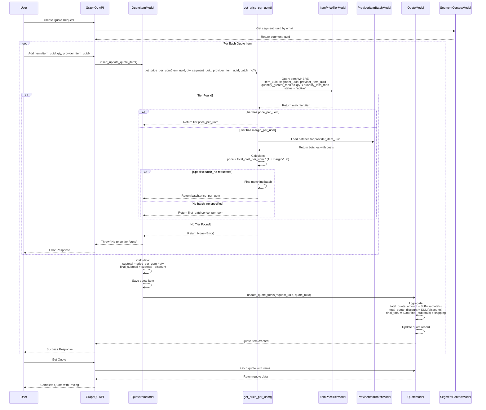

---

### Activity Diagram - Price Calculation

This diagram illustrates the decision-making process for calculating the price per UOM.

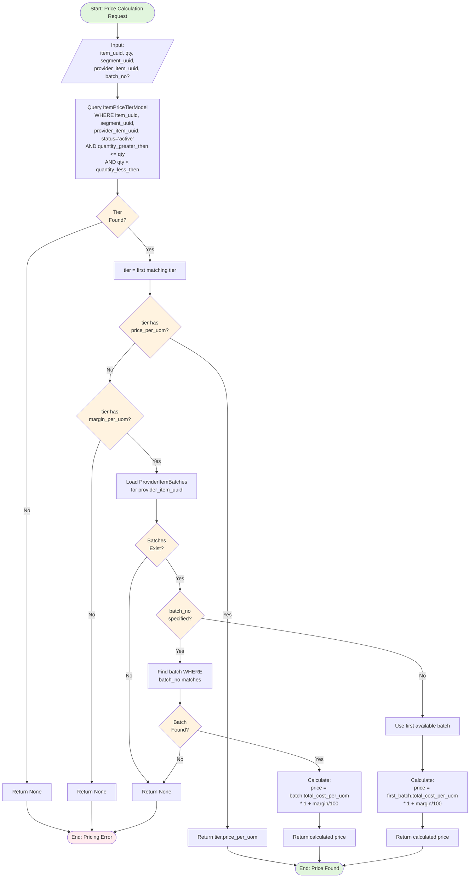

---

### State Diagram - Quote Lifecycle

This diagram shows the different states of quotes and price tiers throughout their lifecycle.

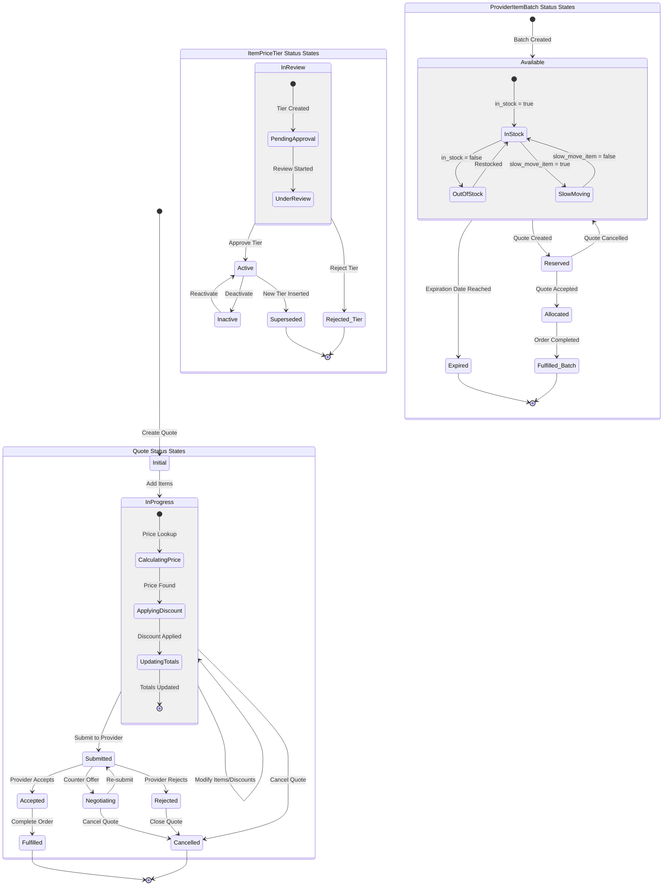

---

### Entity Relationship Diagram

This diagram shows the relationships between all pricing-related entities.

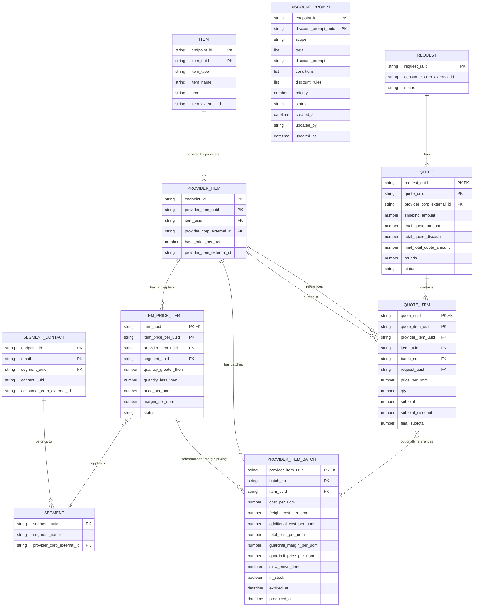

---

### Data Flow Diagram - Price Calculation

This diagram shows how data flows through the pricing calculation system.

```mermaid
flowchart LR
    subgraph Input["Input Data"]
        User[User/Contact<br/>email]
        ItemReq[Item Request<br/>item_uuid, qty]
        ProviderReq[Provider<br/>provider_item_uuid]
        BatchReq[Optional Batch<br/>batch_no]
    end

    subgraph Lookup["Lookup Layer"]
        User --> SegContact[SegmentContact<br/>Lookup]
        SegContact --> Segment[segment_uuid]

        ItemReq --> TierQuery[ItemPriceTier<br/>Query]
        ProviderReq --> TierQuery
        Segment --> TierQuery

        TierQuery --> TierResult{Tier Type?}
    end

    subgraph Calculation["Calculation Layer"]
        TierResult -->|Fixed Price| FixedPrice[Use tier.price_per_uom]
        TierResult -->|Margin Based| MarginCalc[Load Batches]

        BatchReq --> MarginCalc
        MarginCalc --> BatchFilter{Batch<br/>Filtering}

        BatchFilter -->|Specific| SpecBatch[Find batch_no]
        BatchFilter -->|Default| FirstBatch[Use first batch]

        SpecBatch --> CalcMargin[Calculate:<br/>total_cost * 1+margin/100]
        FirstBatch --> CalcMargin
    end

    subgraph Output["Output Layer"]
        FixedPrice --> PriceResult[price_per_uom]
        CalcMargin --> PriceResult

        PriceResult --> QuoteCalc[Quote Item Calculation]
        QuoteCalc --> Subtotal[subtotal =<br/>price_per_uom * qty]

        Subtotal --> DiscountLookup[Discount Prompt<br/>Lookup Optional]
        DiscountLookup --> FinalSubtotal[final_subtotal =<br/>subtotal - discount]

        FinalSubtotal --> QuoteAgg[Quote Aggregation]
        QuoteAgg --> QuoteTotals[Quote Totals:<br/>total_quote_amount<br/>total_quote_discount<br/>final_total_quote_amount]
    end

    style Input fill:#e3f2fd
    style Lookup fill:#fff3e0
    style Calculation fill:#f3e5f5
    style Output fill:#e8f5e9
```

---

### Tier Insertion Sequence Diagram

This diagram shows how the cascading tier structure is maintained when inserting new tiers.

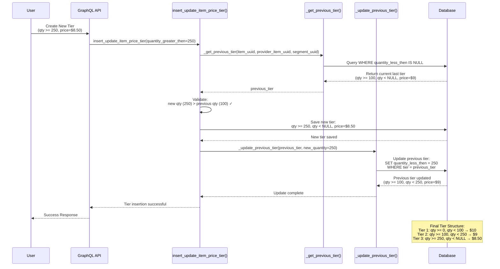

---

### Batch Cost Calculation Diagram

This diagram shows the automatic calculation of batch costs and guardrail pricing.

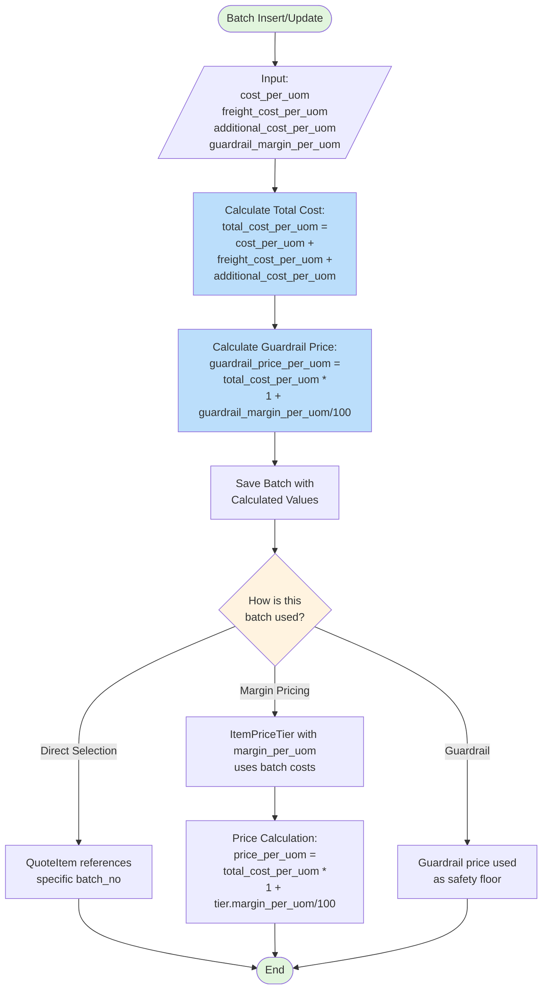

---

### Discount Prompt Application Sequence Diagram

This diagram shows how discount prompts are retrieved and applied to quote items.

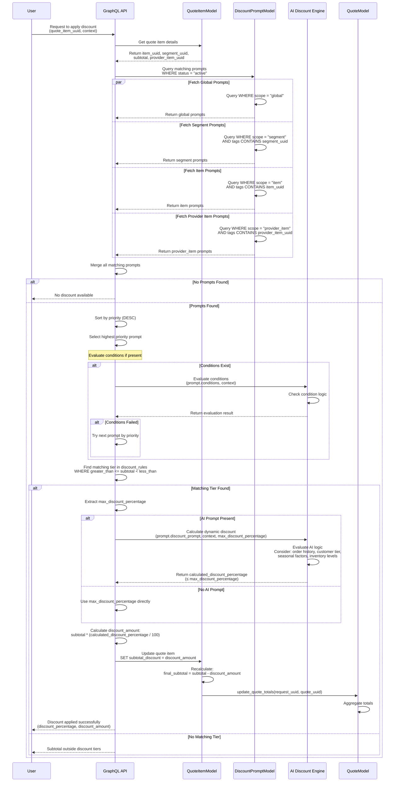

---

### Discount Prompt Matching Activity Diagram

This diagram illustrates the decision-making process for matching and applying discount prompts.

```mermaid
flowchart TD
    Start([Start: Apply Discount Request]) --> InputData[/Input:<br/>quote_item_uuid, item_uuid,<br/>segment_uuid, provider_item_uuid,<br/>subtotal, context/]

    InputData --> QueryPrompts[Query DiscountPromptModel<br/>WHERE status = 'active']

    QueryPrompts --> FetchGlobal[Fetch GLOBAL prompts<br/>scope = 'global']
    QueryPrompts --> FetchSegment[Fetch SEGMENT prompts<br/>scope = 'segment'<br/>AND tags CONTAINS segment_uuid]
    QueryPrompts --> FetchItem[Fetch ITEM prompts<br/>scope = 'item'<br/>AND tags CONTAINS item_uuid]
    QueryPrompts --> FetchProviderItem[Fetch PROVIDER_ITEM prompts<br/>scope = 'provider_item'<br/>AND tags CONTAINS provider_item_uuid]

    FetchGlobal --> MergePrompts[Merge all matching prompts]
    FetchSegment --> MergePrompts
    FetchItem --> MergePrompts
    FetchProviderItem --> MergePrompts

    MergePrompts --> HasPrompts{Prompts<br/>Found?}

    HasPrompts -->|No| NoDiscount[No discount available]
    NoDiscount --> EndNoDiscount([End: No Discount])

    HasPrompts -->|Yes| SortByPriority[Sort prompts by priority DESC]

    SortByPriority --> SelectPrompt[Select highest priority prompt]

    SelectPrompt --> HasConditions{Prompt has<br/>conditions?}

    HasConditions -->|Yes| EvalConditions[Evaluate conditions<br/>using AI engine]
    EvalConditions --> ConditionPass{Conditions<br/>passed?}

    ConditionPass -->|No| MorePrompts{More<br/>prompts?}
    MorePrompts -->|Yes| SelectPrompt
    MorePrompts -->|No| NoDiscount

    ConditionPass -->|Yes| FindTier[Find matching tier in discount_rules]
    HasConditions -->|No| FindTier

    FindTier --> TierMatch[Check: greater_than <= subtotal < less_than]

    TierMatch --> TierFound{Tier<br/>Found?}

    TierFound -->|No| MorePrompts

    TierFound -->|Yes| ExtractMax[Extract max_discount_percentage<br/>from matching tier]

    ExtractMax --> HasAIPrompt{Prompt has<br/>discount_prompt<br/>field?}

    HasAIPrompt -->|Yes| CallAI[Call AI Discount Engine<br/>with prompt, context,<br/>max_discount_percentage]
    CallAI --> AICalc[AI evaluates:<br/>- Customer history<br/>- Order patterns<br/>- Seasonal factors<br/>- Inventory levels<br/>- Custom logic]
    AICalc --> AIResult[AI returns calculated_discount<br/>≤ max_discount_percentage]
    AIResult --> ApplyDiscount[discount_percentage =<br/>calculated_discount]

    HasAIPrompt -->|No| UseMax[discount_percentage =<br/>max_discount_percentage]
    UseMax --> ApplyDiscount

    ApplyDiscount --> CalcAmount[Calculate:<br/>discount_amount = subtotal *<br/>discount_percentage / 100]

    CalcAmount --> UpdateItem[Update QuoteItem:<br/>subtotal_discount = discount_amount<br/>final_subtotal = subtotal - discount_amount]

    UpdateItem --> UpdateQuote[Update Quote Totals:<br/>Aggregate all item discounts]

    UpdateQuote --> Success[Return discount details]
    Success --> EndSuccess([End: Discount Applied])

    style Start fill:#e1f5dd
    style EndSuccess fill:#e1f5dd
    style EndNoDiscount fill:#ffebee
    style HasPrompts fill:#fff3e0
    style HasConditions fill:#fff3e0
    style ConditionPass fill:#fff3e0
    style TierFound fill:#fff3e0
    style HasAIPrompt fill:#fff3e0
    style MorePrompts fill:#fff3e0
    style CallAI fill:#e1bee7
    style AICalc fill:#e1bee7
    style AIResult fill:#e1bee7
```

---

### Discount Prompt Priority Resolution Diagram

This diagram shows how conflicts are resolved when multiple prompts match.

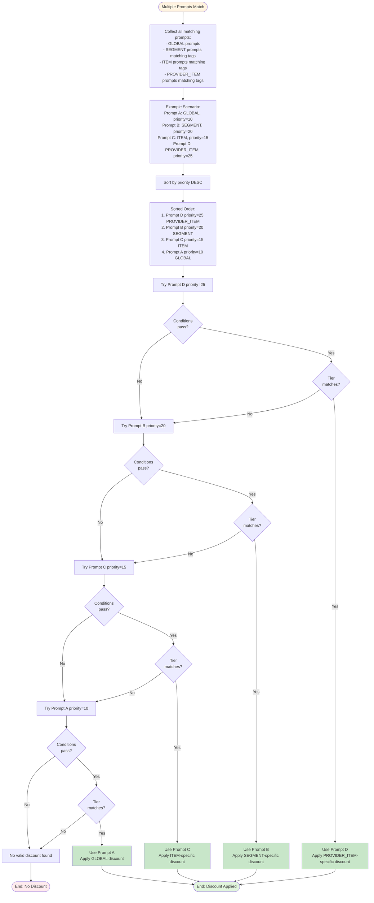

---

### AI Discount Calculation Flow

This diagram shows how the AI engine calculates dynamic discounts within the max percentage limits.

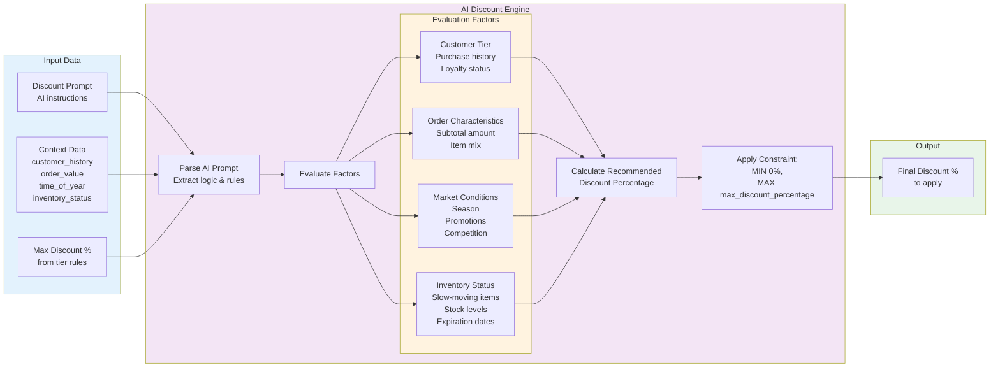

---

## Pricing Calculation Flow

### Price Lookup Service

**File**: [rfq_engine/models/dynamodb/quote_item.py:152-202](../rfq_engine/models/dynamodb/quote_item.py#L152-L202)

**Primary Function**: `get_price_per_uom()`

```python
def get_price_per_uom(
    info: ResolveInfo,
    item_uuid: str,
    qty: float,
    segment_uuid: str,
    provider_item_uuid: str,
    batch_no: str = None,
) -> float | None:
    """
    Get the price per UOM based on item price tiers for the given quantity.
    """
    from .item_price_tier import resolve_item_price_tier_list

    # Query parameters with quantity-based tier matching
    query_params = {
        "item_uuid": item_uuid,
        "segment_uuid": segment_uuid,
        "provider_item_uuid": provider_item_uuid,
        "quantity_value": qty,  # Database-level tier matching
        "status": "active",
    }

    # Retrieve matching price tier
    price_tier_list = resolve_item_price_tier_list(info, **query_params)

    if price_tier_list.total == 0:
        return None

    tier = price_tier_list.item_price_tier_list[0]

    # If tier has direct price, use it
    if tier.price_per_uom is not None:
        return tier.price_per_uom

    # If tier has margin with batches, calculate from batch
    if hasattr(tier, "provider_item_batches") and tier.provider_item_batches:
        if batch_no:
            for batch in tier.provider_item_batches:
                if batch["batch_no"] == batch_no:
                    return batch["price_per_uom"]
        return tier.provider_item_batches[0]["price_per_uom"]

    return None
```

**Pricing Resolution Order**:
1. Find tier matching the requested quantity
2. If tier has `price_per_uom` → use it directly
3. If tier has `margin_per_uom` → use matching batch's calculated price
4. If `batch_no` specified → find that specific batch
5. Otherwise → use first available batch
6. If no tier or batch found → return None (pricing error)

---

### End-to-End Pricing Flow

```
1. USER INITIATES QUOTE CREATION
   ↓
2. IDENTIFY SEGMENT
   - Get segment_uuid from SegmentContact (via email)
   ↓
3. FOR EACH QUOTE ITEM:
   a) Validate: item_uuid, qty, segment_uuid, provider_item_uuid

   b) FIND MATCHING PRICE TIER
      - Query: ItemPriceTierModel WHERE:
        * item_uuid = requested item
        * provider_item_uuid = requested provider
        * segment_uuid = contact's segment
        * quantity_greater_then ≤ qty < quantity_less_then
        * status = "active"

   c) CALCULATE PRICE FROM TIER
      Option 1: IF tier.price_per_uom IS NOT NULL
         → price_per_uom = tier.price_per_uom

      Option 2: IF tier.margin_per_uom IS NOT NULL
         → Load ProviderItemBatches for tier.provider_item_uuid
         → IF batch_no specified:
              price_per_uom = matching_batch.total_cost_per_uom * (1 + margin/100)
            ELSE:
              price_per_uom = first_batch.total_cost_per_uom * (1 + margin/100)

   d) AUTO-CALCULATE QUOTE ITEM TOTALS
      - subtotal = price_per_uom * qty
      - If subtotal_discount provided:
          final_subtotal = subtotal - discount
        ELSE:
          final_subtotal = subtotal

   e) STORE QUOTE ITEM
      ↓
4. AGGREGATE QUOTE TOTALS
   - total_quote_amount = SUM(all quote_items.subtotal)
   - total_quote_discount = SUM(all quote_items.subtotal_discount)
   - items_final_total = SUM(all quote_items.final_subtotal)
   - final_total_quote_amount = items_final_total + shipping_amount
   ↓
5. APPLY DISCOUNT PROMPTS (Optional - per business logic)
   - Query: DiscountPromptModel WHERE:
     * status = "active"
     * scope matches (global, segment, or item via tags)
     * greater_than ≤ subtotal < less_than
   - Apply highest priority matching prompt
   - Get max_discount_percentage from matching tier
   - User can apply up to this percentage
   ↓
6. RETURN QUOTE TO USER
   - price_per_uom (from tier)
   - qty
   - subtotal
   - subtotal_discount (if applied)
   - final_subtotal
   - guardrail_price_per_uom (from batch or provider_item)
   - slow_move_item (flag from batch)
```

---

## Relationships Diagram

```
Segment (pricing segment)
├── segment_uuid
├── provider_corp_external_id (which provider serves this segment)
└── [segment_contact links contacts to segment]
    └── email → SegmentContact → segment_uuid

Item
├── item_uuid
├── item_type, item_name, uom (Unit of Measure)
└── [Price tiers tied to item]

SegmentContact
├── email (contact identity)
├── segment_uuid (which segment/pricing this contact belongs to)
└── contact_uuid, consumer_corp_external_id

Provider_Item (Item offered by a Provider)
├── provider_item_uuid
├── item_uuid (which item)
├── provider_corp_external_id (which provider)
├── base_price_per_uom (fallback price)
├── [Price tiers for this provider's offering]
└── [Batches with cost details]

Item_Price_Tier
├── item_price_tier_uuid
├── item_uuid (hash key)
├── provider_item_uuid (which provider's pricing)
├── segment_uuid (which segment this tier applies to)
├── quantity_greater_then, quantity_less_then (quantity ranges)
├── price_per_uom OR margin_per_uom
└── [Provider_Item_Batches if margin-based]

Provider_Item_Batch
├── batch_no
├── provider_item_uuid (which provider item)
├── cost_per_uom, freight_cost_per_uom, additional_cost_per_uom
├── total_cost_per_uom (auto-calculated)
├── guardrail_margin_per_uom, guardrail_price_per_uom
├── slow_move_item, in_stock (status flags)
└── [Used by price tiers with margin_per_uom]

Discount_Prompt
├── discount_prompt_uuid
├── endpoint_id (hash key)
├── scope (global, segment, item, or provider_item)
├── tags (flexible matching via tags)
├── discount_prompt (AI prompt for logic)
├── conditions (conditional logic)
├── discount_rules (list of tier objects)
│   └── [{greater_than, less_than, max_discount_percentage}, ...]
├── priority (conflict resolution)
├── status (in_review, active, inactive)
├── created_at, updated_by, updated_at (audit fields)
└── Indexes: ScopeIndex, UpdateAtIndex

Quote_Item (Line item in a quote)
├── quote_item_uuid
├── quote_uuid (parent quote)
├── item_uuid, provider_item_uuid, batch_no
├── qty (requested quantity)
├── price_per_uom (looked up from tiers)
├── subtotal = price_per_uom * qty
├── subtotal_discount (manually applied)
└── final_subtotal = subtotal - discount

Quote (Order proposal)
├── quote_uuid
├── request_uuid (parent request)
├── provider_corp_external_id
├── shipping_amount
├── total_quote_amount = SUM(quote_items.subtotal)
├── total_quote_discount = SUM(quote_items.discount)
└── final_total_quote_amount = items_final + shipping
```

---

## Business Logic Patterns

### 1. Cascading Tier Structure

**Implementation**: [rfq_engine/models/dynamodb/item_price_tier.py:40-105](../rfq_engine/models/dynamodb/item_price_tier.py#L40-L105)

When inserting a new tier:
- The "last tier" (where `quantity_less_then = NULL`) is fetched
- New tier's `quantity_greater_then` must be > previous tier's `quantity_greater_then`
- New tier is saved with `quantity_less_then = NULL`
- Previous tier is updated to set its `quantity_less_then = new_tier.quantity_greater_then`

This ensures proper tier sequencing without gaps.

**Applied to**:
- ItemPriceTier (quantity-based tiers)
- DiscountPrompt.discount_rules (subtotal-based tiers within each prompt)

---

### 2. Margin-Based Dynamic Pricing

**Implementation**: [rfq_engine/graphql/item_price_tier/types.py:61-82](../rfq_engine/graphql/item_price_tier/types.py#L61-L82)

Tiers can specify `margin_per_uom` instead of fixed `price_per_uom`:
- Margin is applied to batch's `total_cost_per_uom`
- Allows prices to vary by batch's actual costs
- Formula: `price = total_cost_per_uom * (1 + margin_per_uom / 100)`

**Benefits**:
- Prices automatically adjust to cost fluctuations
- Different batches can have different prices
- Maintains target margin while adapting to market conditions

---

### 3. Segment-Based Pricing

Different segments can have different prices for the same item/provider:
- `segment_uuid` is a key dimension in ItemPriceTier and DiscountRule
- Enables customer-specific or region-specific pricing
- Supports multiple pricing strategies simultaneously

**Example**:
```
Item: "Widget A"
Provider: "Acme Corp"

Segment: "Premium Customers"
  Tier 1: qty >= 0,   qty < 100  → $10/unit
  Tier 2: qty >= 100, qty < NULL → $9/unit

Segment: "Standard Customers"
  Tier 1: qty >= 0,   qty < 100  → $12/unit
  Tier 2: qty >= 100, qty < NULL → $11/unit
```

---

### 4. Guardrail Safety Prices

**Implementation**:
- [rfq_engine/models/dynamodb/provider_item.py:16](../rfq_engine/models/dynamodb/provider_item.py#L16) - `base_price_per_uom`
- [rfq_engine/models/dynamodb/provider_item_batches.py:70-73](../rfq_engine/models/dynamodb/provider_item_batches.py#L70-L73) - `guardrail_price_per_uom`

Two levels of safety pricing:
1. **Provider_Item.base_price_per_uom**: Fallback if no tier matches
2. **ProviderItemBatch.guardrail_price_per_uom**: Batch-level safety floor

**Calculation**:
```python
guardrail_price_per_uom = total_cost_per_uom * (1 + guardrail_margin_per_uom / 100)
```

Prevents unexpected pricing gaps and ensures minimum margins.

---

### 5. Automatic Total Calculation

**Implementation**:
- [rfq_engine/models/dynamodb/quote_item.py:247-312](../rfq_engine/models/dynamodb/quote_item.py#L247-L312) - Quote item totals
- [rfq_engine/models/dynamodb/quote.py:182-220](../rfq_engine/models/dynamodb/quote.py#L182-L220) - Quote totals

**Quote Item Level**:
```python
subtotal = price_per_uom * qty
final_subtotal = subtotal - subtotal_discount
```

**Quote Level**:
```python
total_quote_amount = SUM(quote_items.subtotal)
total_quote_discount = SUM(quote_items.subtotal_discount)
final_total_quote_amount = SUM(quote_items.final_subtotal) + shipping_amount
```

All calculations are performed automatically - no manual intervention required.

---

### 6. Batch-Level Cost Tracking

**Implementation**: [rfq_engine/models/dynamodb/provider_item_batches.py:66-73](../rfq_engine/models/dynamodb/provider_item_batches.py#L66-L73)

Costs are broken down into components:
1. **Product cost**: `cost_per_uom`
2. **Freight**: `freight_cost_per_uom`
3. **Additional costs**: `additional_cost_per_uom`
4. **Total**: Auto-calculated sum

**Auto-Calculation**:
```python
total_cost_per_uom = cost_per_uom + freight_cost_per_uom + additional_cost_per_uom
```

**Benefits**:
- Enables detailed cost analysis
- Supports margin tracking
- Facilitates dynamic pricing based on real costs

---

## Database Indexing Strategy

### ItemPriceTier Indexes
- **provider_item_uuid_index**: Provider-specific tier lookup
- **segment_uuid_index**: Segment-specific tier lookup
- **updated_at_index**: Time-based queries

### ProviderItem Indexes
- **item_uuid_index**: Find all providers offering an item
- **provider_corp_external_id_index**: Find all items from a provider
- **updated_at_index**: Modification tracking

### QuoteItem Indexes
- **provider_item_uuid_index**: Quote items by provider
- **item_uuid_index**: Quote items by item
- **item_uuid_provider_item_uuid_index**: Global secondary index for combined queries
- **updated_at_index**: Temporal queries

### Quote Indexes
- **provider_corp_external_id_index**: Quotes by provider
- **provider_corp_external_id_quote_uuid_index**: Global secondary index
- **updated_at_index**: Temporal queries

---

## Performance Optimization

### Batch Loaders

**Files**:
- [rfq_engine/graphql/batch_loaders/provider_item_batch_list_loader.py](../rfq_engine/graphql/batch_loaders/provider_item_batch_list_loader.py)
- [rfq_engine/graphql/batch_loaders/item_price_tier_by_provider_item_loader.py](../rfq_engine/graphql/batch_loaders/item_price_tier_by_provider_item_loader.py)

**ProviderItemBatchListLoader**:
- Efficiently loads batches for multiple provider items
- Used in ItemPriceTierType.resolve_provider_item_batches()
- Applies margin calculation after loading
- Caches results to reduce database hits

**ItemPriceTierByProviderItemLoader**:
- Loads price tiers by (item_uuid, provider_item_uuid)
- Reduces N+1 query problems
- Implements caching via HybridCacheEngine

**Caching**:
- Configurable TTL via HybridCacheEngine
- Both in-memory and distributed caching support
- Automatic cache invalidation on updates

---

## Summary

The pricing system is a **sophisticated multi-tier architecture** that:

1. **Links contacts to pricing segments** via SegmentContact
2. **Supports dynamic tiered pricing** based on quantity bands
3. **Enables margin-based dynamic pricing** using batch cost data
4. **Implements segment-specific pricing** for different customer groups
5. **Automates calculations** at item, quote, and aggregate levels
6. **Provides safety guardrails** through base prices and margins
7. **Scales efficiently** through batch loaders and caching
8. **Maintains referential integrity** through deletion constraints
9. **Supports AI-driven discount prompts** with flexible scoping and priority-based conflict resolution
10. **Supports hospitality pricing modes** — unit (procurement), per_pax_type (tickets/meals), and occupancy (room-nights)
11. **Implements quote-level FX conversion** with locked rates and native/display currency tracking
12. **Protects cancellation-policy snapshots** as engine-owned quoted terms
13. **Provides durable local availability holds** with transactional capacity reservation and restoration
14. **Supports reusable bundle templates** while keeping each quote component independently priced

The system prioritizes:
- **Efficiency** through database-level tier matching
- **Accuracy** through automated calculations
- **Flexibility** through multiple pricing mechanisms (fixed price, margin-based, dynamic batches)
- **Scalability** through strategic indexing and caching
